# PROJECT_ARCHITECTURE.md — VidCraft Technical Blueprint

> **Document type:** Authoritative technical architecture reference (the "what it IS and how it SHOULD work" document).
> **Companion documents:** [`PROJECT_PROGRESS.md`](PROJECT_PROGRESS.md) (current development state), [`PROJECT_STATE.yaml`](PROJECT_STATE.yaml) (machine-readable state).
> **Source of truth for intended design:** [`VidCraft_Proposal.tex`](VidCraft_Proposal.tex) (the FYP proposal submitted to UET Lahore, Narowal Campus). Everything in this file that describes *intended* architecture is derived from that document. Where this file adds detail the proposal does not specify (e.g. exact API paths, exact env var names), that detail is marked **PROPOSED** — a reasonable default consistent with the proposal, not yet ratified by the team, and safe to change without triggering the ADR process in Section 22.
> **Source of truth for what exists:** the repository itself. As of this document's creation, the repository contains **one file**: `VidCraft_Proposal.tex`. There is no application code, no `package.json`, no `requirements.txt`, no git history, no frontend, no backend, no AI microservice. This is a **pre-development / Day Zero** project. Every implementation-status marker in this document reflects that fact honestly — do not let the density of this document create a false impression that any of it is built yet.
> **Last updated:** 2026-08-10
> **Last updated by:** Claude (Sonnet 5), documentation pass, in direct collaboration with the project lead (Muhammad Majid).
> **Document status:** Initial version. Authoritative until superseded by a later dated revision of this file.

---

## How to read this document

Every capability described below carries one of these status tags. Treat them as load-bearing, not decorative:

| Tag | Meaning |
|---|---|
| `PLANNED` | Explicitly committed to in the proposal (`VidCraft_Proposal.tex`). Not yet implemented. |
| `PROPOSED` | A concrete detail (file path, endpoint, env var, schema field) that the proposal does not specify at this granularity. Filled in here for consistency so implementation can start, but **not yet a ratified team decision** — confirm or override during the phase that builds it, then update this document per Section 22's ADR process. |
| `NOT_IMPLEMENTED` | Zero corresponding code exists in the repository. As of this writing, this applies to **100% of the system**. |
| `TBD` | Genuinely undecided. Do not guess a value for these — surface the open question to the user or record an ADR once decided. |

---

## 1. Project Identity

| Field | Value |
|---|---|
| **Project name** | VidCraft |
| **Full title** | VidCraft: A Multi-Agent, Retrieval-Augmented Pipeline for Prompt-Driven Video Generation |
| **Project type** | Final Year Project (BSCS), UET Lahore — Narowal Campus, Department of Computer Science & Engineering, Session 2023–2027 |
| **Classification** | Industrial / R&D (per Project Registration page in the proposal) |
| **Area of specialisation** | AI, Generative Models, NLP, Multi-Agent Systems |
| **Team** | Muhammad Majid (2023-CS-580, Lead), Tahir Zaka (2023-CS-596), Hammad (2023-CS-567), Maida Ibrar (2023-CS-505) |
| **Supervisor** | Ms. Rabia Sana |
| **Co-Supervisor** | Dr. Yaeen-ul-Haq |
| **Development window** | May 2026 – April 2027 (ten development phases) |

### Problem statement

Three distinct problems motivate the project (proposal, Section 2 "Introduction"):

1. **Prompt quality is inconsistent.** AI video-generation output quality is highly sensitive to prompt precision, and most users don't know what makes a prompt good.
2. **A single generation call cannot express a multi-shot idea.** Commercial text-to-video APIs produce one clip per call; naturally multi-scene ideas (e.g. a short narrative) cannot be expressed as a single prompt.
3. **Iterative experimentation with commercial APIs is expensive.** Per-second billing makes trial-and-error prompt/style refinement financially impractical for students and small creators.

### Proposed solution

An end-to-end pipeline that: (a) scores and clarifies prompts before generation, (b) decomposes suitable prompts into a multi-shot storyboard using a coordinated set of LLM agents grounded by retrieval, (c) generates each shot through either a free, deterministic-consistency programmatic pathway (Remotion) or a tiered external API pathway, and (d) applies a bounded, cost-capped critic/retry loop to catch shots that don't match their intended description.

### Objectives

**Primary aim:** build an end-to-end video generation pipeline that decomposes a single user idea into a coherent multi-shot output, remains usable without prompt-engineering expertise, and stays affordable through a tiered, largely free-tier generation strategy.

**Specific objectives** (proposal §5.1, numbered here as OBJ-1..OBJ-8 for cross-referencing elsewhere in this document):

| ID | Objective |
|---|---|
| OBJ-1 | Score user prompts across five linguistic dimensions and surface actionable improvement suggestions |
| OBJ-2 | Resolve ambiguous prompts through a short conversational clarification exchange rather than silent guessing |
| OBJ-3 | Decompose suitable prompts into a multi-shot storyboard using coordinated LLM agents, grounded in a retrieval-augmented style knowledge base |
| OBJ-4 | Maintain a shared world-state across shots (guaranteed consistency on the programmatic pathway, best-effort on the API pathway) |
| OBJ-5 | Provide both free (programmatic) and tiered paid video generation pathways, free-tier prioritised |
| OBJ-6 | Implement a bounded, automated feedback loop that can trigger limited re-generation when output doesn't match intent |
| OBJ-7 | Provide a usable interface for prompt authoring, clarification, storyboard review and progress tracking |
| OBJ-8 | Conduct a comparative evaluation of single-shot vs. multi-agent prompt enhancement, with a documented testing strategy |

### Target users

- **Students and self-learners** — practising storytelling/visual communication without production equipment.
- **Educators** — short explanatory/narrative videos for classroom use on a limited or no budget.
- **Small content creators and freelancers** — short promotional/social content without a production team.
- **Researchers** — a testbed for prompt engineering, agentic pipelines, or retrieval-augmented generation.

### Core value proposition

Lower two barriers to video content creation simultaneously: the *skill* barrier (prompt engineering, storyboard planning) via automated analysis, clarification and agentic decomposition; and the *cost* barrier via a free programmatic rendering pathway that remains fully functional with zero external API spend.

### Scope

**In scope** (proposal §5.2, `tab:scope`): React frontend (prompt entry, clarification chat, style selection, storyboard review, progress tracking); Node.js/Express backend (API gateway, job scheduling, real-time updates); Python FastAPI AI microservice (analyzer, orchestrator, RAG module, critic loop); Remotion rendering engine; tiered external video/image API integration; FFmpeg post-processing (concatenation, thumbnails, subtitles, compression); optional single-provider TTS narration (stretch); MongoDB data layer; comparative evaluation study; testing report; final live demonstration.

**Explicitly out of scope** (proposal §5.2, closing paragraph):
- Multiple redundant text-to-speech providers — a single free-tier provider only.
- An open-ended library of image-generation models — a small, tiered set only.
- Any claim of **guaranteed** visual consistency on the external API pathway — that pathway is best-effort by design, not a bug to be fixed later.
- (Implicit, from the "Comparative Positioning" table and the Success Criterion tiers) — solving cross-model character consistency in general is explicitly named as an open research problem this project does not claim to solve.

### Expected final outcome

See Section 3 of the proposal ("Success Criterion") for the full tiered definition. Summarised:

- **Minimum Viable:** prompt analyzer functional and validated; multi-agent orchestrator produces a coherent multi-shot storyboard rendered end-to-end via Remotion with consistent parameters; frontend fully functional and mobile-responsive; one full live end-to-end demo run.
- **Target:** RAG retrieval demonstrably relevant; critic/retry loop demonstrably triggers a retry; at least one real external-API video generated; comparative evaluation study completed and documented (regardless of which condition "wins"); testing report delivered.
- **Stretch:** tool-augmented reference-image retrieval; synced audio narration; critic loop extended to the API pathway under a strict retry cap.

### Proposal vs. Implemented vs. Planned

| | Status |
|---|---|
| **What the proposal promises** | Everything described in Sections 1–25 of this document below. |
| **What is currently implemented** | **Nothing.** The repository contains one `.tex` file. Zero lines of application code exist. |
| **What is planned** | The entire system. See [`PROJECT_PROGRESS.md`](PROJECT_PROGRESS.md) for the live tracking of this gap and Section 20 below for the roadmap that closes it. |

---

## 2. Project Requirements

### 2.1 Functional requirements

Each feature below is derived directly from the proposal's Scope (§5.2), Methodology (§6), and Success Criterion (§3) tables. **Implementation status for every single one is `NOT_IMPLEMENTED`** — this column is included for forward reference only and must be updated in `PROJECT_PROGRESS.md`, not silently assumed complete here.

#### FR-1: Prompt Quality Analysis

| Field | Detail |
|---|---|
| Purpose | Score a raw user prompt across five dimensions and surface actionable suggestions before generation |
| Inputs | Raw prompt text (string) |
| Processing | spaCy `en_core_web_sm` pipeline: dependency parsing (subject presence), POS tagging (action-verb coverage), NER (setting/location), custom antonym dictionary (visual contradictions) |
| Outputs | JSON: `overall_score` (0–100), five-dimension breakdown, `flags[]`, `suggestions[]` (see proposal §6.1 for the exact example schema) |
| Dependencies | spaCy + `en_core_web_sm` model; a hand-authored domain-specific antonym dictionary (does not yet exist — `NOT_IMPLEMENTED`, content TBD) |
| User interaction | Triggered automatically on prompt submission from the frontend prompt studio |
| Backend interaction | Called by the Node.js backend as the first step of the generation pipeline |
| DB interaction | Analysis result is expected to be persisted alongside the prompt record (exact schema: `PROPOSED`, see Section 10) |
| AI/ML interaction | This *is* an NLP/AI component; no LLM call is required for this step (spaCy only) |
| External services | None |
| Error cases | Empty/whitespace-only prompt; non-English input (spaCy model is English-only — behaviour on other languages is `TBD`, not addressed in the proposal) |
| Validation | Minimum prompt length; reject empty submissions |
| Security considerations | Prompt text must be treated as untrusted input downstream (never interpolated unsanitised into shell commands, file paths, or HTML) |
| Completion criteria | Analyzer returns a structured score for arbitrary input; validated against a curated 50-prompt test set (proposal §3, Minimum Viable) |

#### FR-2: Conversational Clarification Agent

| Field | Detail |
|---|---|
| Purpose | Resolve missing/ambiguous prompt information via a short chat exchange instead of silent guessing |
| Inputs | FR-1 output (flags indicating missing setting, contradictory descriptors, etc.), user's prior prompt text |
| Processing | LLM call using structured-output mode to generate at most 2 targeted follow-up questions; user's answers parsed into a structured "brief" object and merged into the original prompt |
| Outputs | Clarified/merged prompt text; structured `brief` object |
| Dependencies | Primary LLM (Groq-hosted model, see Section 11); FR-1 must run first |
| User interaction | Chat UI in the frontend; capped at 2 rounds so the pipeline always terminates |
| Backend interaction | Orchestrated by the AI microservice; results relayed to frontend over the existing request/response cycle or WebSocket |
| DB interaction | Clarification Q&A history should be retained for the prompt/version timeline (`PROPOSED` — exact persistence not specified in proposal) |
| AI/ML interaction | LLM call (structured output) |
| External services | Groq API (primary), fallback LLM API if Groq unavailable |
| Error cases | LLM API failure/timeout mid-clarification; user abandons the chat (pipeline must have a defined skip/timeout behavior — `TBD`, not specified in proposal) |
| Validation | Cap of 2 clarification rounds is a hard constraint (proposal §6.2) |
| Security considerations | User free-text answers must be treated as untrusted input before being merged into any downstream prompt sent to further LLM/generation calls (prompt-injection surface) |
| Completion criteria | Frontend clarification flow is "fully functional" per Minimum Viable success criterion |

#### FR-3: Multi-Agent Storyboard Decomposition

| Field | Detail |
|---|---|
| Purpose | Decompose a clarified prompt into a 3–5 shot storyboard with per-shot cinematic parameters |
| Inputs | Clarified prompt text (from FR-2, or directly from FR-1 if user skips clarification) |
| Processing | LangGraph agent graph with three roles: **Screenwriter** (decomposes into shots), **Cinematographer** (assigns lighting/camera/colour/mood per shot, grounded via FR-4), **Producer/Router** (assigns each shot to Remotion or external-API pathway) |
| Outputs | Storyboard JSON: `storyboard_id`, `world_state` (characters, setting, style_tokens), `shots[]` (each with description, camera, duration, pathway) — full example in proposal §6.3 |
| Dependencies | FR-1, FR-2 (optional), FR-4 (RAG grounding), primary + fallback LLM APIs |
| User interaction | Storyboard is displayed for review in the frontend storyboard/shot timeline view |
| Backend interaction | Orchestrated end-to-end by the AI microservice; backend relays job status |
| DB interaction | Storyboard record persisted (`PROPOSED` collection: `storyboards`, see Section 10) |
| AI/ML interaction | Multiple sequential LLM calls: 1 Screenwriter call + 1 Cinematographer call per shot + 1 Producer call per shot |
| External services | Groq (primary), fallback LLM API for harder decomposition cases |
| Error cases | Storyboard fails a sentence-transformer intent-similarity check against the original prompt → sent back to Screenwriter for revision, bounded to the same retry limit as the critic loop (proposal §6.3) |
| Validation | Similarity threshold check (specific numeric threshold: `TBD`, not specified in proposal) |
| Security considerations | Same prompt-injection considerations as FR-2, compounded across multiple agent hops |
| Completion criteria | At least one complex input prompt decomposed into a 3–5 shot storyboard, all shots rendered end-to-end via Remotion with consistent shared parameters (Minimum Viable) |

#### FR-4: Retrieval-Augmented Style Grounding

| Field | Detail |
|---|---|
| Purpose | Ground the Cinematographer agent's style decisions in a curated cinematography reference corpus instead of relying on the LLM's unaided parametric knowledge |
| Inputs | Per-shot description text |
| Processing | Corpus (shot types, lighting terminology, genre/mood conventions) embedded via `all-MiniLM-L6-v2`; top-k (default k=3) retrieval via cosine similarity; retrieved passages injected into the Cinematographer's prompt |
| Outputs | k retrieved reference passages per shot, used as LLM context (not directly user-facing) |
| Dependencies | The reference corpus itself does not yet exist — content curation is an explicit task (proposal, Maida Ibrar's Jul–Aug 2026 task, "Cinematography reference corpus curation") |
| User interaction | None directly; indirectly improves storyboard style quality |
| Backend interaction | Vector index queried by the AI microservice |
| DB interaction | Corpus embeddings stored in a vector index (FAISS) synced with metadata in MongoDB (proposal §9.1) |
| AI/ML interaction | Embedding model (`all-MiniLM-L6-v2`) for both corpus and query encoding |
| External services | None (local embedding model) |
| Error cases | Empty/insufficient corpus coverage for a niche style request (behaviour: `TBD`) |
| Validation | Relevance verified manually on a ≥30-query sample (proposal §3, Target Outcomes) |
| Security considerations | Corpus content should come from licensable/open film-technique references only (proposal §9, "assembled from open film-technique references") |
| Completion criteria | Retrieval returns relevant content for prompts in a held-out test set, manually verified |

#### FR-5: Programmatic Video Generation (Remotion pathway)

| Field | Detail |
|---|---|
| Purpose | Render shots deterministically from code at zero marginal API cost, with guaranteed cross-shot consistency |
| Inputs | Storyboard shot object (description, camera, duration, world_state) |
| Processing | Shot parameters mapped to pre-built Remotion React compositions using `useCurrentFrame`, `spring`, `interpolate` |
| Outputs | Rendered MP4 per shot |
| Dependencies | A composition library must exist (`NOT_IMPLEMENTED` — no compositions have been built) |
| User interaction | None direct; user sees the rendered result in the frontend |
| Backend interaction | Render job triggered/orchestrated by the Node.js backend |
| DB interaction | Render job status/result path persisted |
| AI/ML interaction | None at render time (parameters were already decided upstream by FR-3) |
| External services | None — this is the whole point of the pathway |
| Error cases | Composition doesn't exist for a given shot "type" — mapping strategy from arbitrary shot descriptions to a finite composition library is not fully specified in the proposal (`TBD` — likely needs either a fixed taxonomy of composition templates or a fallback default composition) |
| Validation | At least 3 distinct animated compositions rendered from a single storyboard (proposal §5.2 acceptance criterion) |
| Security considerations | Rendering executes local code (React/Remotion) — no untrusted code execution risk since compositions are authored by the team, not generated dynamically from LLM output |
| Completion criteria | Multi-shot storyboard renders end-to-end via Remotion with shared consistent parameters, no external API cost |

#### FR-6: External API Video/Image Generation (tiered pathway)

| Field | Detail |
|---|---|
| Purpose | Photorealistic generation when Remotion's code-driven style is insufficient |
| Inputs | Enhanced/grounded shot description; optionally a shared reference image from `world_state` |
| Processing | Submitted to an external provider via an asynchronous job queue, following the Tier 1 (free) → Tier 2 (affordable paid) → Tier 3 (premium) strategy (proposal §9.2) |
| Outputs | Generated video/image asset (format/duration dependent on provider) |
| Dependencies | Bull.js job queue + Redis; at least one provider integration (`NOT_IMPLEMENTED` — **no specific provider has been selected yet**; the proposal deliberately abstracts this to a tiering *strategy*, not named vendors — see Section 12) |
| User interaction | User sees a real-time progress indicator (30–120s generation window per proposal) |
| Backend interaction | Job queue managed by Node.js/Express + Bull.js; status pushed via Socket.IO |
| DB interaction | Job metadata, provider used, cost incurred (`PROPOSED` fields — not specified in proposal) |
| AI/ML interaction | None directly (the enhanced prompt was already produced upstream) |
| External services | Whichever concrete provider(s) are selected during Phase 7 — **TBD** |
| Error cases | Free-tier quota exhausted → fall through to next tier; provider API failure/timeout; provider deprecation (see Risk table, Section 24) |
| Validation | At least one real video generated end-to-end through a connected free-tier provider (proposal §5.2 acceptance criterion) |
| Security considerations | API keys must never be exposed to the frontend; all provider calls proxied through the backend |
| Completion criteria | One real successful generation through a connected provider, continuity handled best-effort |

#### FR-7: Continuity / World-State Management

| Field | Detail |
|---|---|
| Purpose | Keep character/setting/style descriptions consistent across all shots in a storyboard |
| Inputs | `world_state` object (characters, setting, style_tokens, optional reference_image_url — see Table in proposal §6.6) |
| Processing | Constructed once per storyboard, injected into every shot's generation call |
| Outputs | Deterministic consistency on the Remotion pathway (same parameters reused in code); best-effort consistency on the API pathway (same descriptive text + optional shared reference image, no pixel-level guarantee) |
| Dependencies | FR-3 (storyboard must exist first) |
| User interaction | None direct |
| Backend/DB interaction | `world_state` persisted as part of the storyboard record |
| AI/ML interaction | Consumed by FR-3's Cinematographer agent and by FR-6's generation calls |
| External services | Depends on whether the selected FR-6 provider supports image-conditioning (provider-dependent, `TBD`) |
| Error cases | N/A on Remotion pathway (deterministic by construction); on API pathway, visibly weak consistency is an accepted, documented limitation, not a defect (proposal Risk table: "Character consistency on API pathway is visibly weak" — Likelihood High, Impact Low, explicitly scoped as best-effort) |
| Completion criteria | Shared parameters demonstrably propagate to every shot on the Remotion pathway (Minimum Viable); best-effort propagation on the API pathway (Target) |

#### FR-8: Critic and Quality-Feedback Loop

| Field | Detail |
|---|---|
| Purpose | Catch shots that don't match their intended description and trigger a bounded number of automatic re-generations |
| Inputs | Rendered shot's extracted frames; the shot's intended description |
| Processing | Vision-capable model inspects frames vs. description, returns structured pass/fail + reason; on failure (and while retry budget remains), Cinematographer revises the shot and it regenerates. See pseudocode in proposal §6.7. |
| Outputs | Final accepted shot (or last attempt if retries exhausted) |
| Dependencies | A vision-capable LLM/API (fallback LLM, since Groq's role here is `TBD` — proposal doesn't confirm Groq has vision capability for this step) |
| User interaction | Visible as part of the progress indicator ("retrying shot 2...") — exact UI treatment `PROPOSED`, not specified |
| Backend/DB interaction | Retry count and critic verdicts should be logged per shot for the evaluation study (FR-12) |
| AI/ML interaction | Vision-capable model call per critic evaluation |
| External services | Whichever fallback LLM provides vision capability — `TBD` |
| Error cases | Max retries exhausted without a pass → finalize with the last attempt (proposal pseudocode explicitly does this rather than failing the whole job) |
| Validation | Default max retries = 2 (configurable) |
| Security considerations | N/A beyond standard API-key handling |
| Completion criteria | At least one demonstrated automatic re-generation cycle triggered by structured critic feedback (Target Outcome) |

#### FR-9: Post-Processing Pipeline

| Field | Detail |
|---|---|
| Purpose | Turn per-shot render outputs into one delivered, web-optimised video |
| Inputs | All shot render outputs for a storyboard (from FR-5 and/or FR-6) |
| Processing | FFmpeg 4-step pipeline: (1) concatenation via concat demuxer, (2) thumbnail frame extraction, (3) optional colour grading + subtitle overlay, (4) H.264 compression |
| Outputs | Single continuous MP4 + thumbnail |
| Dependencies | FFmpeg installed in the backend/runtime environment |
| Backend/DB interaction | Final file path/URL persisted; served via cloud storage (API pathway) or directly via Node.js (Remotion pathway) |
| External services | Cloud media hosting provider — `TBD` (not named in proposal) |
| Error cases | Concatenation failure on mismatched codecs/resolutions between Remotion output and API-provider output — this is a real integration risk the proposal does not explicitly address (**flagged as a documentation gap**, see Section 24) |
| Completion criteria | Multi-shot storyboard output concatenated into one continuous, web-optimised MP4 (proposal §5.2 acceptance criterion) |

#### FR-10: Optional Audio Narration (stretch)

| Field | Detail |
|---|---|
| Purpose | Synthesise narration audio from shot descriptions, synced to the final video |
| Processing | Single free-tier TTS provider (name `TBD`, not specified) → FFmpeg audio stream merge |
| Dependencies | FR-9 must complete first |
| Completion criteria | Narration generated and merged for at least one demonstration case (Stretch Outcome only — **not required for project completion**) |

#### FR-11: Frontend Prompt Studio / Storyboard / Progress UI

| Field | Detail |
|---|---|
| Purpose | User-facing surface for the whole pipeline |
| Processing | React app: prompt entry, clarification chat (FR-2), style configurator, storyboard/shot timeline (FR-3 output), real-time progress via WebSocket (Socket.IO client), prompt/version history |
| Dependencies | Backend REST + WebSocket API (Section 9) |
| Completion criteria | "Fully functional and mobile-responsive" (Minimum Viable success criterion) — verified via manual UI walkthrough across desktop and mobile viewports (proposal §6.11 Testing Strategy) |

#### FR-12: Comparative Evaluation Study

| Field | Detail |
|---|---|
| Purpose | Answer, honestly, whether the multi-agent pipeline actually outperforms a single-shot baseline |
| Processing | Fixed 50-prompt test set run under two conditions (single-shot baseline vs. full multi-agent pipeline) on the same backend; scored via a CLIPScore-style embedding alignment metric (independent of the spaCy heuristic used elsewhere) plus optional small human survey |
| Outputs | Comparison table + discussion in the final report — a directional result in either direction is an acceptable, honest outcome |
| Dependencies | FR-1 through FR-9 all functional; a curated 50-prompt test set (Maida Ibrar's Dec 2026–Jan 2027 task) |
| Completion criteria | Study conducted and reported, regardless of which condition performs better (Target Outcome, proposal §3) |

### 2.2 Non-functional requirements

| Category | Requirement | Source |
|---|---|---|
| Performance | Generation job window of 30–120 seconds on the API pathway must not block the server (handled via async job queue) | Proposal §6.4 |
| Scalability | Not addressed in the proposal beyond the job-queue design. **RECOMMENDED** (not a proposal commitment): design the AI microservice to be stateless per-request so it can be horizontally scaled later. | RECOMMENDED |
| Reliability | Bounded retry logic (critic loop, storyboard similarity check) with hard caps so the pipeline always terminates | Proposal §6.2, §6.3, §6.7 |
| Security | See Section 17 — current: none implemented; recommended baseline documented | Section 17 |
| Maintainability | Provider abstraction layer isolates provider-specific code (explicitly named as a risk mitigation) | Proposal §6, Risk table |
| Usability | Mobile-responsive frontend; conversational clarification instead of silent guessing | Proposal §5.2, §6.2 |
| Accessibility | Not addressed in the proposal. **TBD** — no accessibility (WCAG, screen-reader, keyboard-nav) requirement has been confirmed by the team. |
| Privacy | Only prompt text and generated media metadata stored; no unnecessary personal data collected | Proposal §6.13 (Ethical and Legal Considerations) |
| Logging | Morgan is listed in the backend stack (Section 5); no structured logging strategy beyond that is specified. **TBD** for the AI microservice and for log retention/format. |
| Error handling | See Section 18 | Section 18 |
| Monitoring | Not addressed in the proposal at all. **TBD.** |
| Deployment | Not addressed in the proposal at all beyond "local development machines" for cost purposes. **TBD** — see Section 4's deployment diagram, which is explicitly marked proposed/unconfirmed. |

---

## 3. Complete System Architecture

```text
User
  ↓ (types a prompt, answers clarification questions, reviews storyboard)
React Frontend  [NOT_IMPLEMENTED]
  ↓ REST (prompt submission, storyboard review) + WebSocket (progress updates)
Node.js / Express Backend  [NOT_IMPLEMENTED]
  ├─ API Gateway (routes, validation, auth-if-any)
  ├─ Bull.js Job Queue (backed by Redis) — async generation jobs
  └─ Socket.IO Server — real-time status push to frontend
  ↓ internal HTTP call
Python FastAPI AI Microservice  [NOT_IMPLEMENTED]
  ├─ Prompt Analyzer (spaCy)                          — FR-1
  ├─ Conversational Clarification Agent (LLM)          — FR-2
  ├─ Multi-Agent Orchestrator (LangGraph)               — FR-3
  │    ├─ Screenwriter agent
  │    ├─ Cinematographer agent ←── RAG retrieval ──┐   — FR-4
  │    └─ Producer / Router agent                    │
  ├─ [RAG Style Knowledge Base: FAISS + MongoDB] ─────┘
  └─ Critic / Feedback Loop (vision-capable model)      — FR-8
  ↓ per-shot routing decision
  ┌────────────────────────────┬─────────────────────────────────┐
  │  Remotion Engine (local)    │  External Video/Image APIs        │
  │  [NOT_IMPLEMENTED]          │  (tiered: free → paid → premium)  │
  │  guaranteed consistency     │  [NOT_IMPLEMENTED]                │
  │  FR-5                       │  best-effort consistency — FR-6   │
  └────────────────────────────┴─────────────────────────────────┘
  ↓
FFmpeg Post-Processing (concat, thumbnails, colour, subtitles, compression)  — FR-9  [NOT_IMPLEMENTED]
  ↓
Storage: MongoDB (prompts/storyboards/embeddings) + Cloud media hosting (TBD provider)  [NOT_IMPLEMENTED]
  ↓ WebSocket push
React Frontend (result display)
```

### Component connections

| From | To | Protocol | Carries |
|---|---|---|---|
| User | Frontend | Browser UI | Prompt text, clarification answers, style choices |
| Frontend | Backend | REST (HTTP) | Prompt submission, storyboard fetch/review |
| Frontend | Backend | WebSocket (Socket.IO) | Real-time generation progress |
| Backend | AI Microservice | Internal HTTP (`PROPOSED`, exact protocol TBD — could also be direct function calls if co-located, or gRPC; proposal only says "communicating over HTTP and WebSocket" at the top level, §6) | Prompt text → analysis/orchestration requests, storyboard JSON responses |
| AI Microservice | RAG vector index | In-process / local query | Style grounding retrieval |
| Backend | Remotion Engine | Local process invocation (`PROPOSED`) | Render job parameters → MP4 output |
| Backend | External APIs | HTTPS, via Bull.js job queue | Shot description (+ optional reference image) → generated media |
| Backend | FFmpeg | Local process invocation | Raw shot outputs → final MP4 |
| Backend | MongoDB | Mongoose ODM | Persisted prompts, storyboards, embeddings, job metadata |
| Backend | Cloud storage | Provider SDK/HTTPS (`TBD` provider) | Final media upload/serve |

---

## 4. Architecture Diagrams

All diagrams below describe the **planned** architecture — nothing in them is built yet. Diagram content is derived strictly from the proposal; no components are invented.

### 4.1 System architecture

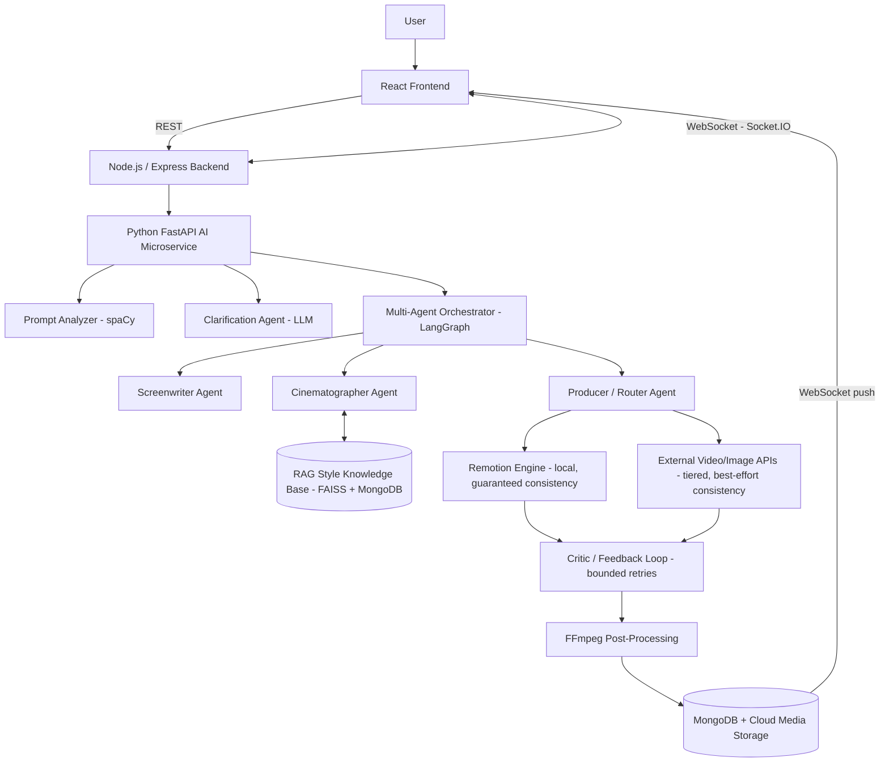

### 4.2 Frontend/backend communication diagram

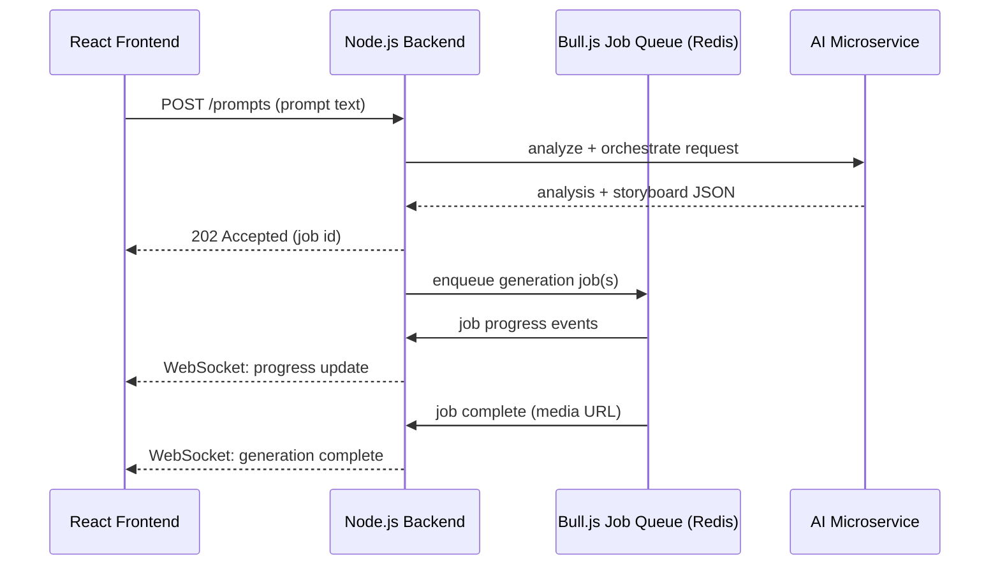

### 4.3 Backend/service architecture

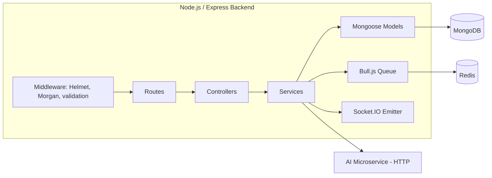

### 4.4 AI/ML pipeline diagram

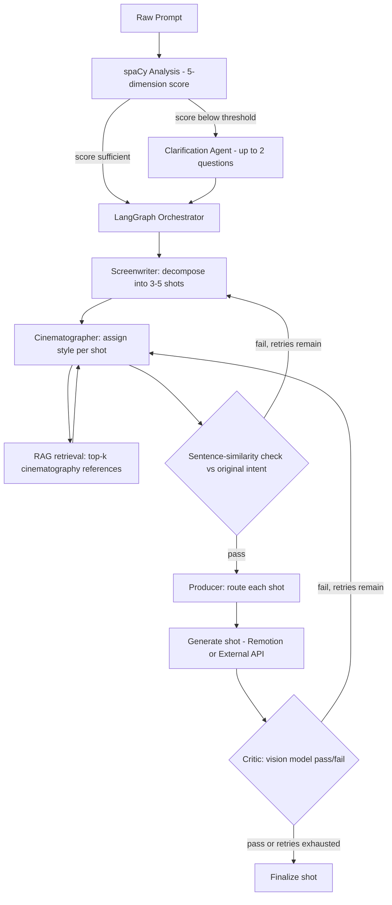

### 4.5 Database relationship diagram

See Section 10.2 for the full ER diagram (kept there to avoid duplicating the schema definition in two places).

### 4.6 Main user workflow

See Section 16.1 for the primary end-to-end sequence diagram.

### 4.7 Important data-processing workflow: Evaluation Study

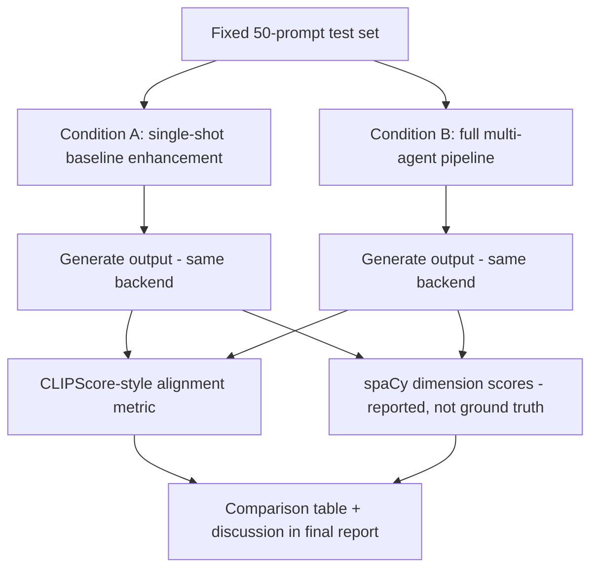

### 4.8 External API/service integration diagram

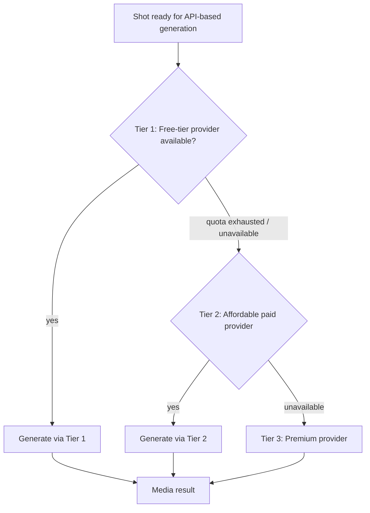

> Note: no specific vendor names appear in this diagram because none are confirmed in the proposal (see Section 12). The tiering *strategy* is decided; the specific providers within each tier are `TBD`.

### 4.9 Deployment architecture diagram (PROPOSED — not decided by the team)

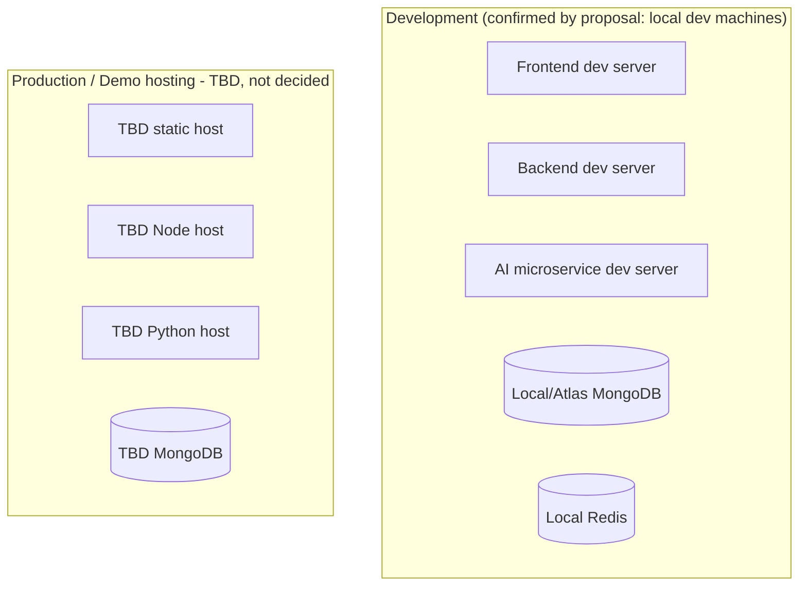

The proposal never discusses a production deployment target — only that development and testing happen on local machines to control cost (Section 5.4, Budget). Treat the "Prod" half of this diagram as a placeholder to be filled in once the team makes that decision, not as an existing plan.

---

## 5. Technology Stack

Source: proposal §9 ("Tools and Technologies") and §6 ("Proposed Methodology"). The "Alternatives Considered" column is filled in only where the proposal explicitly discusses a tradeoff; everywhere else it is marked accordingly rather than invented.

| Technology | Purpose | Where Used | Why Used | Alternatives Considered |
|---|---|---|---|---|
| React 18 | Frontend UI framework | Frontend app | Team familiarity; component model fits prompt studio/storyboard UI | Not documented in proposal |
| Vite | Frontend build tool | Frontend app | Standard fast dev-server pairing with React | Not documented |
| Tailwind CSS | Styling | Frontend app | Utility-first styling | Not documented |
| shadcn/ui | Component library | Frontend app | Pre-built accessible components | Not documented |
| Zustand | Frontend state management | Frontend app | Lightweight state management | Not documented |
| Recharts | Charting | Frontend app (e.g. quality-score visualisation) | — | Not documented |
| Framer Motion | Animation | Frontend app | UI polish | Not documented |
| Socket.IO Client | Real-time updates | Frontend app | Pairs with Socket.IO Server on backend | Not documented |
| Axios / React Query | HTTP client + data fetching/caching | Frontend app | — | Not documented |
| Node.js 20 | Backend runtime | Backend | — | Not documented |
| Express.js | Backend web framework | Backend | API gateway/routing | Not documented |
| MongoDB + Mongoose | Database + ODM | Backend, AI microservice (via metadata sync) | Document model fits variable-shape storyboard/shot data | Not documented |
| Bull.js | Async job queue | Backend | Keeps server non-blocking during 30–120s generation windows | Not documented |
| Redis | Job queue backing store | Backend | Required by Bull.js | Not documented |
| Socket.IO Server | Real-time push | Backend | Progress updates to frontend | Not documented |
| Morgan, Helmet | Logging middleware, security headers | Backend | — | Not documented |
| Cloud media hosting | Serve final video/image assets | Backend (API pathway) | — | **Provider TBD** — not named in proposal |
| Python 3.10 | AI microservice runtime | AI microservice | — | Not documented |
| FastAPI | AI microservice web framework | AI microservice | — | Not documented |
| Uvicorn | ASGI server for FastAPI | AI microservice | — | Not documented |
| spaCy (`en_core_web_sm`) | NLP prompt analysis | AI microservice — FR-1 | Dependency parsing, POS, NER for scoring | Not documented |
| LangChain / LangGraph | Multi-agent orchestration | AI microservice — FR-3 | "chosen over a hand-rolled if/else pipeline because the state-graph model gives explicit, inspectable control flow, conditional branching and bounded cycles for the retry logic" (proposal §9.1) | Hand-rolled if/else pipeline — explicitly rejected |
| Groq API | Primary LLM inference | AI microservice — FR-2, FR-3 | "chosen because the orchestrator issues multiple sequential calls per generation, where inference latency compounds noticeably" — low-latency priority (proposal §9.1) | A single higher-latency provider for all calls — implicitly rejected in favour of a tiered primary/fallback split |
| Fallback LLM API (DECIDED — ADR-016: hosted, default = second Groq model `llama-3.1-8b-instant`) | Absorbs Groq primary unavailability (429/5xx/connection); higher-complexity reasoning | AI microservice — FR-3 (hard cases), FR-8 (critic) | Used only on primary failure, not the default path | **Resolved (ADR-015 hosted-only, ADR-016 default vendor).** Any OpenAI-compatible host works via `FALLBACK_LLM_BASE_URL`. Vision capability for the FR-8 critic is a separate open item. |
| sentence-transformers (`all-MiniLM-L6-v2`) | Embeddings | AI microservice — FR-3 (intent similarity), FR-4 (RAG) | — | Not documented |
| FAISS + MongoDB metadata | Vector similarity search | AI microservice — FR-4 | "chosen for simplicity and to avoid depending on a separate managed vector-database service" (proposal §9.1) | A managed vector-database service — explicitly rejected |
| Remotion | Programmatic video rendering | AI microservice/backend — FR-5 | Guaranteed determinism/consistency at zero API cost | Not documented |
| Manim | Alternative programmatic renderer | Optional, for mathematical/educational visualisations | — | Listed as optional alternative, not primary |
| FFmpeg | Post-processing, concatenation, compression | Backend — FR-9 | — | Not documented |
| Text-to-speech provider | Optional narration | Backend — FR-10 (stretch only) | — | **Provider TBD**, single free-tier provider by rule |
| Git and GitHub | Version control | All | — | Not documented |
| Postman | API testing | Backend | — | Not documented |
| Python `unittest` / `pytest` | AI microservice testing | AI microservice | — | Not documented |
| Jupyter Notebook | NLP/data exploration | AI microservice dev | — | Not documented |

**Explicitly TBD (not in the proposal's technology list at all):**
- Authentication/authorization technology (no auth system is described anywhere in the proposal — see Section 17 and Section 24).
- CI/CD tooling.
- Containerization (no Dockerfile, no `docker-compose.yml` mentioned or present).
- Monitoring/observability stack.
- Cloud hosting provider for production.
- Structured logging library for the Python AI microservice.

---

## 6. Detailed Component Architecture

Each component below currently has **zero implementation**. "Current implementation status" is included on every entry to make that impossible to miss.

### 6.1 Prompt Analyzer

- **Purpose:** First-pass, cheap (no LLM call) scoring of prompt quality.
- **Responsibilities:** Parse prompt, compute 5-dimension score, generate suggestions, decide whether to route to clarification.
- **Inputs:** Raw prompt string.
- **Outputs:** Structured JSON (see FR-1).
- **Dependencies:** spaCy, `en_core_web_sm`, a domain antonym dictionary (content not yet authored).
- **Technologies:** Python, spaCy, FastAPI endpoint.
- **Internal structure (PROPOSED):** `analyzer/pipeline.py` (spaCy pipeline setup), `analyzer/scoring.py` (dimension scoring logic), `analyzer/antonyms.json` (contradiction dictionary data).
- **Communication:** Called synchronously by the backend (or AI microservice entrypoint) at the start of every generation request.
- **Failure modes:** Non-English input; spaCy model not installed in the runtime environment; empty prompt.
- **Security considerations:** Treat prompt text as untrusted; no code execution risk in this component itself.
- **Performance considerations:** Should be fast (no network call) — a good candidate for a tight latency budget (`TBD` numeric target).
- **Testing requirements:** Unit tests on known-good/known-bad example prompts (proposal §6.11).
- **Current implementation status:** `NOT_IMPLEMENTED`.
- **Future work:** Author the antonym dictionary; decide the exact 0–100 scoring formula/weights per dimension (proposal shows the *output shape*, not the scoring *formula* — this is a genuine open design decision, `TBD`).

### 6.2 Conversational Clarification Agent

- **Purpose:** Resolve ambiguity via targeted Q&A instead of guessing.
- **Responsibilities:** Generate ≤2 follow-up questions; parse user answers into structured brief; merge into prompt.
- **Inputs:** FR-1 flags, prior prompt text, user answers.
- **Outputs:** Clarified prompt, brief object.
- **Dependencies:** Primary LLM API (Groq), structured-output parsing.
- **Technologies:** Python, LangChain (for structured output parsing), Groq SDK.
- **Communication:** Called after FR-1 when flags are present; talks to frontend via the backend's request/response or WebSocket channel.
- **Failure modes:** LLM timeout; user never responds (session timeout behavior `TBD`).
- **Security considerations:** User free-text answers are untrusted input for downstream prompt construction (prompt-injection risk into later agent calls).
- **Testing requirements:** Integration test simulating a full clarification round-trip.
- **Current implementation status:** `NOT_IMPLEMENTED`.
- **Future work:** Define exact timeout/skip behavior if user abandons clarification.

### 6.3 Multi-Agent Orchestrator (LangGraph)

- **Purpose:** Coordinate the Screenwriter, Cinematographer, and Producer/Router agents as a single state graph.
- **Responsibilities:** Own the storyboard decomposition process end-to-end, including the bounded retry loop on the intent-similarity check.
- **Inputs:** Clarified prompt.
- **Outputs:** Storyboard JSON (see FR-3).
- **Dependencies:** LangGraph, Groq API, fallback LLM API, sentence-transformers.
- **Internal structure:** `ai-service/orchestrator/graph.py` (LangGraph `StateGraph` definition — `screenwriter` → `producer` → END today, per ADR-001), `ai-service/orchestrator/agents/screenwriter.py` (IMPLEMENTED — AI-004), `ai-service/orchestrator/agents/producer.py` (IMPLEMENTED — AI-005), `ai-service/orchestrator/agents/cinematographer.py` (`NOT_IMPLEMENTED` — AI-007), `ai-service/orchestrator/state.py` (shared `OrchestratorState` TypedDict).
- **Communication:** Cinematographer agent communicates with the RAG module (Section 6.4); Producer agent communicates with the tiered-routing logic (Section 6.5/6.6).
- **Failure modes:** Incoherent storyboard output (Risk table: Medium likelihood, Medium impact — mitigated by bounded retry + similarity check); LLM API failure requiring fallback.
- **Security considerations:** Same prompt-injection surface as 6.2, compounded across 3 agent roles.
- **Performance considerations:** Multiple sequential LLM calls per generation (1 + N shots × 2) — latency compounds, which is *why* Groq was selected as primary (Section 5).
- **Testing requirements:** Unit tests with mocked LLM responses; integration test on real storyboard generation (proposal §6.11).
- **Current implementation status:** `IN_PROGRESS`. Screenwriter (AI-004) and Producer/Router (AI-005) are both implemented and verified: `POST /storyboard/generate` (ai-service) decomposes a clarified prompt into a 3-5 shot storyboard (`storyboard_id`, `world_state{characters, setting, style_tokens}`, `shots[]{shot_id, description, camera, duration_s, pathway}`), then routes each shot's `pathway` per the ADR-013 photorealism heuristic — no longer the AI-004 hardcoded `"remotion"` default. Per ADR-012, `camera` is still a Screenwriter best-effort draft (Cinematographer, AI-007, is expected to refine it, RAG-grounded). Cinematographer node does not exist yet; the similarity-check retry loop (AI-008) does not exist yet; shots routed to `"external_api"` cannot currently be rendered (BACKEND-005/PROVIDER-001 not implemented — see ADR-013 consequences).
- **Future work:** Define the exact similarity threshold (numeric value TBD); implement Cinematographer (AI-007) as a further graph node.

### 6.4 RAG Style Knowledge Base

- **Purpose:** Ground Cinematographer decisions in retrieved reference material.
- **Responsibilities:** Corpus curation, embedding, indexing, top-k retrieval.
- **Inputs:** Shot description (query); the corpus itself (offline, curated once then updated incrementally).
- **Outputs:** Top-k (default 3) relevant passages.
- **Dependencies:** sentence-transformers, FAISS, a curated corpus (does not exist yet — content curation is an explicit, separately tracked task).
- **Technologies:** Python, FAISS, `all-MiniLM-L6-v2`.
- **Failure modes:** Sparse/no corpus coverage for unusual style requests.
- **Testing requirements:** Precision-at-k check on a labelled sample of style queries (proposal §6.11).
- **Current implementation status:** `IN_PROGRESS`. The index scaffold is done + verified (RAG-001): `ai-service/rag/index.py` (`VectorIndex` — FAISS `IndexFlatIP` over L2-normalized vectors = cosine per FR-4, JSON metadata sidecar, graceful empty queries, `save`/`load`) and `ai-service/rag/embedder.py` (lazy-cached real `all-MiniLM-L6-v2`). Corpus content: `NOT_IMPLEMENTED` / not yet curated at all (RAG-002); no populated production index (RAG-003); no Cinematographer consumer (AI-007). See PROJECT_PROGRESS.md Section 5 for the verification record.
- **Metadata sync (ADR-004):** vectors live in the FAISS index; per-vector metadata (source text + dict) is the paired store. Section 10's `embeddings` collection is the eventual canonical MongoDB metadata store, synced with the FAISS index — but that sync is deferred to RAG-003 (corpus ingestion). For the RAG-001 scaffold the JSON sidecar written beside the index (`{VECTOR_INDEX_PATH}.meta.json`) is the interim canonical metadata store, keeping the index self-contained and unit-testable without a live MongoDB.
- **Future work:** Decide corpus size/sourcing in more detail than "assembled from open film-technique references" (proposal's own level of specificity).

### 6.5 Remotion Rendering Engine

- **Purpose:** Free, deterministic-consistency video generation from code.
- **Responsibilities:** Maintain a library of pre-built compositions; map shot parameters onto them; render MP4.
- **Inputs:** Shot object + `world_state`.
- **Outputs:** Rendered MP4 per shot.
- **Dependencies:** Remotion, React, FFmpeg (for final MP4 encoding).
- **Failure modes:** No matching composition for an arbitrary shot description (open design question, see FR-5).
- **Current implementation status:** `IN_PROGRESS`. Four compositions exist (`remotion/src/`): `TitleCard` (generic intro/branding card) plus `WideShot`/`MediumShot`/`CloseUpShot` (keyed on shot type, per the resolved R-11 taxonomy). Each renders a real MP4 from a `Shot`/`WorldState`-shaped prop (`remotion/src/types.ts`), with duration derived from `shot.duration_s` via `calculateMetadata` — not hardcoded. A shared `theme.ts` deterministically maps `world_state.style_tokens` to a palette, so the same storyboard produces the same look across every shot (demonstrates FR-7 continuity). `remotion/render-shot.mjs` implements the shot→composition selection function (`selectCompositionId`) with a documented fallback default, using `@remotion/bundler`/`@remotion/renderer`'s programmatic API (not the CLI) — invoked by `backend/src/services/remotionService.js` via `child_process.execFile` (array args, `shell: false`, so untrusted shot text is never interpolated into a shell command). Verified end-to-end from the backend, for both a taxonomy-matching shot and a deliberately unrecognized one.
- **Not yet implemented:** this only renders *one shot at a time* from hand-written sample props — there's no real storyboard (AI-004/005 don't exist), no batch/multi-shot rendering, and no wiring into an actual REST endpoint (that's INTEG-001/BACKEND-004 territory).

### 6.6 External API Integration Layer

- **Purpose:** Tiered access to third-party video/image generation providers.
- **Responsibilities:** Provider selection logic (Tier 1 → 2 → 3 fallback), request/response translation per provider, job submission via Bull.js.
- **Dependencies:** Bull.js, Redis, at least one concrete provider account/API key (none selected yet).
- **Internal structure (PROPOSED):** A provider-abstraction interface (`generateVideo(shotDescription, worldState) → jobHandle`) with one adapter module per concrete provider, so providers can be swapped without touching orchestration logic — this directly implements the Risk-table mitigation "abstraction layer isolates provider-specific code."
- **Current implementation status:** `NOT_IMPLEMENTED`. No provider selected (Section 12).
- **Future work:** Select concrete Tier 1/2/3 providers (Phase 7, per roadmap).

### 6.7 Critic / Feedback Loop

- **Purpose:** Automated quality gate with bounded retries.
- **Responsibilities:** Frame extraction, vision-model evaluation, structured verdict, triggering revision+retry.
- **Dependencies:** A vision-capable model (provider TBD, likely the fallback LLM if it has multimodal capability).
- **Current implementation status:** `NOT_IMPLEMENTED`.
- **Future work:** Confirm which fallback LLM provider offers vision capability at acceptable cost; define exact `MAX_RETRIES` default (proposal says "default: a maximum of two attempts per shot" — this default IS decided, just not implemented).

### 6.8 Post-Processing Pipeline

- **Purpose:** Assemble final deliverable video.
- **Responsibilities:** Concatenation, thumbnailing, colour grading, subtitles, compression.
- **Dependencies:** FFmpeg.
- **Failure modes:** Codec/resolution mismatch between Remotion output and API-provider output when concatenating (flagged gap, Section 24).
- **Current implementation status:** `NOT_IMPLEMENTED`.

### 6.9 Frontend Application

- See Section 7 in full.
- **Current implementation status:** `NOT_IMPLEMENTED`.

### 6.10 Backend API Gateway

- See Section 8 in full.
- **Current implementation status:** `NOT_IMPLEMENTED`.

---

## 7. Complete Frontend Architecture

**Current status: `NOT_IMPLEMENTED`.** No `frontend/` directory exists in the repository. Everything in this section is `PROPOSED` — a reasonable starting structure consistent with the proposal's named technologies and features, not a decision the team has ratified.

### Proposed folder structure

```text
frontend/                          [PROPOSED — does not exist yet]
├── src/
│   ├── pages/
│   │   ├── PromptStudio.tsx        # main prompt entry + clarification chat
│   │   ├── StoryboardReview.tsx    # storyboard/shot timeline view
│   │   └── History.tsx             # prompt/version history
│   ├── components/
│   │   ├── ClarificationChat/
│   │   ├── StyleConfigurator/
│   │   ├── ProgressTracker/        # WebSocket-driven progress UI
│   │   ├── StoryboardTimeline/
│   │   └── VideoPlayer/
│   ├── state/                      # Zustand stores
│   ├── api/                        # Axios/React Query API client
│   ├── hooks/
│   └── App.tsx
├── package.json                    [NOT_IMPLEMENTED]
├── vite.config.ts                  [NOT_IMPLEMENTED]
└── tailwind.config.js              [NOT_IMPLEMENTED]
```

### Pages/components (derived from proposal §6, §7)

| Page/Component | Purpose | API calls (proposed) | State | User actions |
|---|---|---|---|---|
| Prompt Studio | Prompt entry + clarification chat | `POST /api/prompts` (PROPOSED, Section 9) | Current prompt, clarification history | Type prompt, answer clarification questions |
| Style Configurator | Choose genre/lighting/camera style tokens | Feeds into prompt submission payload | Selected style tokens | Select style options |
| Storyboard Timeline | Review generated storyboard, per-shot status | `GET /api/storyboards/:id` (PROPOSED) | Storyboard JSON, per-shot pathway/status | Review shots, trigger generation |
| Progress Tracker | Real-time generation progress | WebSocket events (PROPOSED event names, Section 9.3) | Job status, retry indicators | Passive (watch) |
| Version/Prompt History | Browse past prompts and their enhancement diffs | `GET /api/prompts/:id/history` (PROPOSED) | History list | Browse past sessions |

Data flow, error handling, loading states, and validation for these components are **not specified** in the proposal beyond "mobile-responsive," "error handling," and "loading states" being named as required deliverables (proposal §7 individual-tasks table, Hammad's Dec 2026–Apr 2027 task). Exact behavior is `TBD` and should be designed during Phase 3.

---

## 8. Complete Backend Architecture

**Current status: `NOT_IMPLEMENTED`.** No `backend/` directory exists. Structure below is `PROPOSED`.

### Proposed folder structure

```text
backend/                           [PROPOSED — does not exist yet]
├── src/
│   ├── routes/
│   │   ├── prompts.js              [IMPLEMENTED — BACKEND-004, no controllers/ split yet]
│   │   ├── storyboards.js          [IMPLEMENTED — BACKEND-004, no controllers/ split yet]
│   │   └── jobs.routes.js
│   ├── controllers/
│   ├── services/
│   │   ├── aiServiceClient.js      [IMPLEMENTED — BACKEND-004, calls the Python FastAPI microservice]
│   │   ├── remotionService.js
│   │   ├── externalApiService.js   # tiered provider abstraction (Section 6.6)
│   │   └── ffmpegService.js
│   ├── models/                     # Mongoose schemas (Section 10)
│   ├── queues/
│   │   └── generationQueue.js      [IMPLEMENTED — BACKEND-003, scaffold + placeholder processor only]
│   ├── sockets/
│   │   └── progressEmitter.js      # Socket.IO
│   ├── middleware/
│   │   ├── validation.js           [IMPLEMENTED — BACKEND-004, requireFields() only so far]
│   │   └── errorHandler.js         [IMPLEMENTED — BACKEND-004, ApiError + notFoundHandler + centralized handler]
│   └── app.js
├── package.json                    [NOT_IMPLEMENTED]
└── .env.example                    [NOT_IMPLEMENTED — see Section 13]
```

### Responsibilities per layer

| Layer | Responsibility | Status |
|---|---|---|
| Routes | Define REST endpoints, delegate to controllers | `IN_PROGRESS` — prompts.js/storyboards.js handle request/response directly (no separate controllers/ layer yet); jobs.routes.js not started |
| Controllers | Request/response handling, input validation | `NOT_IMPLEMENTED` — folded into routes/ for now |
| Services | Business logic — AI microservice calls, Remotion invocation, external API calls, FFmpeg invocation | `IN_PROGRESS` — aiServiceClient.js and remotionService.js implemented; externalApiService.js/ffmpegService.js not started |
| Models | Mongoose schemas for prompts, storyboards, embeddings, jobs | `IN_PROGRESS` — prompts/storyboards done (BACKEND-002); embeddings/jobs not started |
| Queues | Bull.js async job management for generation | `IN_PROGRESS` — generationQueue.js scaffolded and verified (job enqueues, processes) against a real Redis instance (WSL2); no real generation job type wired in yet (INTEG-001/BACKEND-005) |
| Sockets | Socket.IO progress push | `NOT_IMPLEMENTED` |
| Middleware | Helmet (security headers), Morgan (logging), validation, centralized error handling | `IMPLEMENTED` — Helmet/Morgan since BACKEND-001; validation.js/errorHandler.js since BACKEND-004 |

No authentication/authorization middleware is listed because **no auth system is specified anywhere in the proposal.** This is a genuine gap — see Section 17 and Section 24.

---

## 9. API Documentation

**Prompts and Storyboards endpoints below are now implemented (BACKEND-004)** — real routes in `backend/src/routes/`, live-verified end-to-end against MongoDB and the real ai-service (see PROJECT_PROGRESS.md session log). Generation/Jobs endpoints (Section 9.3) remain `PROPOSED` — they depend on BACKEND-003/BACKEND-005, not yet built. **Do not treat unimplemented paths as final** — confirm when their turn comes and update this section then.

### 9.1 Prompts

| | |
|---|---|
| **Method / URL** | `POST /api/prompts` |
| **Status** | `IMPLEMENTED` (BACKEND-004) |
| **Purpose** | Submit a raw prompt; triggers analysis (FR-1) and, if needed, returns clarification questions (FR-2) |
| **Auth** | None specified — `TBD` |
| **Request body** | `{ "prompt": string }` — `styleTokens` from the original PROPOSED shape is not accepted yet (no Style Configurator wiring, FRONTEND-003) |
| **Response (201)** | `{ "promptId": string, "analysis": {...FR-1 schema...}, "clarificationQuestions"?: string[] }` |
| **Error responses** | `400` missing `prompt`; `502` ai-service unreachable/error |
| **Dependencies** | FR-1, FR-2 |

| | |
|---|---|
| **Method / URL** | `POST /api/prompts/:id/clarify` |
| **Status** | `IMPLEMENTED` (BACKEND-004) |
| **Purpose** | Submit answers to clarification questions |
| **Request body** | `{ "questions"?: string[], "answers": string[] }` — `questions` echoes back what `/api/prompts` returned, needed because nothing persists them server-side yet |
| **Response (200)** | `{ "clarifiedPrompt": string, "brief": object }` |
| **Error responses** | `400` missing `answers`; `404` unknown/malformed `:id`; `502` ai-service unreachable/error |

### 9.2 Storyboards

| | |
|---|---|
| **Method / URL** | `POST /api/storyboards` |
| **Status** | `IMPLEMENTED` (BACKEND-004), shape deviates from the original PROPOSED spec |
| **Purpose** | Trigger multi-agent decomposition (FR-3) for a (clarified) prompt |
| **Request body** | `{ "promptId": string }` |
| **Response (201)** | `{ "storyboardId": string, "status": "completed", "worldState": object, "shots": object[] }` — **not** the originally PROPOSED `202 {storyboardId, status: "processing"}`; see ADR-014. The call is synchronous today because BACKEND-003's queue doesn't exist yet — revisit once it does. |
| **Error responses** | `400` missing `promptId`; `404` unknown/malformed `promptId`; `502` ai-service unreachable/error |

| | |
|---|---|
| **Method / URL** | `GET /api/storyboards/:id` |
| **Status** | `IMPLEMENTED` (BACKEND-004) |
| **Purpose** | Fetch a storyboard's current state (shots, world_state, per-shot generation status) |
| **Response (200)** | Storyboard JSON per proposal §6.3 schema |
| **Error responses** | `404` unknown `:id`; `400` malformed `:id` |

### 9.3 Generation

| | |
|---|---|
| **Method / URL** | `POST /api/storyboards/:id/generate` |
| **Status** | `PROPOSED` |
| **Purpose** | Kick off generation for all shots (routes each to Remotion or external API per FR-6/FR-5) |
| **Response (202)** | `{ "jobId": string }` |
| **WebSocket events (PROPOSED names)** | `generation:progress`, `generation:retry`, `generation:complete`, `generation:error` |

| | |
|---|---|
| **Method / URL** | `GET /api/jobs/:id` |
| **Status** | `PROPOSED` |
| **Purpose** | Poll job status (fallback if WebSocket is unavailable) |

### 9.4 History

| | |
|---|---|
| **Method / URL** | `GET /api/prompts/:id/history` |
| **Status** | `PROPOSED` |
| **Purpose** | Prompt/version timeline for the frontend history view |

### Planned but not yet designed at all

- Evaluation-study endpoints (for FR-12) — the proposal describes this as an offline research study run by the team, not necessarily an exposed API. `TBD` whether this needs API surface at all.
- Any authentication endpoint — `TBD`, no auth system specified.

---

## 10. Database Architecture

**Current status: `IN_PROGRESS`.** `prompts` and `storyboards` (of the 5 collections below) have real Mongoose schemas (`backend/src/models/Prompt.js`, `backend/src/models/Storyboard.js`) and a working connection module (`backend/src/config/db.js`), verified 2026-08-10 with a real local MongoDB instance: connect, write, read-back, and clean disconnect all confirmed. `embeddings`, `jobs`, and `evaluation_runs` remain `NOT_IMPLEMENTED` (they belong to RAG-001, BACKEND-003, and the EVAL-* tasks respectively). Database technology is confirmed as **MongoDB** (proposal §5.2, §9.6); schema field names below are `PROPOSED`.

**Naming note:** the Mongoose schemas use **snake_case** field names (`raw_text`, `world_state`, `duration_s`, etc.), matching the proposal's actual wire-format JSON (§6.1, §6.3) and `remotion/src/types.ts` — not the camelCase shown in the ER diagram below, which is this document's own drafting inconsistency rather than a deliberate choice to diverge from the proposal. Treat the field *names* in this ER diagram as illustrative of the *shape*, not the literal case convention.

### 10.1 Collections

| Collection | Purpose | Created by | Modified by | Read by | Deleted when |
|---|---|---|---|---|---|
| `prompts` | Raw + clarified prompt text, FR-1 analysis result | Backend, on prompt submission | Clarification agent (adds clarified text) | Frontend (history view), Orchestrator | `TBD` — no retention policy specified |
| `storyboards` | Full storyboard: `world_state`, `shots[]`, per-shot status/pathway | Orchestrator, after FR-3 completes | Generation services (update shot status), Critic loop (retry count) | Frontend (storyboard review), Post-processing | `TBD` |
| `embeddings` | Vector metadata for RAG corpus and/or prompt-similarity checks (paired with the FAISS index) | RAG corpus ingestion (offline), FR-3 similarity check | — | RAG retrieval, similarity check | `TBD` |
| `jobs` | Generation job status, provider used, retry count, cost tracking (`PROPOSED` — not explicitly named in proposal, but implied by the job-queue design and by FR-12's need to log costs/retries) | Backend, on job enqueue | Bull.js worker, Critic loop | Frontend (progress), Evaluation study tooling | `TBD` |
| `evaluation_runs` | FR-12 results: prompt, condition (baseline/multi-agent), scores | Evaluation study tooling | — | Final report generation | Not deleted — part of the deliverable |

### 10.2 Entity relationship diagram

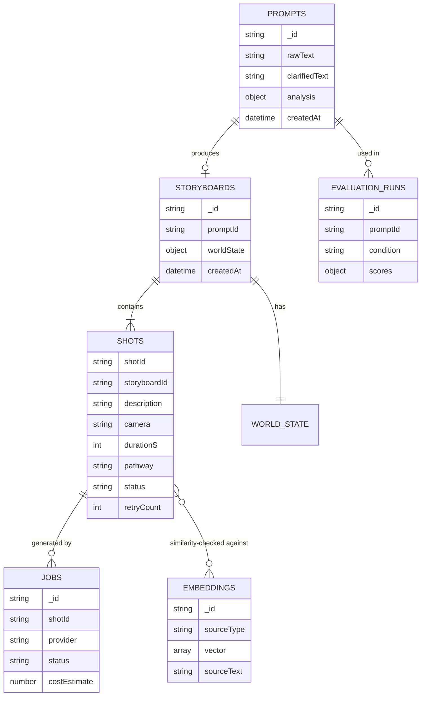

> This schema is `PROPOSED` in full — the proposal establishes *what data must exist* (world_state fields in Table `tab:worldstate`, the analysis JSON shape in §6.1, the storyboard JSON shape in §6.3) but does not define formal Mongoose schemas, indexes, or exact field names beyond those examples. Treat this ER diagram as a starting draft for Phase 2, not a ratified schema.

---

## 11. AI/ML Architecture

### 11.1 Prompt Analyzer (spaCy)

| | |
|---|---|
| Model | `en_core_web_sm` (spaCy) |
| Purpose | Rule/pipeline-based prompt quality scoring — not a trained classifier |
| Input | Raw prompt string |
| Output | 5-dimension score + flags + suggestions (JSON, proposal §6.1) |
| Preprocessing | None beyond spaCy's own tokenization |
| Postprocessing | Score aggregation across dimensions (exact formula `TBD`) |
| Inference method | Local, CPU, no GPU required |
| Hardware requirements | Runs on a standard development machine (proposal §5.4 budget: "Rs. 0 — runs on development machines") |
| Dependencies | spaCy, `en_core_web_sm` model download |
| Failure handling | `TBD` — no fallback behavior specified for non-English or malformed input |
| Expected latency | Not specified; should be low given no network call |
| Limitations | English-only; a rule-based heuristic, not a learned quality model — the proposal is explicit that this is *not* claimed as a research contribution in itself (see proposal §4, "Programmatic and Code-Driven Video Generation": "applies standard NLP tooling to a video-specific scoring rubric") |

### 11.2 LLM Agents (Screenwriter, Cinematographer, Producer, Clarification)

| | |
|---|---|
| Primary provider | Groq API, model `llama-3.3-70b-versatile` (confirmed 2026-08-10, ADR-011 — proposal itself only said "Groq-hosted open-weight models," e.g. Llama-family, without committing to a specific id) |
| Fallback provider | DECIDED (ADR-015/016): a HOSTED cloud LLM API, never local. Default = a second Groq model (`llama-3.1-8b-instant`) on the same key; env-overridable to any OpenAI-compatible host |
| Purpose | Storyboard decomposition, per-shot style assignment, provider routing, clarification-question generation |
| Input | Clarified prompt / shot description / RAG-retrieved context |
| Output | Structured JSON (storyboard, shot parameters, routing decision, clarification questions) via structured-output mode |
| Prompt/system instructions | Not specified in the proposal beyond role descriptions — actual system prompts for each agent are an implementation task, `NOT_IMPLEMENTED` |
| Model parameters | `TBD` (temperature, max tokens, etc. not specified) |
| Inference method | Remote API call |
| API requirements | Groq API key; fallback provider API key |
| Failure handling | Fallback to secondary LLM "where a step requires stronger reasoning than the primary model reliably provides" (proposal §6.3) |
| Expected latency | Groq explicitly chosen to minimize this, since "the orchestrator issues several LLM calls per generation" |
| Limitations | Multiple sequential calls per generation (1 Screenwriter + 2×N-shots for Cinematographer/Producer) — latency and cost compound with storyboard length |

### 11.3 Embedding Model

| | |
|---|---|
| Model | `all-MiniLM-L6-v2` (sentence-transformers) |
| Purpose | (a) Intent-similarity check between original and decomposed shots; (b) RAG corpus/query embedding |
| Input | Text (prompt, shot description, or corpus passage) |
| Output | 384-dimension vector (standard for this model) |
| Inference method | Local |
| Hardware | CPU-sufficient, runs on dev machine |

### 11.4 Critic Model (Vision-capable)

| | |
|---|---|
| Provider | `TBD` — likely the fallback LLM if it offers multimodal/vision input, not confirmed in proposal |
| Purpose | Evaluate rendered frames against the intended shot description |
| Input | Extracted frames (image) + shot description (text) |
| Output | Structured pass/fail + reason (example JSON in proposal Appendix C) |
| Failure handling | Bounded retry (default max 2 attempts); on exhaustion, finalize with the last attempt rather than fail the job |

### 11.5 Complete AI Pipeline

```text
Raw Prompt
  ↓
spaCy Analysis (5-dimension score)
  ↓ (if below threshold)
Clarification Agent (≤2 questions, LLM)
  ↓
LangGraph Orchestrator
  ↓
  Screenwriter (LLM) → 3-5 shots
  ↓
  Cinematographer (LLM + RAG retrieval) → per-shot style params
  ↓
  Sentence-similarity validation (embedding model) → retry loop if failed
  ↓
  Producer/Router (LLM) → pathway assignment per shot
  ↓
Generation (Remotion local render OR External API call)
  ↓
Critic (vision model) → pass/fail → bounded retry loop if failed
  ↓
Validation (critic pass, or retries exhausted)
  ↓
Database (MongoDB) — persist final shot state
  ↓
Frontend (delivered video)
```

This mirrors the generic template in the user's documentation request, adapted to the actual named components — no invented steps.

---

## 12. External Services and Integrations

| Service | Status |
|---|---|
| **Groq API** | `PLANNED` (primary LLM). Purpose: low-latency inference for the multi-agent orchestration layer. Auth: API key (`GROQ_API_KEY`, placeholder — see Section 13). Rate limits: `TBD`, not documented. Fallback behavior: falls through to the secondary LLM API on failure or insufficient quality. Cost: proposal budgets "Rs. 0 – 2,000" assuming free-tier usage during development. |
| **Fallback LLM API** | `IMPLEMENTED` (AI-006). DECIDED (ADR-015/016): a HOSTED OpenAI-compatible endpoint, never local; default = second Groq model `llama-3.1-8b-instant` on the same `GROQ_API_KEY`. Purpose: absorb Groq primary unavailability. Auth: `FALLBACK_LLM_API_KEY` (blank → reuse `GROQ_API_KEY`). Cost: Rs. 0 on the Groq default; only a non-Groq override incurs the budgeted "Rs. 3,000 – 5,000." |
| **External video/image generation providers (Tier 1/2/3)** | `PLANNED` strategy, **no specific vendor selected**. The proposal deliberately does not name vendors in its final version — it specifies only a tiering *policy* (free-tier first, then affordable paid, then premium). Selecting concrete providers is an explicit Phase 7 task. Cost: budgeted "Rs. 8,000 – 12,000" combined for video, "Rs. 2,000 – 4,000" for image. |
| **Text-to-speech provider** | `PLANNED` (stretch-only), provider `TBD`. A single free-tier provider by explicit scope rule (proposal §5.2). Cost: budgeted "Rs. 0." |
| **Cloud media hosting** | `PLANNED`, provider `TBD`. Purpose: serve final video/image assets on the API pathway. Not named in the proposal. |

For every service above, credentials must be supplied via environment variables (Section 13) and **never** committed to the repository or hard-coded. Use `<API_KEY>`-style placeholders in all example configs.

**Development/testing strategy:** the proposal's budget structure (§5.4) explicitly assumes free-tier and trial-credit usage is prioritized throughout development, with paid tiers "reserved for final testing and demonstration." This is a cost-control policy, not a technical architecture decision — it does not change any code path, only which provider/tier is actually invoked at a given time.

---

## 13. Environment Variables

`.env.example` now exists at the repo root (SETUP-003) and is the source of truth; the table below mirrors it. `GROQ_MODEL` was added in AI-003 once a concrete Groq model id was confirmed working (see ADR-011) — the proposal only committed to "a Groq-hosted open-weight model," not a specific id.

```text
# --- Database ---
MONGODB_URI=                  # required, both dev and prod
REDIS_URL=                    # required (Bull.js job queue backing store)

# --- Primary LLM ---
GROQ_API_KEY=<API_KEY>        # required, primary agent-orchestration inference
GROQ_MODEL=llama-3.3-70b-versatile   # confirmed working model id (ADR-011)

# --- Fallback LLM (AI-006; ADR-015 hosted-only, ADR-016 default vendor) ---
# Hosted OpenAI-compatible /chat/completions endpoint, never a local model.
# Defaults (config.py) = a second Groq model on the same free key.
LLM_FALLBACK_ENABLED=true                          # false -> Groq failures fatal
FALLBACK_LLM_BASE_URL=https://api.groq.com/openai/v1
FALLBACK_LLM_API_KEY=                              # blank -> reuse GROQ_API_KEY
FALLBACK_LLM_MODEL=llama-3.1-8b-instant
LLM_TIMEOUT_SECONDS=60

# --- External video/image generation (providers TBD per tier) ---
VIDEO_API_KEY_TIER1=<API_KEY>     # TBD provider
VIDEO_API_KEY_TIER2=<API_KEY>     # TBD provider
VIDEO_API_KEY_TIER3=<API_KEY>     # TBD provider
IMAGE_API_KEY=<API_KEY>           # TBD provider

# --- Optional TTS (stretch feature only) ---
TTS_API_KEY=<API_KEY>             # TBD provider, optional

# --- Cloud media storage (provider TBD) ---
CLOUD_STORAGE_KEY=<API_KEY>
CLOUD_STORAGE_BUCKET=

# --- App config ---
PORT=                          # backend server port, TBD default
NODE_ENV=                      # development | production
AI_SERVICE_URL=                # internal URL for backend -> AI microservice calls

# --- AI microservice config ---
VECTOR_INDEX_PATH=rag/data/style_index   # RAG-001: base path; store writes {path}.faiss + {path}.meta.json
EMBEDDING_MODEL=all-MiniLM-L6-v2   # RAG-001/FR-4: corpus + query encoder (384-dim)
RAG_TOP_K=3                    # RAG-001/FR-4: default k for style retrieval
CRITIC_MAX_RETRIES=2           # confirmed default per proposal §6.7
STORYBOARD_SIMILARITY_THRESHOLD=  # TBD numeric value, not specified in proposal
ANALYSIS_SCORE_THRESHOLD=60    # confirmed default per proposal §6.1 ("default: 60/100")
```

| Variable | Required? | Dev-only or Prod too? | Notes |
|---|---|---|---|
| `MONGODB_URI` | Required | Both | — |
| `REDIS_URL` | Required | Both | — |
| `GROQ_API_KEY` | Required | Both | Never commit real value |
| `GROQ_MODEL` | Required | Both | Default `llama-3.3-70b-versatile`, confirmed available on the Groq API as of 2026-08-10 (ADR-011) |
| `FALLBACK_LLM_API_KEY` | Optional | ai-service | Blank → reuses `GROQ_API_KEY` (ADR-016 default: second Groq model, hosted) |
| `VIDEO_API_KEY_TIER1/2/3` | Required for FR-6 | Both | Providers undecided — Phase 7 |
| `TTS_API_KEY` | Optional | Both | Stretch feature only |
| `CRITIC_MAX_RETRIES` | Required | Both | Default confirmed: `2` |
| `ANALYSIS_SCORE_THRESHOLD` | Required | Both | Default confirmed: `60` |
| `STORYBOARD_SIMILARITY_THRESHOLD` | Required | Both | **Value TBD** — not specified anywhere in the proposal; must be decided during Phase 5 implementation |

**No real secrets appear anywhere in this document or should ever appear in any file in this repository.**

---

## 14. Folder and File Architecture

### 14.1 Actual current repository state

```text
fyp/                                  ← repository root (C:\Users\majid\Desktop\fyp)
├── VidCraft_Proposal.tex             ← the FYP proposal (LaTeX source). AUTHORITATIVE for intended design.
├── PROJECT_ARCHITECTURE.md           ← this file
├── PROJECT_PROGRESS.md               ← live development-state tracker
├── PROJECT_STATE.yaml                ← machine-readable mirror of progress
└── README.md                         ← orientation pointer to the above
```

That is the **entire** repository as of this writing. No other files, no `node_modules`, no `.git`, no build artifacts.

### 14.2 Proposed future structure

```text
fyp/
├── VidCraft_Proposal.tex
├── PROJECT_ARCHITECTURE.md
├── PROJECT_PROGRESS.md
├── PROJECT_STATE.yaml
├── README.md
├── frontend/                  [PROPOSED — Section 7]
├── backend/                   [PROPOSED — Section 8]
├── ai-service/                [PROPOSED]
│   ├── analyzer/
│   ├── orchestrator/
│   │   └── agents/
│   ├── rag/
│   ├── critic/
│   └── main.py
├── remotion/                  [top-level, per ADR-009 — not nested under ai-service/]
│   ├── package.json
│   ├── tsconfig.json
│   └── src/
│       ├── index.ts           (registerRoot)
│       ├── Root.tsx           (<Composition> registrations)
│       └── *.tsx               (individual compositions)
├── .env.example                [PROPOSED — Section 13]
└── docker-compose.yml          [TBD — not confirmed the team will containerize]
```

For every important file, once it exists, this section (and Section 6/7/8) must be updated to explain: purpose, responsibilities, dependencies, who imports/uses it, and what it should NOT contain (e.g. `.env.example` should never contain a real secret; `ai-service/orchestrator/agents/*.py` should not contain provider-specific HTTP logic — that belongs in the routing/adapter layer per the Section 6.6 abstraction-layer decision).

---

## 15. Data Flow

### 15.1 Primary generation flow (Remotion pathway, the guaranteed/demo-safe path)

```text
User Input (raw prompt)
  → Frontend (POST /api/prompts)
  → Backend Controller
  → AI Microservice: Prompt Analyzer (spaCy) → score
  → [if score < 60] Clarification Agent → merged prompt
  → AI Microservice: LangGraph Orchestrator
      → Screenwriter → shots[]
      → Cinematographer (+ RAG retrieval) → per-shot style
      → similarity check → (retry loop if needed)
      → Producer/Router → pathway = "remotion" for all shots
  → Backend: Remotion render service → MP4 per shot
  → Backend: Critic loop (optional on this pathway, can run every shot since regen is free)
  → Backend: FFmpeg post-processing → concatenated final MP4
  → Database: persist storyboard + final media path
  → WebSocket: "generation:complete" → Frontend
  → Frontend: display final video
```

### 15.2 External API pathway (best-effort consistency, real cost)

```text
[same as above through Producer/Router, pathway = "external_api" for some/all shots]
  → Backend: Bull.js job enqueued per shot
  → Backend: tiered provider selection (Tier 1 → 2 → 3)
  → External Provider API call (async, 30-120s)
  → Backend: Critic loop (bounded, max 2 retries — cost-capped on this pathway)
  → Backend: FFmpeg post-processing
  → Database + WebSocket + Frontend (same as above)
```

### 15.3 Evaluation study data flow

See the Mermaid diagram in Section 4.7 — this is a separate, offline research workflow, not part of the live user-facing pipeline.

---

## 16. User Workflows

### 16.1 Primary workflow: prompt to delivered video (happy path)

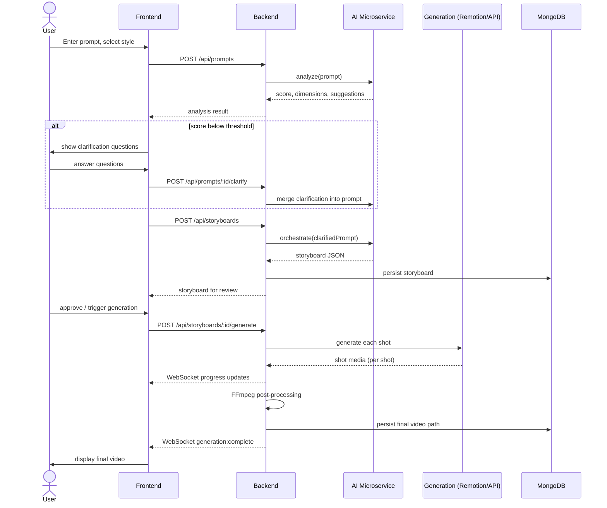

### 16.2 Error case: critic-triggered retry

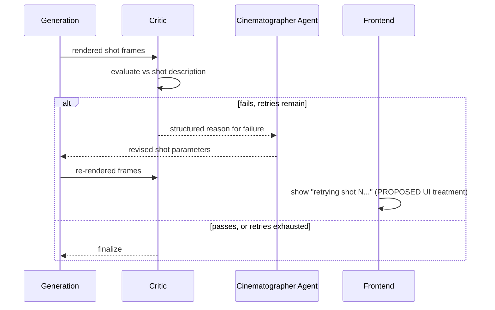

### 16.3 Error case: external API quota exhausted mid-tier

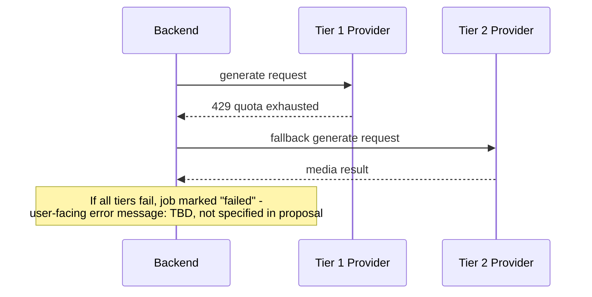

---

## 17. Security Architecture

### CURRENT

**Nothing.** No code exists, therefore no security mechanism of any kind is implemented. Do not describe this project as having any current security posture beyond "no attack surface exists because no deployed system exists."

### RECOMMENDED (not yet implemented, not yet ratified as team decisions — proposed defaults only)

| Area | Recommendation |
|---|---|
| Authentication | **Genuinely unresolved.** The proposal never describes a login/account system. Before building any user-specific feature (history, saved storyboards), the team must decide: is this a single-tenant demo tool, or does it need accounts? This is flagged again in Section 24 as a real gap, not just a checklist item. |
| Input validation | Validate prompt length/content at the API boundary before it reaches any LLM call or file-system operation. |
| Secrets management | All API keys via environment variables only (Section 13); never committed; `.env` must be in `.gitignore` from the very first commit. |
| API security | External provider API calls must be proxied through the backend — the frontend must never hold a provider API key. |
| Prompt injection | User-supplied prompt/clarification text is untrusted input to every downstream LLM call (FR-2, FR-3) — treat model outputs as data, not as instructions to execute against the system. |
| File handling | Generated media file paths/names should be server-generated (e.g. UUIDs), never derived directly from user input, to avoid path traversal. |
| Rate limiting | Generation endpoints trigger real costs (external API calls) — rate limiting per user/session is strongly advisable before any public deployment, though not discussed in the proposal at all. |
| CORS | Restrict the backend's CORS policy to the known frontend origin(s) once deployment targets are decided. |
| XSS | Frontend must never render LLM-generated or user-submitted text as raw HTML. |
| Sensitive data | Per the proposal's own Ethical and Legal Considerations (§6.13): "Only prompt text and generated media metadata are stored; no unnecessary personal data is collected." |

---

## 18. Error Handling Architecture

| Failure | Expected behavior |
|---|---|
| Validation error (empty/invalid prompt) | `400` response, no downstream processing triggered |
| Primary LLM (Groq) failure/timeout | Fall back to secondary LLM API (confirmed policy, proposal §6.3) |
| Both LLM providers fail | `TBD` — not specified. Recommend: job marked failed, user-facing error, no silent partial storyboard. |
| Database errors | `TBD` — not specified in proposal |
| Vector index (RAG) unavailable | `TBD` — Cinematographer agent presumably proceeds without grounding, but this fallback is not confirmed |
| External API quota exhausted (one tier) | Fall through to next tier (confirmed policy, proposal §9.2) |
| All tiers fail | `TBD` — not specified |
| Network/timeout on generation call | Generation window is 30–120s (confirmed); beyond that, `TBD` timeout policy |
| Storyboard similarity check fails | Retry Screenwriter, bounded by the same retry cap as the critic loop (confirmed, proposal §6.3) |
| Critic loop fails repeatedly | Finalize with the last attempt rather than fail the whole job (confirmed, proposal §6.7 pseudocode) |
| Queue (Bull.js/Redis) failure | `TBD` — not specified |
| Concatenation failure (codec/resolution mismatch between pathways) | `TBD` — **flagged as an unaddressed integration risk**, see Section 24 |
| User-facing error messages | `TBD` — no copy/UX for error states specified anywhere in the proposal |
| Logging behavior on failure | Morgan is the only logging tool named (backend HTTP logging); no structured error-logging strategy for the AI microservice is specified |

This table double as the authoritative gap list for error handling — a large fraction of it is `TBD`, and that is accurately reported here rather than papered over.

---

## 19. Testing Architecture

Directly from proposal §6.11 ("Testing Strategy"), which is the one part of the proposal that already specifies a testing approach per layer:

| Layer | Testing Approach | Tooling |
|---|---|---|
| Prompt analyzer | Unit tests on known-good and known-bad example prompts | Python `unittest` / `pytest` |
| Multi-agent orchestrator | Unit tests with mocked LLM responses; integration test on real storyboard generation | `pytest`, LangGraph test harness |
| RAG retrieval module | Precision-at-k check on a labelled sample of style queries | Manual annotation, Python scripts |
| REST/WebSocket backend | Endpoint and event contract tests | Postman, manual WebSocket inspection |
| Frontend | Manual UI walkthroughs across desktop and mobile viewports | Browser dev tools |
| End-to-end pipeline | Full run from prompt submission to delivered video, repeated for both pathways | Manual demonstration runs, logged |

**Acceptance criteria per major feature** are defined in the proposal's Scope table (`tab:scope`, reproduced in Section 2.1's `Completion criteria` rows above) and the tiered Success Criterion (Section 1). No feature should be marked `VERIFIED` in `PROJECT_PROGRESS.md` without satisfying its specific completion criterion from this document.

**Current test coverage: 0%.** No test files exist.

---

## 20. Development Roadmap

Ten phases, taken directly from the proposal's Gantt chart (proposal §8) and Individual Tasks table (§7), broken into trackable tasks. **Every task below starts at status `NOT_STARTED`** — see `PROJECT_PROGRESS.md` and `PROJECT_STATE.yaml` for the live version of this table, which is the one that should actually be updated as work happens. This copy exists to define the roadmap's *shape and dependencies*, not to be edited turn-by-turn (edit the progress file instead; only touch this roadmap if the actual plan changes — see Section 22).

### Phase 0/1 — Research & Environment Setup (May 2026)

| Task ID | Name | Depends on | Files/components | Acceptance criteria | Complexity |
|---|---|---|---|---|---|
| SETUP-001 | Technology feasibility testing (Ollama/Groq, spaCy, sentence-transformers, OpenCV, FFmpeg all runnable locally) | — | dev machines | All named tools installed and runnable with a trivial smoke test | Low |
| SETUP-002 | Initialize git repository, `.gitignore`, base folder structure | — | repo root | `git init` done, `frontend/`, `backend/`, `ai-service/` scaffolds exist | Low |
| SETUP-003 | `.env.example` created per Section 13 | SETUP-002 | `.env.example` | File exists, no real secrets, matches Section 13 | Low |

### Phase 2 — Backend, DB & Vector Index (June 2026)

| Task ID | Name | Depends on | Files/components | Acceptance criteria | Complexity |
|---|---|---|---|---|---|
| BACKEND-001 | Node.js/Express project setup | SETUP-002 | `backend/src/app.js` | Server starts, health-check route responds | Low |
| BACKEND-002 | MongoDB connection + Mongoose schema draft (Section 10) | BACKEND-001 | `backend/src/models/` | Schemas defined for `prompts`, `storyboards`; connection verified | Medium |
| BACKEND-003 | Redis + Bull.js queue scaffold | BACKEND-001 | `backend/src/queues/` | A trivial job can be enqueued and processed | Medium |
| BACKEND-004 | REST routes, middleware (Helmet, Morgan, validation), error handler | BACKEND-002 | `backend/src/routes/`, `backend/src/middleware/` | Endpoints from Section 9 stubbed and documented (even if returning mock data) | Medium |
| RAG-001 | FAISS index scaffold + MongoDB metadata sync design | BACKEND-002 | `ai-service/rag/` | Empty index can be created, queried, returns no results gracefully | Medium |

### Phase 3 — Frontend Development (June–July 2026)

| Task ID | Name | Depends on | Files/components | Acceptance criteria | Complexity |
|---|---|---|---|---|---|
| FRONTEND-001 | React/Vite/Tailwind/shadcn-ui project setup | SETUP-002 | `frontend/` | Dev server runs, base layout renders | Low |
| FRONTEND-002 | Prompt input + clarification chat UI | FRONTEND-001, BACKEND-004 | `frontend/src/pages/PromptStudio.tsx` | Can submit a prompt, display mock analysis/questions | Medium |
| FRONTEND-003 | Style configurator UI | FRONTEND-001 | `frontend/src/components/StyleConfigurator/` | Style tokens selectable, included in submission payload | Low |

### Phase 4 — Remotion Integration (July–August 2026)

| Task ID | Name | Depends on | Files/components | Acceptance criteria | Complexity |
|---|---|---|---|---|---|
| REMOTION-001 | Remotion project scaffold, first composition | SETUP-002 | `remotion/` (top-level dir, per ADR-009) | One composition renders a test MP4 locally | Medium |
| REMOTION-002 | Composition library covering ≥3 distinct shot styles | REMOTION-001 | compositions dir | Meets proposal's "at least 3 distinct animated compositions" acceptance criterion (§5.2) | High |
| REMOTION-003 | Shot → composition mapping logic | REMOTION-002 | `remotion/render-shot.mjs` (`selectCompositionId`), `backend/src/services/remotionService.js` | Arbitrary shot JSON maps to a valid composition or documented default | Done (was High/open design question, resolved per ADR — see R-11) |

### Phase 5 — Multi-Agent Orchestration & NLP Core (August–October 2026)

| Task ID | Name | Depends on | Files/components | Acceptance criteria | Complexity |
|---|---|---|---|---|---|
| AI-001 | FastAPI microservice scaffold | SETUP-002 | `ai-service/main.py` | Health-check endpoint responds | Low |
| AI-002 | spaCy prompt analyzer (FR-1) | AI-001 | `ai-service/analyzer/` | Returns structured score per proposal §6.1 schema, unit-tested | Medium |
| AI-003 | Conversational clarification agent (FR-2) | AI-002 | `ai-service/clarification/` | ≤2 questions generated, brief object produced, capped correctly | Medium |
| AI-004 | LangGraph orchestrator: Screenwriter agent | AI-003 | `ai-service/orchestrator/agents/screenwriter.py` | Decomposes a prompt into 3–5 shots | Done — see PROJECT_PROGRESS.md verification log |
| AI-005 | LangGraph orchestrator: Producer/Router agent | AI-004 | `ai-service/orchestrator/agents/producer.py` | Assigns pathway per shot per tiering policy | Done — see PROJECT_PROGRESS.md verification log |
| AI-006 | Groq + fallback LLM integration | AI-004 | `ai-service/llm/{completion,groq_client,http_llm_client}.py` | Fallback triggers correctly on primary failure | Done — hosted OpenAI-compatible fallback (ADR-015/016); see PROJECT_PROGRESS.md verification log |

### Phase 6 — RAG Knowledge Base & Style Grounding (September–November 2026)

| Task ID | Name | Depends on | Files/components | Acceptance criteria | Complexity |
|---|---|---|---|---|---|
| RAG-002 | Curate cinematography reference corpus | — | `ai-service/rag/corpus/` | Corpus covers shot types, lighting, genre/mood conventions | Medium |
| RAG-003 | Embed corpus, populate vector index | RAG-001, RAG-002 | `ai-service/rag/` | Queries return relevant top-k results | Medium |
| AI-007 | Cinematographer agent (FR-3, grounded by RAG-003) | AI-004, RAG-003 | `ai-service/orchestrator/agents/cinematographer.py` | Per-shot style assignment demonstrably uses retrieved context | High |
| AI-008 | Sentence-similarity intent check + retry loop | AI-007 | `ai-service/orchestrator/` | Storyboard revision loop triggers correctly, bounded | Medium |

### Phase 7 — Critic Loop & External API Integration (November–December 2026)

| Task ID | Name | Depends on | Files/components | Acceptance criteria | Complexity |
|---|---|---|---|---|---|
| PROVIDER-001 | Select concrete Tier 1/2/3 providers | — | Section 12 update | At least one Tier 1 (free) provider account working end-to-end | Medium (decision-heavy, not just code) |
| BACKEND-005 | External API adapter layer (provider abstraction) | PROVIDER-001, BACKEND-003 | `backend/src/services/externalApiService.js` | Meets proposal's "at least one real video generated through a connected free-tier provider" (§5.2) | High |
| CRITIC-001 | Critic loop implementation (vision model, bounded retries) | BACKEND-005 or REMOTION-002 | `ai-service/critic/` | At least one demonstrated automatic retry cycle (Target Outcome, §3) | High |

### Phase 8 — Integration & Optimization (January 2027)

| Task ID | Name | Depends on | Files/components | Acceptance criteria | Complexity |
|---|---|---|---|---|---|
| INTEG-001 | Full end-to-end wiring, frontend ↔ backend ↔ AI microservice ↔ generation | All prior phases | whole repo | One complete successful run, prompt to delivered video (Minimum Viable, §3) | High |
| INTEG-002 | FFmpeg post-processing pipeline (concat, thumbnails, subtitles, compression) | REMOTION-002, BACKEND-005 | `backend/src/services/ffmpegService.js` | Multi-shot storyboard concatenated into one continuous MP4 (§5.2) | Medium |

### Phase 9 — Evaluation Study (February 2027)

| Task ID | Name | Depends on | Files/components | Acceptance criteria | Complexity |
|---|---|---|---|---|---|
| EVAL-001 | Curate fixed 50-prompt test set | — | `ai-service/evaluation/dataset/` | 50 prompts covering single-shot and multi-shot ideas | Low |
| EVAL-002 | Run baseline (single-shot) condition | INTEG-001, EVAL-001 | evaluation scripts | Results logged per prompt | Medium |
| EVAL-003 | Run multi-agent condition | INTEG-001, EVAL-001 | evaluation scripts | Results logged per prompt | Medium |
| EVAL-004 | Score both conditions (CLIPScore-style metric + spaCy scores) | EVAL-002, EVAL-003 | evaluation scripts | Comparison table produced (Target Outcome, §3) | Medium |

### Phase 10 — Report Writing & Demo Preparation (March–April 2027)

| Task ID | Name | Depends on | Files/components | Acceptance criteria | Complexity |
|---|---|---|---|---|---|
| DOCS-001 | Final report writing | All prior phases | (outside this repo, or a `report/` dir — `TBD`) | Report submitted | — |
| DEMO-001 | Live demonstration rehearsal | INTEG-001 | — | One successful live end-to-end run demonstrated (§3) | — |

---

## 21. Dependency Graph

```text
SETUP-001/002/003 (environment, repo scaffold)
   ↓
   ├──────────────────────────────┬──────────────────────────────┐
   ↓                              ↓                              ↓
BACKEND-001..004                FRONTEND-001..003              AI-001 (FastAPI scaffold)
   ↓                                                              ↓
RAG-001 (index scaffold)                                     AI-002 (spaCy analyzer)
   ↓                                                              ↓
RAG-002/003 (corpus + embeddings)                             AI-003 (clarification)
   ↓                                                              ↓
   └──────────────────────────────────────────────────────→  AI-004/005/006 (orchestrator core)
                                                                   ↓
                                                              AI-007/008 (Cinematographer + RAG grounding)
                                                                   ↓
   ┌───────────────────────────────────────────────────────────────┐
   ↓                                                                 ↓
REMOTION-001..003 (guaranteed pathway)                  PROVIDER-001 → BACKEND-005 (API pathway)
   ↓                                                                 ↓
   └──────────────────────────────┬──────────────────────────────┘
                                   ↓
                            CRITIC-001 (feedback loop)
                                   ↓
                            INTEG-002 (FFmpeg post-processing)
                                   ↓
                            INTEG-001 (full end-to-end wiring)
                                   ↓
                            EVAL-001..004 (evaluation study)
                                   ↓
                            DOCS-001, DEMO-001 (report + demo)
```

The critical-path insight from this graph: **the Remotion pathway (REMOTION-001..003) has no dependency on any external provider decision (PROVIDER-001)** — it can and should be built first, since it's both the guaranteed demo-safe path and the fastest way to reach a working end-to-end system. This matches the proposal's own stated rationale (§5, "Project Rationale": Remotion as "a reliable, cost-free fallback" that keeps the system "functional and demonstrable throughout development").

---

## 22. Design Decisions / Architecture Decision Records

### ADR-001: LangGraph for multi-agent orchestration (not a hand-rolled if/else pipeline)
- **Date:** Recorded in project proposal, finalized 2026-08-10
- **Context:** The pipeline needs explicit control flow with conditional branching and bounded retry cycles (similarity check, critic loop).
- **Options considered:** Hand-rolled sequential function calls with manual state passing; LangGraph state-graph orchestration.
- **Selected:** LangGraph.
- **Why:** "gives explicit, inspectable control flow, conditional branching and bounded cycles for the retry logic" (proposal §9.1).
- **Consequences:** Adds a framework dependency and a learning curve, but makes the retry/branching logic auditable rather than buried in ad-hoc conditionals.

### ADR-002: Groq as primary LLM, secondary provider as fallback only
- **Date:** Finalized 2026-08-10
- **Context:** The orchestrator issues multiple sequential LLM calls per generation (1 + 2×N shots); latency compounds.
- **Options considered:** A single LLM provider for everything; a low-latency primary with a stronger fallback for hard cases.
- **Selected:** Groq primary, fallback provider for high-complexity/vision cases only.
- **Why:** Minimizes compounding latency on the hot path while preserving access to stronger reasoning when needed.
- **Consequences:** Two providers to integrate/maintain; this ADR fixes the *policy*, not the *vendor*. UPDATE (AI-006, 2026-08-10): the vendor and mechanism are now decided — ADR-015 mandates the fallback be a **hosted** OpenAI-compatible endpoint (never a local model, per the user's no-local-heavy-compute constraint), and ADR-016 sets the default to a second Groq model (`llama-3.1-8b-instant`) on the same free key, env-overridable to any independent provider. Also note the fallback now triggers on ANY primary unavailability (429/5xx/connection/no-key/bad-JSON), not only "high-complexity/vision" cases — that framing is superseded.

### ADR-015: No local LLM / heavy on-device compute — all inference via hosted APIs
- **Date:** 2026-08-10
- **Context:** The user directed that no LLM or heavy work run locally: it consumes dev-machine resources and yields slow responses, hurting UX.
- **Selected:** All LLM inference goes through hosted APIs. AI-006's fallback is a hosted OpenAI-compatible endpoint; an initial local Ollama/llama3 draft was implemented and **removed** the same session after a cold-start warm-up exceeded 120s (and, running native on Windows, it was unreachable from the WSL2 ai-service anyway).
- **Consequences:** Forward implication — RAG-001's local `sentence-transformers`+`torch` embedder and AI-008's similarity check conflict with this policy and should migrate to a **hosted embeddings API** (logged as an open follow-up on RAG-003).

### ADR-016: Fallback LLM default — a second Groq model via the OpenAI-compatible endpoint
- **Date:** 2026-08-10
- **Context:** Section 12/13 left the fallback vendor `TBD`. A zero-cost, no-extra-signup, API-based default was wanted.
- **Selected:** Default fallback = Groq `llama-3.1-8b-instant` through `https://api.groq.com/openai/v1` on the same free `GROQ_API_KEY` — a different per-model rate bucket than the primary `llama-3.3-70b-versatile`, directly mitigating the 30 req/min free-tier 429s. The client is provider-agnostic: `FALLBACK_LLM_BASE_URL`/`_API_KEY`/`_MODEL` override to any OpenAI-compatible host (OpenRouter, Together, Google Gemini OpenAI-compat, OpenAI) with no code change.
- **Consequences:** A same-provider fallback does not cover a *full* Groq outage; revisit if an independent secondary becomes warranted (relates to R-8/R-13).

### ADR-003: Dual-mode generation — Remotion (guaranteed) + tiered external APIs (best-effort)
- **Date:** Finalized 2026-08-10
- **Context:** Academic team with a limited budget; external APIs charge per-second; cross-clip character consistency is an open research problem industry-wide.
- **Options considered:** External-API-only pipeline; programmatic-only pipeline; both, split by an explicit, honestly-labeled consistency guarantee.
- **Selected:** Both, explicitly split.
- **Why:** Keeps the system demonstrable at zero cost throughout development (engineering merit) and avoids promising something (guaranteed API-pathway consistency) that current published research doesn't support (honesty/rigor merit) — this is the single most important framing decision in the whole proposal; do not silently "fix" the best-effort framing into a guarantee without a very good reason and a new ADR.
- **Consequences:** Two full generation pathways to build and maintain, roughly doubling FR-5/FR-6 implementation surface vs. a single-pathway design.

### ADR-004: FAISS + MongoDB metadata (not a managed vector database)
- **Date:** Finalized 2026-08-10
- **Context:** Need vector similarity search for RAG retrieval and intent-similarity checks.
- **Options considered:** Managed vector DB service (e.g. Pinecone-style); FAISS index synced with existing MongoDB metadata.
- **Selected:** FAISS + MongoDB.
- **Why:** "chosen for simplicity and to avoid depending on a separate managed vector-database service" (proposal §9.1) — avoids adding a new paid/managed dependency for a project already juggling multiple external services.
- **Consequences:** No managed scaling/durability guarantees; the team owns index persistence and rebuild logic.

### ADR-005: Bounded retry loops everywhere (default max 2), never unbounded self-refinement
- **Date:** Finalized 2026-08-10
- **Context:** Both the storyboard similarity check and the critic loop could, in principle, retry indefinitely chasing a "perfect" result.
- **Options considered:** Unbounded iterative refinement; a hard retry cap.
- **Selected:** Hard cap (default 2 attempts), finalize with the last attempt on exhaustion rather than fail the job.
- **Why:** Keeps cost and live-demo timing predictable — explicitly named as a risk mitigation in the proposal's Risk table (Section 24).
- **Consequences:** The system will sometimes ship an imperfect shot rather than loop forever — this is an intentional tradeoff, not a bug.

### ADR-006: Evaluation study must use an independent metric, not the same spaCy heuristic used to trigger enhancement
- **Date:** Finalized 2026-08-10
- **Context:** Scoring the enhancer's own output with the same heuristic that triggered enhancement is circular and proves nothing.
- **Options considered:** Reuse the spaCy score as the evaluation metric; use an independent embedding-based text-visual alignment metric (CLIPScore-style).
- **Selected:** Independent metric, with spaCy scores reported separately (not as ground truth).
- **Why:** Proposal §6.10 explicitly names avoiding this circularity as the reason for the evaluation design.
- **Consequences:** Requires implementing/adapting a second scoring mechanism distinct from FR-1.

### ADR-007: Scope trimmed deliberately — single TTS provider, small tiered API set, no guaranteed API-pathway consistency claim
- **Date:** Finalized 2026-08-10
- **Context:** Four-person academic team, fixed timeline; earlier proposal drafts (not preserved in this repo) included a much larger, unbounded list of provider integrations.
- **Options considered:** Broad integration surface (many providers/models) to show engineering breadth; narrow, deliberately bounded surface with deeper treatment of the agentic/RAG/evaluation components.
- **Selected:** Narrow surface.
- **Why:** Proposal §5.2 explicitly states these exclusions "to keep this scope achievable."
- **Consequences:** Any future request to "add more providers/models" should be weighed against this explicit scope-discipline decision, not treated as an obviously good idea by default.

### ADR-008: `ai-service` runs inside WSL2 (Ubuntu), not native Windows Python
- **Date:** 2026-08-10
- **Context:** During SETUP-001 feasibility testing on the primary dev machine (Windows 11), spaCy installed via pip but failed at `import` time. Root cause confirmed via the Windows Code Integrity event log: **Smart App Control** (a Windows 11 security feature) was blocking spaCy's unsigned compiled Cython `.pyd` extension files one at a time. All other AI-microservice dependencies tested (torch, numpy, opencv-python, faiss-cpu, sentence-transformers, fastapi, uvicorn) imported cleanly natively — the issue was scoped specifically to spaCy.
- **Options considered:** (1) User disables Smart App Control in Windows Security to allow the native install — rejected: it's irreversible without a full Windows reinstall, and it's a security-relevant system setting change that shouldn't be made just to unblock one dependency. (2) Run `ai-service` inside WSL2 (Windows Subsystem for Linux) — Smart App Control's Code Integrity policy does not intercept binaries running inside the WSL2 Linux VM.
- **Selected:** WSL2 (Ubuntu, already installed on the dev machine as the default distro).
- **Why:** Sidesteps the OS-level security policy entirely with no security tradeoff, and is the standard approach for Python native-extension-heavy workloads on Windows. Confirmed working: a venv at `ai-service/.venv-wsl` (created via the `/mnt/c/...` path into this same repo) has spaCy 3.8.15 + `en_core_web_sm` installed and verified with a real-sentence smoke test (correct tokenization, POS tags, and one named entity extracted).
- **Consequences:** Future sessions building AI-001 (FastAPI microservice scaffold) onward should develop and run `ai-service` from within WSL2, not native Windows Python. The backend (Node/Express) and frontend (React/Vite) are unaffected — no native compiled-extension dependencies were found to trigger this issue for either stack, so they can stay on native Windows unless a similar block surfaces. The native-Windows `ai-service/.venv` created earlier in SETUP-001 (which worked for everything except spaCy) is superseded by `.venv-wsl` and should be removed once AI-001 is actually scaffolded inside WSL2.

### ADR-009: Remotion lives in a dedicated top-level `remotion/` directory, not inside `ai-service/`
- **Date:** 2026-08-10
- **Context:** Section 20's roadmap and Section 14.2's proposed folder structure both left Remotion's placement `TBD` ("`ai-service/` or dedicated `remotion/` dir"). REMOTION-001 needed a real answer to scaffold anything.
- **Options considered:** (1) Inside `ai-service/` — rejected: Remotion is a Node.js/React rendering toolkit (uses JSX compositions, `@remotion/cli`, a Node-based renderer), and `ai-service/` is a Python/FastAPI project; mixing runtimes in one directory would require an awkward dual-toolchain setup with no benefit. (2) A dedicated top-level `remotion/` directory with its own `package.json` — selected.
- **Selected:** Top-level `remotion/` directory, independently `npm install`-able, with its own `package.json`, `tsconfig.json`, and `src/` (compositions in `src/*.tsx`, root registration in `src/Root.tsx`/`src/index.ts`).
- **Why:** Keeps the Node/React toolchain (Remotion, React, TypeScript) isolated from the Python AI microservice, mirroring how `frontend/` and `backend/` are already separate Node projects. The backend (per Section 6.5, "Local process invocation") will shell out to this directory's `remotion render` CLI, the same way it will shell out to FFmpeg.
- **Consequences:** `backend/src/services/remotionService.js` (REMOTION-003 / Section 6.5) should invoke Remotion, not treat it as a Python-side dependency. Update Section 14.2's proposed structure to show `remotion/` as a top-level sibling of `frontend/`/`backend/`/`ai-service/`, not nested under `ai-service/`. **Implemented 2026-08-10 (REMOTION-003):** rather than shelling out to the `remotion render` CLI, `remotionService.js` invokes `node remotion/render-shot.mjs <propsPath> <outputPath>` via `child_process.execFile` — `render-shot.mjs` uses `@remotion/bundler`'s `bundle()` + `@remotion/renderer`'s `renderMedia()` programmatic API directly. This was chosen over the CLI because it avoids any shell/argv escaping question for shot text (props travel through a temp JSON file, never a command-line string) and is the API Remotion itself recommends for render-triggered-by-application-code use cases (vs. the CLI, meant for one-off/manual renders).
- **Also noted (not an architecture decision, an environment gotcha):** TypeScript 7.x (installed by default via `npm install -D typescript` at the time of this session) breaks `@remotion/cli`'s esbuild-loader (`typescript.sys.readFile` is undefined) because Remotion's bundler expects the classic TS compiler API shape. Pin `typescript` to `^5` in any Remotion-adjacent package until Remotion officially supports TS 7.

### ADR-010: FR-1 scoring formula — equal-weight average, 40-point flag threshold
- **Date:** 2026-08-10
- **Context:** R-12 left the spaCy scoring formula/weights as `TBD` — the proposal specifies the 5 dimensions and the illustrative output shape (§6.1) but not how they combine into `overall_score`, nor the threshold for raising a flag.
- **Options considered:** (1) Equal-weight mean of the 5 dimensions — simplest, no basis yet to justify weighting one dimension over another. (2) A weighted formula favoring, e.g., subject/action over visual richness — rejected for now: no data or stated rationale to justify specific weights; would be an arbitrary choice presented as a principled one.
- **Selected:** `overall_score = round(mean(5 dimension scores))`; any single dimension below 40/100 raises that dimension's flag + a matching suggestion string.
- **Why:** Simplest defensible default absent a specified formula — documented here rather than left as a silent hard-coded choice buried in code.
- **Consequences:** Per-dimension heuristics (subject-clarity from `nsubj`/`nsubjpass` presence + vague-pronoun penalty; action-specificity from a vague-verb lemma list + `advmod` bonus; environment-detail from GPE/LOC/FAC NER + locative prepositions + time-of-day words; visual-richness from adjective density; temporal-coherence from temporal-marker presence + finite past/present tense-mixing) live as code in `ai-service/analyzer/scoring.py`. Revisit both the weights and the flag threshold once the curated 50-prompt test set (EVAL-001) exists and can show whether this default is systematically miscalibrated.

### ADR-011: Concrete Groq model selected — `llama-3.3-70b-versatile`
- **Date:** 2026-08-10
- **Context:** Section 11.2 left the specific Groq model `TBD` ("Groq-hosted open-weight models, e.g. Llama-family," not a committed id). AI-003 (clarification agent) needed a real model id to make its first LLM call.
- **Options considered:** Queried the live Groq `/models` endpoint with the project's API key; available options included `llama-3.1-8b-instant`, `llama-3.3-70b-versatile`, `openai/gpt-oss-20b`/`120b`, `qwen/qwen3.6-27b`, among others.
- **Selected:** `llama-3.3-70b-versatile` as the default (`GROQ_MODEL` env var, overridable), confirmed working via a live JSON-mode structured-output smoke test.
- **Why:** Larger/more capable than the `8b-instant` variant for the structured-reasoning tasks the orchestrator agents will need (question generation, storyboard decomposition), while still served on Groq's low-latency infrastructure per ADR-002. Kept as an env var rather than hard-coded so it can be swapped without a code change if latency/quality tradeoffs need revisiting.
- **Consequences:** AI-004/AI-005/AI-006 (Screenwriter/Producer/Groq-integration agents) should default to the same `GROQ_MODEL` unless a specific step is later found to need a different model. This ADR fixed only the primary Groq model id; the fallback-provider choice was subsequently resolved by ADR-015 (hosted-only, never local) + ADR-016 (default = second Groq model `llama-3.1-8b-instant`).

### ADR-012: Screenwriter drafts full shot shape (camera + pathway placeholder), not just narrative fields
- **Date:** 2026-08-10
- **Context:** The proposal splits shot generation across three agents — Screenwriter (narrative decomposition), Cinematographer (per-shot camera/lighting/mood, RAG-grounded, AI-007), Producer/Router (pathway assignment, AI-005). Building AI-004 alone raised the question of whether the Screenwriter's output should omit `camera`/`pathway` entirely (leaving a partial shape until AI-005/007 exist) or draft placeholder values for them now.
- **Options considered:** (a) Screenwriter output omits `camera`/`pathway`, leaving the storyboard incomplete until AI-005/AI-007 land; (b) Screenwriter drafts a best-effort `camera` value per shot and a hardcoded `pathway` default, both explicitly documented as placeholders for later agents to overwrite.
- **Selected:** (b). `ai-service/orchestrator/agents/screenwriter.py` asks the LLM for a `camera` framing per shot and hardcodes every shot's `pathway` to `"remotion"` (`DEFAULT_PATHWAY`).
- **Why:** Matches the same "reasonable, documented default" precedent as ADR-010/REMOTION-003's fallback default — it lets AI-004's output already conform to the full FR-3 storyboard JSON shape and flow directly into the existing Remotion pathway (REMOTION-003) today, rather than sitting unusable until AI-005/AI-007 are built. AI-005 (Producer/Router) is expected to overwrite `pathway` per its tiering policy; AI-007 (Cinematographer) is expected to overwrite/refine `camera` and populate `style_tokens` (left as `[]` by the Screenwriter) using RAG-grounded retrieval — neither treats the Screenwriter's draft as final.
- **Consequences:** Until AI-005/AI-007 exist, every generated storyboard routes 100% of shots through Remotion with camera framings that are a first-draft LLM guess, not retrieval-grounded. This is acceptable for the Minimum Viable criterion (Remotion-only end-to-end demo) but must not be read as Cinematographer/Producer logic already existing.

### ADR-013: Producer/Router pathway heuristic — photorealism signal maps to external_api, else remotion
- **Date:** 2026-08-10
- **Context:** The proposal (§6.6, "API-based generation") states external-API generation is for "photorealistic output," while Remotion is the stylized/animated pathway — but doesn't give the Producer/Router agent (AI-005) a precise, implementable decision rule, and concrete Tier 1/2/3 providers are still `TBD` (PROVIDER-001, open question R-8). AI-005 needed a real, testable routing decision now, not a decision deferred until providers are chosen.
- **Options considered:** (a) Route every shot to `remotion` unconditionally until PROVIDER-001 resolves (defers the decision entirely); (b) An LLM classification per shot: does its description or the storyboard's `world_state.style_tokens` explicitly call for photorealistic/live-action output? If yes → `external_api`, else → `remotion`.
- **Selected:** (b). `ai-service/orchestrator/agents/producer.py`'s `assign_pathways()` sends the full shot list + `world_state` to Groq in one call and gets back a per-shot `pathway` decision using exactly this photorealism heuristic.
- **Why:** Gives AI-005 a real, LLM-reasoned decision (not a hardcoded stub) that's directly traceable to the proposal's own stated pathway distinction, and is verifiably testable today even though nothing downstream can execute an `external_api` shot yet.
- **Consequences:** A shot routed to `"external_api"` by this agent **cannot currently be rendered** — the external API adapter layer (BACKEND-005) and concrete provider selection (PROVIDER-001) don't exist yet. This is a forward-looking routing decision only; INTEG-001 (full end-to-end wiring) is where an `external_api` shot will eventually need a real generation backend, or a documented interim fallback to Remotion. Live-verified 2026-08-10: a prompt mixing an explicit "photorealistic" shot with two "stylized animated" shots correctly split 1 `external_api` / 2 `remotion`.

---

## 23. Constraints and Rules — PROJECT RULES

Only confirmed requirements/decisions are listed as hard rules. Where no team decision exists yet, that is stated explicitly rather than invented.

**Technologies that MUST be used** (confirmed by proposal): React (frontend), Node.js/Express (backend), MongoDB (database), Python/FastAPI (AI microservice), LangChain/LangGraph (orchestration — not a hand-rolled pipeline, per ADR-001), Groq API (primary LLM, per ADR-002), Remotion (guaranteed-consistency pathway), FFmpeg (post-processing), FAISS (vector search, per ADR-004).

**Technologies that MUST NOT be used / practices that MUST NOT happen:**
- Do not claim guaranteed visual consistency on the external API pathway anywhere in code, UI copy, or documentation (ADR-003). This is a proposal-level commitment, not a style preference.
- Do not implement unbounded retry/refinement loops — every retry loop must have a hard cap (ADR-005).
- Do not add additional TTS providers beyond the single free-tier provider without a new scope decision (ADR-007).
- Do not add additional image/video generation models beyond the tiered set without a new scope decision (ADR-007).
- Do not evaluate the multi-agent pipeline's output using the same spaCy heuristic used to trigger enhancement (ADR-006) — this would silently reintroduce the circularity the proposal explicitly designed around.
- Do not commit real API keys/secrets to the repository, ever.

**Architecture rules:**
- Provider-specific external-API logic must live behind the abstraction layer described in Section 6.6 — orchestration/agent code must not contain provider-specific HTTP calls directly (Risk-table mitigation).
- The Remotion pathway must remain fully functional with zero external API dependency at all times — it is the designated fallback that keeps the system demonstrable (ADR-003).

**Naming/coding conventions:** `TBD` — not yet decided by the team. **Recommendation only** (not a rule until ratified): adopt Prettier/ESLint for JS/TS and Black/PEP8 for Python at Phase 0/1 kickoff, then record the actual decision here as a new ADR once made. Do not treat this recommendation as binding.

**API conventions:** REST endpoint shapes in Section 9 are `PROPOSED`, not ratified — confirm during Phase 2 and update this document, don't silently diverge from it without updating it.

**Database rules:** Collection/schema names in Section 10 are `PROPOSED`. MongoDB itself (as the technology) is a confirmed rule; the specific schema is not.

**Deployment constraints:** None confirmed. Development happens on local machines (confirmed, budget-driven). No production hosting decision exists (Section 4.9).

---

## 24. Known Problems and Risks

Combines the proposal's own Risk table (§6.9) with additional gaps surfaced during this documentation pass.

| # | Problem | Impact | Current workaround | Proposed solution | Priority | Status |
|---|---|---|---|---|---|---|
| R-1 | **Zero code implemented** — entire system is unbuilt | Expected at this stage, not itself a defect | N/A | Execute the roadmap in Section 20, starting with SETUP/BACKEND/AI scaffolds | Critical (but normal) | Open |
| R-2 | Free-tier API quotas exhausted before demo | Medium | Remotion pathway remains fully functional independent of any external API | Paid-tier budget reserved for final demonstration (proposal) | Medium | Open |
| R-3 | External provider deprecates/changes API mid-project | Medium | — | Tiered provider list with alternatives; abstraction layer isolates provider-specific code | Medium | Open |
| R-4 | Multi-agent orchestration produces incoherent storyboards | Medium | — | Bounded retry via similarity check + critic loop; Remotion used as primary demonstrated case | Medium | Open |
| R-5 | Critic loop cost/latency exceeds demo time budget | Low | — | Hard-capped retry limit; critic loop optional on API pathway | Medium | Open |
| R-6 | Character consistency on API pathway is visibly weak | High (likelihood) | Explicitly scoped as best-effort | N/A — this is an accepted, documented limitation, not something to "fix" | Low (by design) | Accepted, not a bug |
| R-7 | Team member availability conflicts with timeline | Low | — | Individual task ownership (Section 20); buffer weeks in later phases | Medium | Open |
| R-8 | **No provider selected within any of the three API tiers** | High — blocks FR-6, PROVIDER-001, BACKEND-005 | None | Select concrete providers early enough in Phase 7 to leave integration/debugging time | High | Open (newly surfaced by this doc) |
| R-9 | **No authentication/authorization model specified anywhere** | Medium — blocks any user-specific feature (history, saved storyboards) | None | Team must explicitly decide: single-tenant demo vs. accounts, before Phase 3 UI work depends on it | Medium | Open (newly surfaced by this doc) |
| R-10 | **Codec/resolution mismatch risk when concatenating Remotion output with external-API output** | Medium — could break FR-9 for mixed-pathway storyboards | None | Standardize output resolution/codec at the generation-adapter boundary before FFmpeg concat | Medium | Open (newly surfaced by this doc) |
| R-11 | ~~**Shot → Remotion composition mapping strategy undefined**~~ **RESOLVED 2026-08-10** | Was High — blocked REMOTION-003, and by extension the Minimum Viable success criterion | REMOTION-002 established the taxonomy (leading word of `shot.camera` → Wide/Medium/CloseUp). REMOTION-003 implemented `selectCompositionId()` in `remotion/render-shot.mjs`: matches `wide`/`medium`/`close-up`-prefixed camera values to their composition, and falls back to `MediumShot` (documented, chosen as the most visually neutral option) for anything else — verified with both a matching shot and a deliberately unrecognized `camera` value ("aerial drone, 360 orbit"), both rendered to valid MP4s without error. | N/A — resolved | N/A | Resolved |
| R-12 | **Numeric thresholds undefined** (storyboard similarity threshold; exact spaCy scoring formula/weights) | Medium — blocks AI-008 from being fully specified | Reasonable defaults will need to be chosen and documented, not silently hard-coded without record | Decide and record as an ADR once chosen | Medium | **Partially resolved 2026-08-10** — spaCy scoring formula/weights decided (ADR-010). Storyboard similarity threshold still open, blocks AI-008. |
| R-13 | No error-handling policy for "all LLM fallbacks fail" or "all API tiers fail" cases | Medium | None | Define fail-closed behavior (job marked failed, user-facing error) before Phase 8 integration | Medium | Open (newly surfaced by this doc) |

---

## 25. Definition of Done

A component must satisfy **all** of the following before its status may be changed from `IN_PROGRESS` to `COMPLETED` in `PROJECT_PROGRESS.md`, and **all** of the following plus independent verification before `VERIFIED`:

### Feature complete
- Code exists in the repository implementing the feature's stated inputs/processing/outputs (Section 2.1).
- The feature's specific "Completion criteria" row (Section 2.1) is met, not just "code exists that looks related."

### API complete
- Endpoint implemented matching (or deliberately superseding, with this document updated) its Section 9 specification.
- Request validation and error responses implemented, not just the happy path.
- Tested via Postman or equivalent per Section 19.

### Component complete
- All items in that component's Section 6 entry addressed: inputs/outputs match spec, failure modes handled (not just happy path), current implementation status updated in this document.

### Phase complete
- Every task listed under that phase in Section 20 is at minimum `COMPLETED`.
- The phase's Gantt-chart milestone (proposal §8, "Key Milestones") is demonstrably true, not assumed.

### Project complete
- All Minimum Viable outcomes (Section 1 / proposal §3) are true and independently verified.
- Target outcomes are true and reported (directional result not required to favor the multi-agent pipeline — an honest negative/mixed result still counts as "done" for the evaluation study specifically).
- Final live demonstration has actually been run successfully at least once (not "should work").

### The verification rule (applies to all of the above)
**A feature/component/phase must never be marked `VERIFIED` because documentation says it's done, or because code that looks plausible exists.** `VERIFIED` requires actually inspecting the code and/or running it and/or running its tests, and recording that inspection in `PROJECT_PROGRESS.md`'s "Verified Components" section (with what was checked and the result). This is the single most important rule in this entire document — it is the whole reason `PROJECT_PROGRESS.md` exists as a file separate from this one.

---

# AI AGENT HANDOFF INSTRUCTIONS

**You are entering an existing project. Do not start coding immediately.**

As of this document's writing, "existing" means: one proposal document and this documentation set. It does **not** mean there is working code to preserve — but the *plan* is established and should not be casually re-derived or second-guessed without reading it first. Follow this procedure:

### Step 1 — Read `PROJECT_ARCHITECTURE.md` (this file)
Understand what the project is, why it exists, and how it is supposed to work. Pay particular attention to Section 22 (ADRs) — these are decisions with documented rationale, not arbitrary choices you're free to silently change.

### Step 2 — Read `PROJECT_PROGRESS.md`
Understand where development currently stands. This file is expected to change frequently; this file (`PROJECT_ARCHITECTURE.md`) changes rarely, only when the actual architecture changes.

### Step 3 — Read `PROJECT_STATE.yaml`
The machine-readable summary. Useful for quickly checking task statuses and dependencies without parsing prose.

### Step 4 — Inspect the repository directly
Do not trust any status marker in these documents without checking the actual files. Run `git status`, list directories, open the files that are claimed to exist.

### Step 5 — Compare documented architecture against actual implementation
If a discrepancy exists — documentation claims something is `IMPLEMENTED` but the code doesn't exist or doesn't match — **the repository wins.** Correct `PROJECT_PROGRESS.md` immediately; do not proceed as if the documentation were correct.

### Step 6 — Identify the current development phase
Cross-reference `PROJECT_STATE.yaml`'s `current_phase` against Section 20's roadmap.

### Step 7 — Identify the highest-priority unfinished task
Check `PROJECT_PROGRESS.md`'s "Next Recommended Actions" section first — it should already reflect this. If it's stale or missing, derive it from Section 21's dependency graph: find the earliest task in the critical path that is not yet `COMPLETED`.

### Step 8 — Check dependencies
Confirm every task listed as a dependency in Section 20/21 is actually `COMPLETED` (verified in the repo, not just claimed) before starting the next one.

### Step 9 — Implement only what is required
Do not expand scope beyond the task's definition in Section 20 without flagging it — especially do not silently add providers, models, or features excluded in Section 1/23 ("Explicitly out-of-scope").

### Step 10 — Test/verify the implementation
Per Section 19's testing approach for that layer, and Section 25's Definition of Done for that item's category.

### Step 11 — Update `PROJECT_PROGRESS.md`
Move the task to its new status, add it to "Completed Features" or "In Progress" as appropriate, log it in "Recent Changes," and update the completion percentage based on actual verified task counts — never estimate.

### Step 12 — If architecture changed, update `PROJECT_ARCHITECTURE.md`
If you deviated from a documented design (e.g. picked a different vector store, changed the retry cap, chose an auth strategy), update this document's relevant section **and** add a new ADR in Section 22 explaining what changed and why. Do not let code and documentation drift apart.

### Step 13 — Record significant decisions
Any non-trivial choice (a concrete provider selection for PROVIDER-001, a numeric threshold for R-12, an auth strategy for R-9) gets a new ADR, not just a code comment.

### Step 14 — Provide a concise summary of what changed and what should happen next
End your turn by stating, in plain language: what you did, what you verified (and how), and what the next recommended action is — mirroring the structure of this handoff section so the next agent (human or AI) can pick up immediately.

---

*End of PROJECT_ARCHITECTURE.md.*
