# PROJECT_ARCHITECTURE.md — VidCraft Technical Blueprint

> **Document type:** Authoritative technical architecture reference (the "what it IS and how it SHOULD work" document).
> **Companion documents:** [`PROJECT_PROGRESS.md`](PROJECT_PROGRESS.md) (current development state), [`PROJECT_STATE.yaml`](PROJECT_STATE.yaml) (machine-readable state).
> **Source of truth for intended design:** [`VidCraft_Proposal.tex`](VidCraft_Proposal.tex) (the FYP proposal submitted to UET Lahore, Narowal Campus). Everything in this file that describes *intended* architecture is derived from that document. Where this file adds detail the proposal does not specify (e.g. exact API paths, exact env var names), that detail is marked **PROPOSED** — a reasonable default consistent with the proposal, not yet ratified by the team, and safe to change without triggering the ADR process in Section 22.
> **Source of truth for what exists:** the repository itself. As of this document's creation, the repository contains **one file**: `VidCraft_Proposal.tex`. There is no application code, no `package.json`, no `requirements.txt`, no git history, no frontend, no backend, no AI microservice. This is a **pre-development / Day Zero** project. Every implementation-status marker in this document reflects that fact honestly — do not let the density of this document create a false impression that any of it is built yet.
> **Last updated:** 2026-08-11
> **Last updated by:** Claude (Sonnet 5), documentation pass syncing AI-008 (sentence-similarity intent check + retry loop) into Sections 6.3, 20 (risk table), 24, and the ADR log, in direct collaboration with the project lead (Muhammad Majid).
> **Document status:** Initial version. Authoritative until superseded by a later dated revision of this file.

---

## How to read this document

Every capability described below carries one of these status tags. Treat them as load-bearing, not decorative:

| Tag | Meaning |
|---|---|
| `PLANNED` | Explicitly committed to in the proposal (`VidCraft_Proposal.tex`). Not yet implemented. |
| `PROPOSED` | A concrete detail (file path, endpoint, env var, schema field) that the proposal does not specify at this granularity. Filled in here for consistency so implementation can start, but **not yet a ratified team decision** — confirm or override during the phase that builds it, then update this document per Section 22's ADR process. |
| `NOT_IMPLEMENTED` | Zero corresponding code exists in the repository. As of this writing, this applies to **100% of the system**. |
| `TBD` | Genuinely undecided. Do not guess a value for these — surface the open question to the user or record an ADR once decided. |

---

## 1. Project Identity

| Field | Value |
|---|---|
| **Project name** | VidCraft |
| **Full title** | VidCraft: A Multi-Agent, Retrieval-Augmented Pipeline for Prompt-Driven Video Generation |
| **Project type** | Final Year Project (BSCS), UET Lahore — Narowal Campus, Department of Computer Science & Engineering, Session 2023–2027 |
| **Classification** | Industrial / R&D (per Project Registration page in the proposal) |
| **Area of specialisation** | AI, Generative Models, NLP, Multi-Agent Systems |
| **Team** | Muhammad Majid (2023-CS-580, Lead), Tahir Zaka (2023-CS-596), Hammad (2023-CS-567), Maida Ibrar (2023-CS-505) |
| **Supervisor** | Ms. Rabia Sana |
| **Co-Supervisor** | Dr. Yaeen-ul-Haq |
| **Development window** | May 2026 – April 2027 (ten development phases) |

### Problem statement

Three distinct problems motivate the project (proposal, Section 2 "Introduction"):

1. **Prompt quality is inconsistent.** AI video-generation output quality is highly sensitive to prompt precision, and most users don't know what makes a prompt good.
2. **A single generation call cannot express a multi-shot idea.** Commercial text-to-video APIs produce one clip per call; naturally multi-scene ideas (e.g. a short narrative) cannot be expressed as a single prompt.
3. **Iterative experimentation with commercial APIs is expensive.** Per-second billing makes trial-and-error prompt/style refinement financially impractical for students and small creators.

### Proposed solution

An end-to-end pipeline that: (a) scores and clarifies prompts before generation, (b) decomposes suitable prompts into a multi-shot storyboard using a coordinated set of LLM agents grounded by retrieval, (c) generates each shot through either a free, deterministic-consistency programmatic pathway (Remotion) or a tiered external API pathway, and (d) applies a bounded, cost-capped critic/retry loop to catch shots that don't match their intended description.

### Objectives

**Primary aim:** build an end-to-end video generation pipeline that decomposes a single user idea into a coherent multi-shot output, remains usable without prompt-engineering expertise, and stays affordable through a tiered, largely free-tier generation strategy.

**Specific objectives** (proposal §5.1, numbered here as OBJ-1..OBJ-8 for cross-referencing elsewhere in this document):

| ID | Objective |
|---|---|
| OBJ-1 | Score user prompts across five linguistic dimensions and surface actionable improvement suggestions |
| OBJ-2 | Resolve ambiguous prompts through a short conversational clarification exchange rather than silent guessing |
| OBJ-3 | Decompose suitable prompts into a multi-shot storyboard using coordinated LLM agents, grounded in a retrieval-augmented style knowledge base |
| OBJ-4 | Maintain a shared world-state across shots (guaranteed consistency on the programmatic pathway, best-effort on the API pathway) |
| OBJ-5 | Provide both free (programmatic) and tiered paid video generation pathways, free-tier prioritised |
| OBJ-6 | Implement a bounded, automated feedback loop that can trigger limited re-generation when output doesn't match intent |
| OBJ-7 | Provide a usable interface for prompt authoring, clarification, storyboard review and progress tracking |
| OBJ-8 | Conduct a comparative evaluation of single-shot vs. multi-agent prompt enhancement, with a documented testing strategy |

### Target users

- **Students and self-learners** — practising storytelling/visual communication without production equipment.
- **Educators** — short explanatory/narrative videos for classroom use on a limited or no budget.
- **Small content creators and freelancers** — short promotional/social content without a production team.
- **Researchers** — a testbed for prompt engineering, agentic pipelines, or retrieval-augmented generation.

### Core value proposition

Lower two barriers to video content creation simultaneously: the *skill* barrier (prompt engineering, storyboard planning) via automated analysis, clarification and agentic decomposition; and the *cost* barrier via a free programmatic rendering pathway that remains fully functional with zero external API spend.

### Scope

**In scope** (proposal §5.2, `tab:scope`): React frontend (prompt entry, clarification chat, style selection, storyboard review, progress tracking); Node.js/Express backend (API gateway, job scheduling, real-time updates); Python FastAPI AI microservice (analyzer, orchestrator, RAG module, critic loop); Remotion rendering engine; tiered external video/image API integration; FFmpeg post-processing (concatenation, thumbnails, subtitles, compression); optional single-provider TTS narration (stretch); MongoDB data layer; comparative evaluation study; testing report; final live demonstration.

**Explicitly out of scope** (proposal §5.2, closing paragraph):
- Multiple redundant text-to-speech providers — a single free-tier provider only.
- An open-ended library of image-generation models — a small, tiered set only.
- Any claim of **guaranteed** visual consistency on the external API pathway — that pathway is best-effort by design, not a bug to be fixed later.
- (Implicit, from the "Comparative Positioning" table and the Success Criterion tiers) — solving cross-model character consistency in general is explicitly named as an open research problem this project does not claim to solve.

### Expected final outcome

See Section 3 of the proposal ("Success Criterion") for the full tiered definition. Summarised:

- **Minimum Viable:** prompt analyzer functional and validated; multi-agent orchestrator produces a coherent multi-shot storyboard rendered end-to-end via Remotion with consistent parameters; frontend fully functional and mobile-responsive; one full live end-to-end demo run.
- **Target:** RAG retrieval demonstrably relevant; critic/retry loop demonstrably triggers a retry; at least one real external-API video generated; comparative evaluation study completed and documented (regardless of which condition "wins"); testing report delivered.
- **Stretch:** tool-augmented reference-image retrieval; synced audio narration; critic loop extended to the API pathway under a strict retry cap.

### Proposal vs. Implemented vs. Planned

| | Status |
|---|---|
| **What the proposal promises** | Everything described in Sections 1–25 of this document below. |
| **What is currently implemented** | **Nothing.** The repository contains one `.tex` file. Zero lines of application code exist. |
| **What is planned** | The entire system. See [`PROJECT_PROGRESS.md`](PROJECT_PROGRESS.md) for the live tracking of this gap and Section 20 below for the roadmap that closes it. |

---

## 2. Project Requirements

### 2.1 Functional requirements

Each feature below is derived directly from the proposal's Scope (§5.2), Methodology (§6), and Success Criterion (§3) tables. **Implementation status for every single one is `NOT_IMPLEMENTED`** — this column is included for forward reference only and must be updated in `PROJECT_PROGRESS.md`, not silently assumed complete here.

#### FR-1: Prompt Quality Analysis

| Field | Detail |
|---|---|
| Purpose | Score a raw user prompt across five dimensions and surface actionable suggestions before generation |
| Inputs | Raw prompt text (string) |
| Processing | spaCy `en_core_web_sm` pipeline: dependency parsing (subject presence), POS tagging (action-verb coverage), NER (setting/location), custom antonym dictionary (visual contradictions) |
| Outputs | JSON: `overall_score` (0–100), five-dimension breakdown, `flags[]`, `suggestions[]` (see proposal §6.1 for the exact example schema) |
| Dependencies | spaCy + `en_core_web_sm` model; a hand-authored domain-specific antonym dictionary (does not yet exist — `NOT_IMPLEMENTED`, content TBD) |
| User interaction | Triggered automatically on prompt submission from the frontend prompt studio |
| Backend interaction | Called by the Node.js backend as the first step of the generation pipeline |
| DB interaction | Analysis result is expected to be persisted alongside the prompt record (exact schema: `PROPOSED`, see Section 10) |
| AI/ML interaction | This *is* an NLP/AI component; no LLM call is required for this step (spaCy only) |
| External services | None |
| Error cases | Empty/whitespace-only prompt; non-English input (spaCy model is English-only — behaviour on other languages is `TBD`, not addressed in the proposal) |
| Validation | Minimum prompt length; reject empty submissions |
| Security considerations | Prompt text must be treated as untrusted input downstream (never interpolated unsanitised into shell commands, file paths, or HTML) |
| Completion criteria | Analyzer returns a structured score for arbitrary input; validated against a curated 50-prompt test set (proposal §3, Minimum Viable) |

#### FR-2: Conversational Clarification Agent

| Field | Detail |
|---|---|
| Purpose | Resolve missing/ambiguous prompt information via a short chat exchange instead of silent guessing |
| Inputs | FR-1 output (flags indicating missing setting, contradictory descriptors, etc.), user's prior prompt text |
| Processing | LLM call using structured-output mode to generate at most 2 targeted follow-up questions; user's answers parsed into a structured "brief" object and merged into the original prompt |
| Outputs | Clarified/merged prompt text; structured `brief` object |
| Dependencies | Primary LLM (Groq-hosted model, see Section 11); FR-1 must run first |
| User interaction | Chat UI in the frontend; capped at 2 rounds so the pipeline always terminates |
| Backend interaction | Orchestrated by the AI microservice; results relayed to frontend over the existing request/response cycle or WebSocket |
| DB interaction | Clarification Q&A history should be retained for the prompt/version timeline (`PROPOSED` — exact persistence not specified in proposal) |
| AI/ML interaction | LLM call (structured output) |
| External services | Groq API (primary), fallback LLM API if Groq unavailable |
| Error cases | LLM API failure/timeout mid-clarification; user abandons the chat (pipeline must have a defined skip/timeout behavior — `TBD`, not specified in proposal) |
| Validation | Cap of 2 clarification rounds is a hard constraint (proposal §6.2) |
| Security considerations | User free-text answers must be treated as untrusted input before being merged into any downstream prompt sent to further LLM/generation calls (prompt-injection surface) |
| Completion criteria | Frontend clarification flow is "fully functional" per Minimum Viable success criterion |

#### FR-3: Multi-Agent Storyboard Decomposition

| Field | Detail |
|---|---|
| Purpose | Decompose a clarified prompt into a 3–5 shot storyboard with per-shot cinematic parameters |
| Inputs | Clarified prompt text (from FR-2, or directly from FR-1 if user skips clarification) |
| Processing | LangGraph agent graph with two roles: **Screenwriter** (decomposes into shots), **Cinematographer** (assigns lighting/camera/colour/mood per shot, grounded via FR-4). Rendering pathway/provider is **not** an agent decision (see ADR-020) — it comes from the user's explicit selection (FR-6) and is stamped onto every shot by the backend after the agent graph completes. |
| Outputs | Storyboard JSON: `storyboard_id`, `world_state` (characters, setting, style_tokens), `shots[]` (each with description, camera, duration; `pathway`/`provider` added by the backend post-agent, per the user's FR-6 selection) — full example in proposal §6.3 |
| Dependencies | FR-1, FR-2 (optional), FR-4 (RAG grounding), primary + fallback LLM APIs |
| User interaction | Storyboard is displayed for review in the frontend storyboard/shot timeline view |
| Backend interaction | Orchestrated end-to-end by the AI microservice; backend relays job status |
| DB interaction | Storyboard record persisted (`PROPOSED` collection: `storyboards`, see Section 10) |
| AI/ML interaction | Multiple sequential LLM calls: 1 Screenwriter call + 1 Cinematographer call per shot (no Producer/Router call — retired, ADR-020) |
| External services | Groq (primary), fallback LLM API for harder decomposition cases |
| Error cases | Storyboard fails a sentence-transformer intent-similarity check against the original prompt → sent back to Screenwriter for revision, bounded to the same retry limit as the critic loop (proposal §6.3) |
| Validation | Similarity threshold check (specific numeric threshold: `TBD`, not specified in proposal) |
| Security considerations | Same prompt-injection considerations as FR-2, compounded across multiple agent hops |
| Completion criteria | At least one complex input prompt decomposed into a 3–5 shot storyboard, all shots rendered end-to-end via Remotion with consistent shared parameters (Minimum Viable) |

#### FR-4: Retrieval-Augmented Style Grounding

| Field | Detail |
|---|---|
| Purpose | Ground the Cinematographer agent's style decisions in a curated cinematography reference corpus instead of relying on the LLM's unaided parametric knowledge |
| Inputs | Per-shot description text |
| Processing | Corpus (shot types, lighting terminology, genre/mood conventions) embedded via `all-MiniLM-L6-v2`; top-k (default k=3) retrieval via cosine similarity; retrieved passages injected into the Cinematographer's prompt |
| Outputs | k retrieved reference passages per shot, used as LLM context (not directly user-facing) |
| Dependencies | The reference corpus itself does not yet exist — content curation is an explicit task (proposal, Maida Ibrar's Jul–Aug 2026 task, "Cinematography reference corpus curation") |
| User interaction | None directly; indirectly improves storyboard style quality |
| Backend interaction | Vector index queried by the AI microservice |
| DB interaction | Corpus embeddings stored in a vector index (FAISS) synced with metadata in MongoDB (proposal §9.1) |
| AI/ML interaction | Embedding model (`all-MiniLM-L6-v2`) for both corpus and query encoding |
| External services | None (local embedding model) |
| Error cases | Empty/insufficient corpus coverage for a niche style request (behaviour: `TBD`) |
| Validation | Relevance verified manually on a ≥30-query sample (proposal §3, Target Outcomes) |
| Security considerations | Corpus content should come from licensable/open film-technique references only (proposal §9, "assembled from open film-technique references") |
| Completion criteria | Retrieval returns relevant content for prompts in a held-out test set, manually verified |

#### FR-5: Programmatic Video Generation (Remotion pathway)

| Field | Detail |
|---|---|
| Purpose | Render shots deterministically from code at zero marginal API cost, with guaranteed cross-shot consistency |
| Inputs | Storyboard shot object (description, camera, duration, world_state) |
| Processing | Shot parameters mapped to pre-built Remotion React compositions using `useCurrentFrame`, `spring`, `interpolate` |
| Outputs | Rendered MP4 per shot |
| Dependencies | A composition library must exist (`NOT_IMPLEMENTED` — no compositions have been built) |
| User interaction | None direct; user sees the rendered result in the frontend |
| Backend interaction | Render job triggered/orchestrated by the Node.js backend |
| DB interaction | Render job status/result path persisted |
| AI/ML interaction | None at render time (parameters were already decided upstream by FR-3) |
| External services | None — this is the whole point of the pathway |
| Error cases | Composition doesn't exist for a given shot "type" — mapping strategy from arbitrary shot descriptions to a finite composition library is not fully specified in the proposal (`TBD` — likely needs either a fixed taxonomy of composition templates or a fallback default composition) |
| Validation | At least 3 distinct animated compositions rendered from a single storyboard (proposal §5.2 acceptance criterion) |
| Security considerations | Rendering executes local code (React/Remotion) — no untrusted code execution risk since compositions are authored by the team, not generated dynamically from LLM output |
| Completion criteria | Multi-shot storyboard renders end-to-end via Remotion with shared consistent parameters, no external API cost |

#### FR-6: External API Video/Image Generation (user-selected provider)

**Design change (ADR-020, 2026-08-11):** originally specified as an automatic Tier 1 → Tier 2 → Tier 3 fallback strategy with the Producer/Router agent (AI-005) deciding per shot (ADR-013). Retired: this is a student FYP, not production software, and the team's actual goal is a transparent, user-controlled menu — Remotion as a permanent, explicit **free tier**, plus the real providers built in BACKEND-005 listed **by name** as paid-but-cheap alternatives the user opts into deliberately. No agent decides this anymore; no silent cross-provider fallback happens either (see below).

**Design change (ADR-021, 2026-08-11):** real per-shot generation is now wired (`POST /api/storyboards/:id/generate`) for `remotion`/`pollinations`/`cloudflare`; `huggingface` shots are deliberately held (not attempted) pending a paid API key. A separate, additive **single-image mode** (`POST /api/images`, no storyboard/shots) was also added — see FR-6.1 below.

| Field | Detail |
|---|---|
| Purpose | Let the user explicitly choose how their video is rendered — Remotion (free, code-driven, always works) or a named external provider (photorealistic, small real cost) — rather than have an agent or an automatic tier ladder decide silently |
| Inputs | The user's single `renderProvider` choice (`remotion` \| `pollinations` \| `cloudflare` \| `huggingface`), made once per generation via the frontend Style Configurator, applied uniformly to every shot in that storyboard; the (grounded) shot description for whichever provider was chosen |
| Outputs | Generated video/image asset per shot (format/duration dependent on the chosen provider) |
| Dependencies | `backend/src/services/externalApiService.js` (BACKEND-005 — `IMPLEMENTED`, see Section 6.6) exposes one adapter per provider; `generationService.js` (ADR-021) dispatches to it per shot; Bull.js/Redis queue now runs the real per-storyboard generation job (INTEG-001/ADR-023) — `POST /storyboards/:id/generate` is async (`202` + poll `GET /api/jobs/:id`), resolving the earlier synchronous ADR-014 stopgap |
| User interaction | User picks the render option before generation (Style Configurator); sees a small cost/free indicator per option; on the paid path, a real-time progress indicator during generation (30–120s window per proposal) — **not yet built**, today's `POST /api/storyboards/:id/generate` is a synchronous call with no progress push |
| Backend interaction | `POST /api/storyboards` accepts `renderProvider` and stamps it onto every shot; `POST /api/storyboards/:id/generate` (ADR-021) actually invokes `remotionService.renderShot()` or `externalApiService.generateByProvider()` per shot and persists `shot.asset_url`/`status`/`error`, serving output at `/media` |
| DB interaction | `Storyboard.render_provider` (storyboard-level) plus each shot's derived `pathway`/`provider`/`asset_url`/`status`/`error` fields (Section 10) |
| AI/ML interaction | None — this is a user selection, not an agent decision (Producer/Router retired, ADR-020) |
| External services | **Concrete, named, live-validated (PROVIDER-001/ADR-019, BACKEND-005):** Pollinations.ai (image, free, no key), Cloudflare Workers AI (image, free-tier account), Hugging Face Inference Providers (video — the only video option; monthly free credits currently depleted; **deliberately held, not retried, per ADR-021** until a paid key exists) |
| Error cases | The chosen provider fails (network/quota/timeout) → surfaced as an error to the user for that generation, **not** silently retried on a different named provider — once the user picked "Pollinations" by name, quietly substituting Cloudflare would violate their actual choice (ADR-020). `huggingface` shots get a distinct `status:"on_hold"` (not `"failed"`) with an explanatory message — not attempted, not an error (ADR-021). Provider deprecation (see Risk table, Section 24). |
| Validation | At least one real video generated end-to-end through a connected free-tier provider (proposal §5.2 acceptance criterion) — **image tier met and now verified through the real per-shot generation path** (`POST /storyboards/:id/generate`, live-verified 2026-08-11: 4/4 real Cloudflare JPEGs, 3/3 real Pollinations JPEGs, served correctly at `/media`); **video tier still not met, and deliberately not being pursued right now** (Hugging Face held pending a paid key, ADR-021 — not the same as "blocked and waiting to be unblocked") |

##### FR-6.1: Single-image mode (`POST /api/images`) — ADR-021, 2026-08-11

A separate, additive generation mode: skips the Screenwriter/storyboard shot decomposition entirely and generates exactly one image from the prompt's already-enhanced text (same FR-1/FR-2 pipeline) plus optional style tokens, via an explicit image-only provider choice (`pollinations` \| `cloudflare` — Remotion needs a shot to render, Hugging Face is video-only, so neither applies). Route: `backend/src/routes/images.js`; generation: `generationService.generateSingleImage()`; provider set: `constants/renderProviders.js`'s `IMAGE_PROVIDERS`; persistence: `Prompt.image_provider`/`image_url`. Frontend: `StyleConfigurator`'s new "What do you want to generate?" toggle (`single_image` vs `storyboard`, `GenerationMode`), routing `handleGenerate()` to `api.generateSingleImage()`; result rendered by `SingleImageView.tsx` (original prompt vs. enhanced prompt, side by side, plus the image) instead of `StoryboardView.tsx`. Does not change what an image-provider **storyboard** produces (still multi-shot stills, per FR-9's eventual concatenation design) — this is a second, independent path, not a replacement. Live-verified end-to-end in a real browser session (real spaCy analysis → real Groq clarification → real Groq-clarified prompt → real Cloudflare-generated 1024×1024 JPEG rendered inline), zero console errors, and confirmed the existing multi-shot storyboard flow (Pollinations) is unaffected by the same session.
| Security considerations | API keys must never be exposed to the frontend; all provider calls proxied through the backend |
| Completion criteria | One real successful generation through each offered provider, continuity handled best-effort; user sees exactly which provider they're choosing and that it isn't free before they pick it |

#### FR-7: Continuity / World-State Management

| Field | Detail |
|---|---|
| Purpose | Keep character/setting/style descriptions consistent across all shots in a storyboard |
| Inputs | `world_state` object (characters, setting, style_tokens, optional reference_image_url — see Table in proposal §6.6) |
| Processing | Constructed once per storyboard, injected into every shot's generation call |
| Outputs | Deterministic consistency on the Remotion pathway (same parameters reused in code); best-effort consistency on the API pathway (same descriptive text + optional shared reference image, no pixel-level guarantee) |
| Dependencies | FR-3 (storyboard must exist first) |
| User interaction | None direct |
| Backend/DB interaction | `world_state` persisted as part of the storyboard record |
| AI/ML interaction | Consumed by FR-3's Cinematographer agent and by FR-6's generation calls |
| External services | Depends on whether the selected FR-6 provider supports image-conditioning (provider-dependent, `TBD`) |
| Error cases | N/A on Remotion pathway (deterministic by construction); on API pathway, visibly weak consistency is an accepted, documented limitation, not a defect (proposal Risk table: "Character consistency on API pathway is visibly weak" — Likelihood High, Impact Low, explicitly scoped as best-effort) |
| Completion criteria | Shared parameters demonstrably propagate to every shot on the Remotion pathway (Minimum Viable); best-effort propagation on the API pathway (Target) |

**Current implementation status: `IMPLEMENTED` (both pathways), live-verified 2026-08-12.** The API pathway previously satisfied none of this: `generationService.generateShotAsset()` passed a bare `shot.description` to the provider and discarded `world_state` entirely, so the Cinematographer's RAG-derived `style_tokens` were computed, persisted, and then thrown away at generation time — every shot was an independent draw and consecutive shots shared no subject, environment, or palette. `backend/src/services/continuityPrompt.js` is the injection point this table always specified, in three tiers:

1. **Canonical prompt** (`buildShotPrompt`) — an invariant `Subject:` / `Location:` / `Style:` block built from `world_state`, byte-identical across every shot in a storyboard, preceded by a per-shot framing phrase and action clause. Ordering is load-bearing: diffusion text encoders weight earlier tokens most heavily, so the two properties that must *differ* between shots lead, and the block that must *not* differ follows.
2. **Deterministic per-shot seed** (`seedForShot`) — FNV-1a over `(storyboard_id, shot_id)`. Reproducible across runs (which FR-12 depends on) without being shared between shots; see ADR-027 for why a single storyboard-wide seed was tried first and rejected.
3. **Reference-image anchoring** — the first frame a storyboard generates is written to `world_state.reference_image_url` (a field that existed in the schema and was read by nothing) and passed to later shots as an img2img reference. Cloudflare only: Pollinations' `image[]` parameter needs a publicly-fetchable URL and generated assets live on the backend's local `/media` mount. Toggle: `CONTINUITY_REFERENCE_ANCHORING` (**default off** — see below), strength `CONTINUITY_STRENGTH` (default 0.75). Degrades to tiers 1–2 rather than failing the shot if the img2img call errors.

**Tiers 1–2 are the shipped default and are live-verified on both providers.** Pollinations and Cloudflare each produced a three-shot storyboard holding subject, wardrobe, location and palette steady while framing varied correctly wide → medium → close — including, on Cloudflare, a genuine close-up (hand at the collar, pendant in frame).

**Tier 3 was live-verified against real Cloudflare credentials and then turned off by default, because measurement contradicted the design intent.** The API contract works exactly as coded (`image_b64` accepted; the img2img model returns raw PNG bytes rather than FLUX's JSON-with-base64, which the response branching in `providers/cloudflareImage.js` handles). The *output* is worse:

| | Tier 1–2 only (default) | + Tier 3 anchoring |
|---|---|---|
| Subject/wardrobe/location held | Yes | Yes |
| Framing varies per shot | **Yes** — wide, medium, true close-up | **No** — all three rendered as the same standing pose |
| Resolution | 1024×1024 | 512×512 (SD v1.5 default; now pinned to 1024, but it was a silent quality cliff) |
| Time per shot | ~2.2s | ~6s |

Anchoring inherits the reference's *layout*, not just its subject — which defeats the point of a storyboard. Raising `strength` to recover compositional freedom destroys the anchoring instead of trading against it: a sweep at 0.65 / 0.75 / 0.95 showed the first two copying the reference's composition wholesale, and 0.95 changing the subject's wardrobe colour, losing the setting, and putting a **second person** in frame. There is no setting that yields both. The tier stays implemented and verified because it is a legitimate FR-12 ablation condition (`CONTINUITY_REFERENCE_ANCHORING=true`), not because it is recommended.

Known residual drift, consistent with this feature's declared best-effort scope: a garment colour named in `world_state` can still shift between shots (observed black ↔ maroon for "red leather jacket"), and extreme close-ups on an *object* still render as tight portraits because the provider models carry a strong portrait bias — the Remotion `CloseUpShot` punch-in compensates by cropping in (see §6.5). Pixel-level identity lock remains out of reach for this provider set; it needs IP-Adapter/InstantID-class conditioning that neither Pollinations' free API nor the Workers AI catalog exposes. This is the pre-declared risk-table position ("Character consistency on API pathway is visibly weak" — Likelihood High, Impact Low), not a regression.

#### FR-8: Critic and Quality-Feedback Loop

| Field | Detail |
|---|---|
| Purpose | Catch shots that don't match their intended description and trigger a bounded number of automatic re-generations |
| Inputs | Rendered shot's extracted frames; the shot's intended description |
| Processing | Vision-capable model inspects frames vs. description, returns structured pass/fail + reason; on failure (and while retry budget remains), Cinematographer revises the shot and it regenerates. See pseudocode in proposal §6.7. |
| Outputs | Final accepted shot (or last attempt if retries exhausted) |
| Dependencies | A vision-capable LLM/API (fallback LLM, since Groq's role here is `TBD` — proposal doesn't confirm Groq has vision capability for this step) |
| User interaction | Visible as part of the progress indicator ("retrying shot 2...") — exact UI treatment `PROPOSED`, not specified |
| Backend/DB interaction | Retry count and critic verdicts should be logged per shot for the evaluation study (FR-12) |
| AI/ML interaction | Vision-capable model call per critic evaluation |
| External services | Whichever fallback LLM provides vision capability — `TBD` |
| Error cases | Max retries exhausted without a pass → finalize with the last attempt (proposal pseudocode explicitly does this rather than failing the whole job) |
| Validation | Default max retries = 2 (configurable) |
| Security considerations | N/A beyond standard API-key handling |
| Completion criteria | At least one demonstrated automatic re-generation cycle triggered by structured critic feedback (Target Outcome) |

#### FR-9: Post-Processing Pipeline

| Field | Detail |
|---|---|
| Purpose | Turn per-shot render outputs into one delivered, web-optimised video |
| Inputs | All shot render outputs for a storyboard (from FR-5 and/or FR-6) |
| Processing | Concatenation + colour grading + H.264 compression happen in **Remotion**, not FFmpeg (ADR-027): the `StoryboardVideo` composition holds every shot for its own `duration_s` in a `<Series>`. Thumbnail extraction and subtitle overlay are **FFmpeg's**, and are now implemented (ADR-028, `backend/src/services/ffmpegService.js`). |
| Outputs | Single continuous MP4, plus a poster/thumbnail JPEG, a WebVTT caption track, and a hardsubbed copy of the video. The master MP4 is never modified by post-processing — the hardsub is a separate file. |
| Dependencies | Remotion (`@remotion/bundler`/`@remotion/renderer`) for assembly; FFmpeg (this build is compiled `--enable-libass`) for the thumbnail and the subtitle burn-in, and still for the FR-8 critic's frame extraction |
| Backend/DB interaction | Persisted as `Storyboard.video_url` (with `video_error` when assembly fails) plus `thumbnail_url` / `subtitles_url` / `subtitled_video_url` / `postprocess_error`; all served via the Node.js `/media` mount and surfaced together on `GET /api/jobs/:id` |
| External services | Cloud media hosting provider — `TBD` (not named in proposal); currently local disk only |
| Error cases | Assembly failure is non-fatal by construction — per-shot assets are the quota-expensive part of a run and are already persisted, so a failed assembly records `video_error` and leaves them intact rather than failing the job. Post-processing is non-fatal for the same reason and additionally fails **per artifact**, so a broken thumbnail cannot cost you the captions. Captions are refused outright (rather than written wrong) if their computed frame total disagrees with what Remotion actually rendered. Codec/resolution mismatch (R-10) is structurally avoided rather than handled: every shot passes through one renderer at a fixed 1920×1080/30fps. |
| Completion criteria | Multi-shot storyboard output concatenated into one continuous, web-optimised MP4 (proposal §5.2 acceptance criterion) — **met** for image-provider and Remotion storyboards |

**Current implementation status: `VERIFIED` (INTEG-002), live-verified 2026-08-12.** Concatenation, thumbnails and subtitles are all done; cloud hosting is not (still local disk, provider `TBD`). `remotion/src/compositions/StoryboardVideo.tsx` + `remotion/render-storyboard.mjs` assemble a storyboard into one MP4, invoked by `remotionService.renderStoryboard()` at the end of every generation job (`queues/generationQueue.js`); `ffmpegService.postProcess()` then derives the poster frame, the WebVTT track and the hardsubbed copy from it. Shots without an `asset_url` are dropped rather than rendered as gaps, so a partially-failed storyboard still yields a watchable video of the shots that succeeded — and because the caption track is built from the *same* `remotionService.assembledShots()` filter, the captions describe that shortened timeline rather than the authored one. See ADR-028.

Doing this in Remotion rather than with an FFmpeg concat pass is what makes the output a *video* rather than a slideshow: each still is animated by the same per-shot-type camera move the individual compositions already implement (wide → dolly-in, medium → push with lateral drift, close-up → punch-in), and the FR-7 storyboard theme is applied over every shot as a shared grade + vignette, so the sequence reads as one look even where the provider's stills drift in tone. See ADR-027.

Verified 2026-08-12: three real Pollinations stills → one 1920×1080 H.264 MP4, 300 frames at 30fps (exactly the storyboard's 4+3+3s), each shot's still visible with its camera move applied and no text cards. One real defect surfaced and was fixed during this verification: helmet's default `Cross-Origin-Resource-Policy: same-origin` on the `/media` mount blocked Remotion's headless browser (served from the bundler's own origin) from loading any still, failing the render with undecodable images — `backend/src/app.js` now sets `cross-origin` for `/media` alone, leaving the strict default on every API route.

#### FR-10: Optional Audio Narration (stretch)

| Field | Detail |
|---|---|
| Purpose | Synthesise narration audio from shot descriptions, synced to the final video |
| Processing | Single free-tier TTS provider (name `TBD`, not specified) → FFmpeg audio stream merge |
| Dependencies | FR-9 must complete first |
| Completion criteria | Narration generated and merged for at least one demonstration case (Stretch Outcome only — **not required for project completion**) |

#### FR-11: Frontend Prompt Studio / Storyboard / Progress UI

| Field | Detail |
|---|---|
| Purpose | User-facing surface for the whole pipeline |
| Processing | React app: prompt entry, clarification chat (FR-2), style configurator, storyboard/shot timeline (FR-3 output), real-time progress via WebSocket (Socket.IO client), prompt/version history |
| Dependencies | Backend REST + WebSocket API (Section 9) |
| Completion criteria | "Fully functional and mobile-responsive" (Minimum Viable success criterion) — verified via manual UI walkthrough across desktop and mobile viewports (proposal §6.11 Testing Strategy) |

#### FR-12: Comparative Evaluation Study

| Field | Detail |
|---|---|
| Purpose | Answer, honestly, whether the multi-agent pipeline actually outperforms a single-shot baseline |
| Processing | Fixed 50-prompt test set run under two conditions (single-shot baseline vs. full multi-agent pipeline) on the same backend; scored via a CLIPScore-style embedding alignment metric (independent of the spaCy heuristic used elsewhere) plus optional small human survey |
| Outputs | Comparison table + discussion in the final report — a directional result in either direction is an acceptable, honest outcome |
| Dependencies | FR-1 through FR-9 all functional; a curated 50-prompt test set (Maida Ibrar's Dec 2026–Jan 2027 task) |
| Completion criteria | Study conducted and reported, regardless of which condition performs better (Target Outcome, proposal §3) |

### 2.2 Non-functional requirements

| Category | Requirement | Source |
|---|---|---|
| Performance | Generation job window of 30–120 seconds on the API pathway must not block the server (handled via async job queue) | Proposal §6.4 |
| Scalability | Not addressed in the proposal beyond the job-queue design. **RECOMMENDED** (not a proposal commitment): design the AI microservice to be stateless per-request so it can be horizontally scaled later. | RECOMMENDED |
| Reliability | Bounded retry logic (critic loop, storyboard similarity check) with hard caps so the pipeline always terminates | Proposal §6.2, §6.3, §6.7 |
| Security | See Section 17 — current: none implemented; recommended baseline documented | Section 17 |
| Maintainability | Provider abstraction layer isolates provider-specific code (explicitly named as a risk mitigation) | Proposal §6, Risk table |
| Usability | Mobile-responsive frontend; conversational clarification instead of silent guessing | Proposal §5.2, §6.2 |
| Accessibility | Not addressed in the proposal. **TBD** — no accessibility (WCAG, screen-reader, keyboard-nav) requirement has been confirmed by the team. |
| Privacy | Only prompt text and generated media metadata stored; no unnecessary personal data collected | Proposal §6.13 (Ethical and Legal Considerations) |
| Logging | Morgan is listed in the backend stack (Section 5); no structured logging strategy beyond that is specified. **TBD** for the AI microservice and for log retention/format. |
| Error handling | See Section 18 | Section 18 |
| Monitoring | Not addressed in the proposal at all. **TBD.** |
| Deployment | Not addressed in the proposal at all beyond "local development machines" for cost purposes. **TBD** — see Section 4's deployment diagram, which is explicitly marked proposed/unconfirmed. |

---

## 3. Complete System Architecture

```text
User
  ↓ (types a prompt, answers clarification questions, reviews storyboard)
React Frontend  [NOT_IMPLEMENTED]
  ↓ REST (prompt submission, storyboard review) + WebSocket (progress updates)
Node.js / Express Backend  [NOT_IMPLEMENTED]
  ├─ API Gateway (routes, validation, auth-if-any)
  ├─ Bull.js Job Queue (backed by Redis) — async generation jobs
  └─ Socket.IO Server — real-time status push to frontend
  ↓ internal HTTP call
Python FastAPI AI Microservice  [NOT_IMPLEMENTED]
  ├─ Prompt Analyzer (spaCy)                          — FR-1
  ├─ Conversational Clarification Agent (LLM)          — FR-2
  ├─ Multi-Agent Orchestrator (LangGraph)               — FR-3
  │    ├─ Screenwriter agent
  │    └─ Cinematographer agent ←── RAG retrieval ──┐   — FR-4
  ├─ [RAG Style Knowledge Base: FAISS + MongoDB] ─────┘
  └─ Critic / Feedback Loop (vision-capable model)      — FR-8
  ↓ user's explicit render-provider choice, stamped onto every shot (ADR-020 — no agent decides this)
  ┌────────────────────────────┬─────────────────────────────────┐
  │  Remotion Engine (local)    │  External Video/Image APIs        │
  │  [free tier, default]       │  (named providers, small real cost)│
  │  guaranteed consistency     │  [IN_PROGRESS — BACKEND-005]      │
  │  FR-5                       │  best-effort consistency — FR-6   │
  └────────────────────────────┴─────────────────────────────────┘
  ↓
Post-Processing — FR-9  [VERIFIED — INTEG-002]
  Remotion StoryboardVideo: concat + per-shot camera move + colour grade + H.264  [IMPLEMENTED, ADR-027]
  FFmpeg: poster frame + WebVTT track + hardsubbed copy  [IMPLEMENTED, ADR-028]
  ↓
Storage: MongoDB (prompts/storyboards/embeddings) + Cloud media hosting (TBD provider)  [NOT_IMPLEMENTED]
  ↓ WebSocket push
React Frontend (result display)
```

### Component connections

| From | To | Protocol | Carries |
|---|---|---|---|
| User | Frontend | Browser UI | Prompt text, clarification answers, style choices |
| Frontend | Backend | REST (HTTP) | Prompt submission, storyboard fetch/review |
| Frontend | Backend | WebSocket (Socket.IO) | Real-time generation progress |
| Backend | AI Microservice | Internal HTTP (`PROPOSED`, exact protocol TBD — could also be direct function calls if co-located, or gRPC; proposal only says "communicating over HTTP and WebSocket" at the top level, §6) | Prompt text → analysis/orchestration requests, storyboard JSON responses |
| AI Microservice | RAG vector index | In-process / local query | Style grounding retrieval |
| Backend | Remotion Engine | Local process invocation (`PROPOSED`) | Render job parameters → MP4 output |
| Backend | External APIs | HTTPS, via Bull.js job queue | Shot description (+ optional reference image) → generated media |
| Backend | FFmpeg | Local process invocation | Raw shot outputs → final MP4 |
| Backend | MongoDB | Mongoose ODM | Persisted prompts, storyboards, embeddings, job metadata |
| Backend | Cloud storage | Provider SDK/HTTPS (`TBD` provider) | Final media upload/serve |

---

## 4. Architecture Diagrams

All diagrams below describe the **planned** architecture — nothing in them is built yet. Diagram content is derived strictly from the proposal; no components are invented.

### 4.1 System architecture

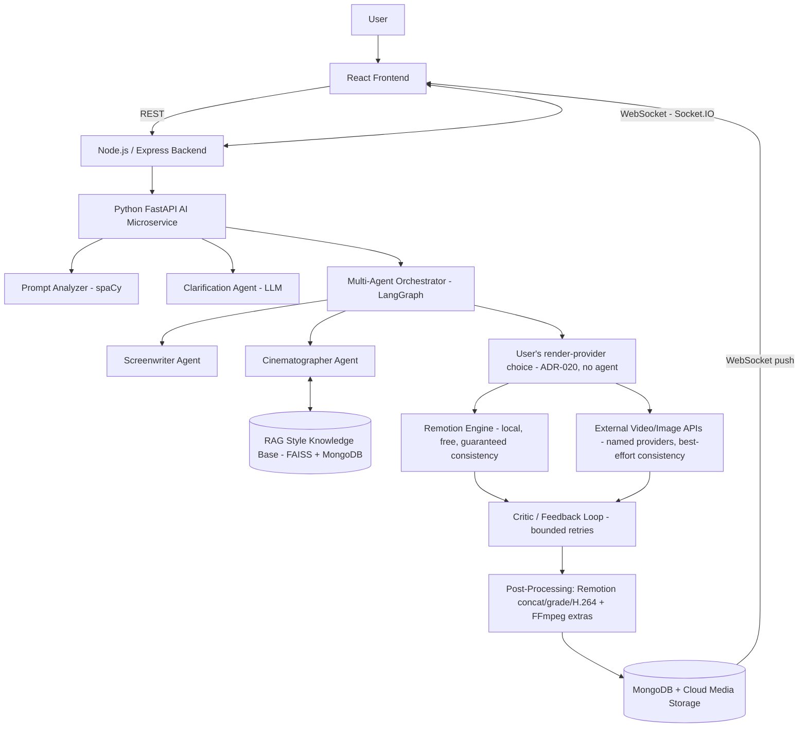

### 4.2 Frontend/backend communication diagram

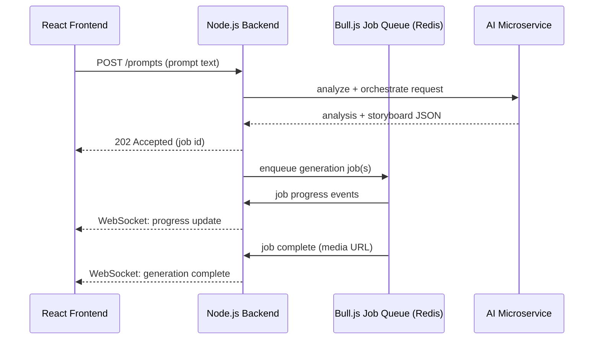

### 4.3 Backend/service architecture

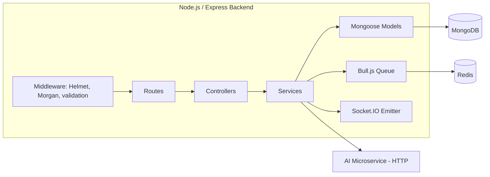

### 4.4 AI/ML pipeline diagram

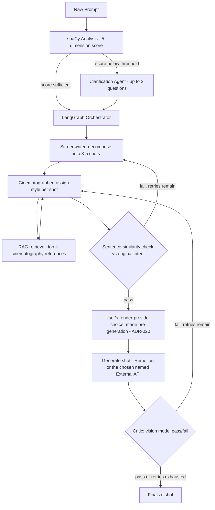

### 4.5 Database relationship diagram

See Section 10.2 for the full ER diagram (kept there to avoid duplicating the schema definition in two places).

### 4.6 Main user workflow

See Section 16.1 for the primary end-to-end sequence diagram.

### 4.7 Important data-processing workflow: Evaluation Study

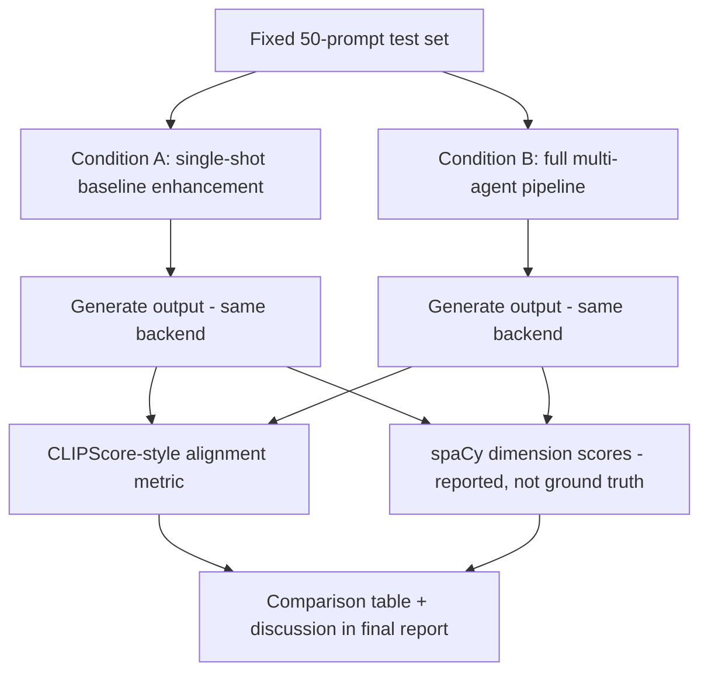

### 4.8 External API/service integration diagram

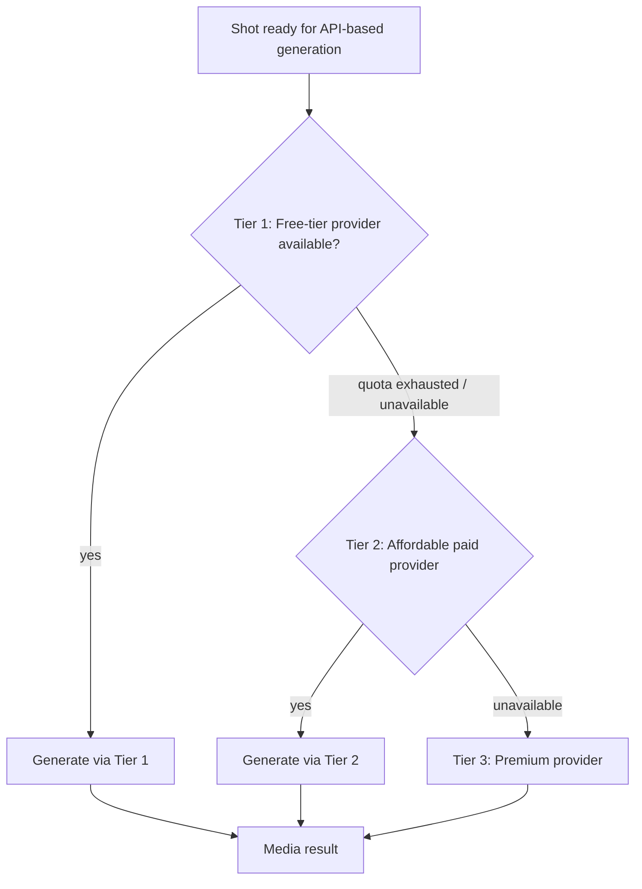

> Note: no specific vendor names appear in this diagram because none are confirmed in the proposal (see Section 12). The tiering *strategy* is decided; the specific providers within each tier are `TBD`.

### 4.9 Deployment architecture diagram (PROPOSED — not decided by the team)

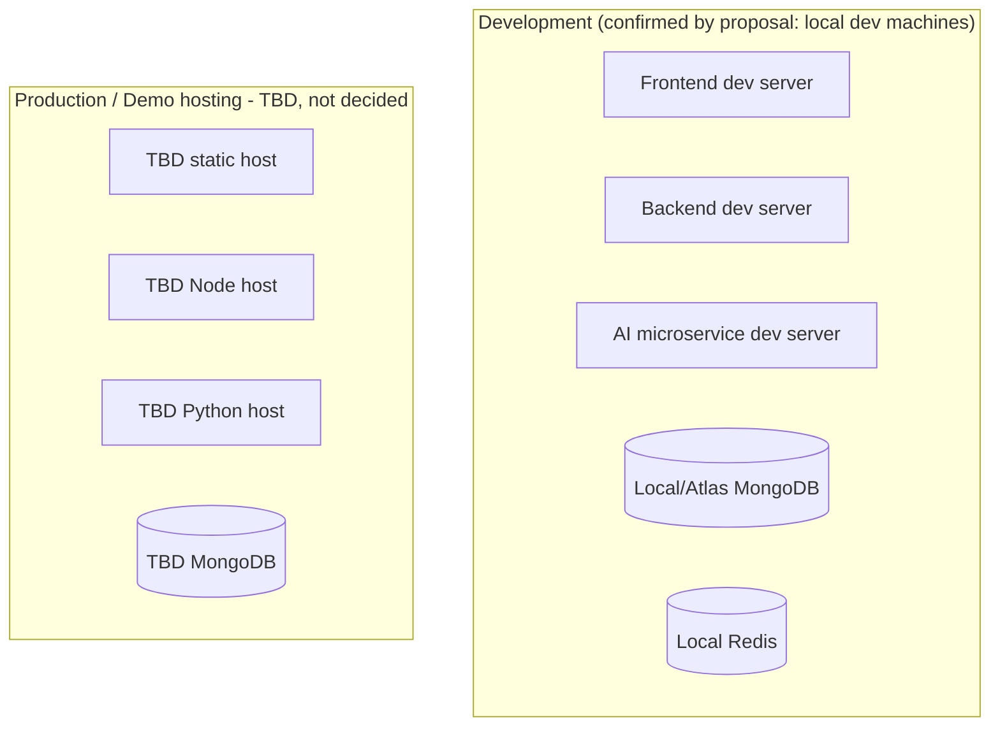

The proposal never discusses a production deployment target — only that development and testing happen on local machines to control cost (Section 5.4, Budget). Treat the "Prod" half of this diagram as a placeholder to be filled in once the team makes that decision, not as an existing plan.

---

## 5. Technology Stack

Source: proposal §9 ("Tools and Technologies") and §6 ("Proposed Methodology"). The "Alternatives Considered" column is filled in only where the proposal explicitly discusses a tradeoff; everywhere else it is marked accordingly rather than invented.

| Technology | Purpose | Where Used | Why Used | Alternatives Considered |
|---|---|---|---|---|
| React 18 | Frontend UI framework | Frontend app | Team familiarity; component model fits prompt studio/storyboard UI | Not documented in proposal |
| Vite | Frontend build tool | Frontend app | Standard fast dev-server pairing with React | Not documented |
| Tailwind CSS | Styling | Frontend app | Utility-first styling | Not documented |
| shadcn/ui | Component library | Frontend app | Pre-built accessible components | Not documented |
| Zustand | Frontend state management | Frontend app | Lightweight state management | Not documented |
| Recharts | Charting | Frontend app (e.g. quality-score visualisation) | — | Not documented |
| Framer Motion | Animation | Frontend app | UI polish | Not documented |
| Socket.IO Client | Real-time updates | Frontend app | Pairs with Socket.IO Server on backend | Not documented |
| Axios / React Query | HTTP client + data fetching/caching | Frontend app | — | Not documented |
| Node.js 20 | Backend runtime | Backend | — | Not documented |
| Express.js | Backend web framework | Backend | API gateway/routing | Not documented |
| MongoDB + Mongoose | Database + ODM | Backend, AI microservice (via metadata sync) | Document model fits variable-shape storyboard/shot data | Not documented |
| Bull.js | Async job queue | Backend | Keeps server non-blocking during 30–120s generation windows | Not documented |
| Redis | Job queue backing store | Backend | Required by Bull.js | Not documented |
| Socket.IO Server | Real-time push | Backend | Progress updates to frontend | Not documented |
| Morgan, Helmet | Logging middleware, security headers | Backend | — | Not documented |
| Cloud media hosting | Serve final video/image assets | Backend (API pathway) | — | **Provider TBD** — not named in proposal |
| Python 3.10 | AI microservice runtime | AI microservice | — | Not documented |
| FastAPI | AI microservice web framework | AI microservice | — | Not documented |
| Uvicorn | ASGI server for FastAPI | AI microservice | — | Not documented |
| spaCy (`en_core_web_sm`) | NLP prompt analysis | AI microservice — FR-1 | Dependency parsing, POS, NER for scoring | Not documented |
| LangChain / LangGraph | Multi-agent orchestration | AI microservice — FR-3 | "chosen over a hand-rolled if/else pipeline because the state-graph model gives explicit, inspectable control flow, conditional branching and bounded cycles for the retry logic" (proposal §9.1) | Hand-rolled if/else pipeline — explicitly rejected |
| Groq API | Primary LLM inference | AI microservice — FR-2, FR-3 | "chosen because the orchestrator issues multiple sequential calls per generation, where inference latency compounds noticeably" — low-latency priority (proposal §9.1) | A single higher-latency provider for all calls — implicitly rejected in favour of a tiered primary/fallback split |
| Fallback LLM API (DECIDED — ADR-016: hosted, default = second Groq model `llama-3.1-8b-instant`) | Absorbs Groq primary unavailability (429/5xx/connection); higher-complexity reasoning | AI microservice — FR-3 (hard cases), FR-8 (critic) | Used only on primary failure, not the default path | **Resolved (ADR-015 hosted-only, ADR-016 default vendor).** Any OpenAI-compatible host works via `FALLBACK_LLM_BASE_URL`. Vision capability for the FR-8 critic is a separate open item. |
| sentence-transformers (`all-MiniLM-L6-v2`) | Embeddings | AI microservice — FR-3 (intent similarity), FR-4 (RAG) | — | Not documented |
| FAISS + MongoDB metadata | Vector similarity search | AI microservice — FR-4 | "chosen for simplicity and to avoid depending on a separate managed vector-database service" (proposal §9.1) | A managed vector-database service — explicitly rejected |
| Remotion | Programmatic video rendering | AI microservice/backend — FR-5 | Guaranteed determinism/consistency at zero API cost | Not documented |
| Manim | Alternative programmatic renderer | Optional, for mathematical/educational visualisations | — | Listed as optional alternative, not primary |
| FFmpeg | FR-8 critic frame extraction (implemented); FR-9 thumbnails + subtitles (implemented — ADR-028, needs a `--enable-libass` build for the burn-in). **Concatenation/grading/compression moved to Remotion — ADR-027** | Backend — FR-8, FR-9 | — | Not documented |
| Text-to-speech provider | Optional narration | Backend — FR-10 (stretch only) | — | **Provider TBD**, single free-tier provider by rule |
| Git and GitHub | Version control | All | — | Not documented |
| Postman | API testing | Backend | — | Not documented |
| Python `unittest` / `pytest` | AI microservice testing | AI microservice | — | Not documented |
| Jupyter Notebook | NLP/data exploration | AI microservice dev | — | Not documented |

**Explicitly TBD (not in the proposal's technology list at all):**
- Authentication/authorization technology (no auth system is described anywhere in the proposal — see Section 17 and Section 24).
- CI/CD tooling.
- Containerization (no Dockerfile, no `docker-compose.yml` mentioned or present).
- Monitoring/observability stack.
- Cloud hosting provider for production.
- Structured logging library for the Python AI microservice.

---

## 6. Detailed Component Architecture

Each component below currently has **zero implementation**. "Current implementation status" is included on every entry to make that impossible to miss.

### 6.1 Prompt Analyzer

- **Purpose:** First-pass, cheap (no LLM call) scoring of prompt quality.
- **Responsibilities:** Parse prompt, compute 5-dimension score, generate suggestions, decide whether to route to clarification.
- **Inputs:** Raw prompt string.
- **Outputs:** Structured JSON (see FR-1).
- **Dependencies:** spaCy, `en_core_web_sm`, a domain antonym dictionary (content not yet authored).
- **Technologies:** Python, spaCy, FastAPI endpoint.
- **Internal structure (PROPOSED):** `analyzer/pipeline.py` (spaCy pipeline setup), `analyzer/scoring.py` (dimension scoring logic), `analyzer/antonyms.json` (contradiction dictionary data).
- **Communication:** Called synchronously by the backend (or AI microservice entrypoint) at the start of every generation request.
- **Failure modes:** Non-English input; spaCy model not installed in the runtime environment; empty prompt.
- **Security considerations:** Treat prompt text as untrusted; no code execution risk in this component itself.
- **Performance considerations:** Should be fast (no network call) — a good candidate for a tight latency budget (`TBD` numeric target).
- **Testing requirements:** Unit tests on known-good/known-bad example prompts (proposal §6.11).
- **Current implementation status:** `NOT_IMPLEMENTED`.
- **Future work:** Author the antonym dictionary; decide the exact 0–100 scoring formula/weights per dimension (proposal shows the *output shape*, not the scoring *formula* — this is a genuine open design decision, `TBD`).

### 6.2 Conversational Clarification Agent

- **Purpose:** Resolve ambiguity via targeted Q&A instead of guessing.
- **Responsibilities:** Generate ≤2 follow-up questions; parse user answers into structured brief; merge into prompt.
- **Inputs:** FR-1 flags, prior prompt text, user answers.
- **Outputs:** Clarified prompt, brief object.
- **Dependencies:** Primary LLM API (Groq), structured-output parsing.
- **Technologies:** Python, LangChain (for structured output parsing), Groq SDK.
- **Communication:** Called after FR-1 when flags are present; talks to frontend via the backend's request/response or WebSocket channel.
- **Failure modes:** LLM timeout; user never responds (session timeout behavior `TBD`).
- **Security considerations:** User free-text answers are untrusted input for downstream prompt construction (prompt-injection risk into later agent calls).
- **Testing requirements:** Integration test simulating a full clarification round-trip.
- **Current implementation status:** `NOT_IMPLEMENTED`.
- **Future work:** Define exact timeout/skip behavior if user abandons clarification.

### 6.3 Multi-Agent Orchestrator (LangGraph)

- **Purpose:** Coordinate the Screenwriter and Cinematographer agents as a single state graph.
- **Responsibilities:** Own the storyboard decomposition process end-to-end, including the bounded retry loop on the intent-similarity check. Does **not** own pathway/provider assignment — that's a user selection applied by the backend after the graph completes (FR-6, ADR-020).
- **Inputs:** Clarified prompt.
- **Outputs:** Storyboard JSON (see FR-3) — shots carry no `pathway` field from this component; the backend adds it afterward from the user's FR-6 selection.
- **Dependencies:** LangGraph, Groq API, fallback LLM API, sentence-transformers.
- **Internal structure:** `ai-service/orchestrator/graph.py` (LangGraph `StateGraph` definition — `screenwriter` → `cinematographer` → `intent_check` → END, per ADR-001 + ADR-012's ordering + AI-008's SIM-check placement from Section 4.4; the `producer` node from ADR-013 is removed per ADR-020), `ai-service/orchestrator/agents/screenwriter.py` (IMPLEMENTED — AI-004, no longer emits a `pathway` placeholder), `ai-service/orchestrator/agents/cinematographer.py` (IMPLEMENTED — AI-007), `ai-service/orchestrator/similarity.py` (IMPLEMENTED — AI-008), `ai-service/orchestrator/state.py` (shared `OrchestratorState` TypedDict, including `attempt_count`/`similarity_score`). `ai-service/orchestrator/agents/producer.py` (AI-005) is retired and removed from the codebase — git history retains it if it's ever needed for reference.
- **Communication:** Cinematographer agent communicates with the RAG module (Section 6.4); the intent-similarity check reuses the same RAG module's embedder (not a corpus/index query). Pathway/provider is no longer this component's concern at all — see Section 6.6.
- **Failure modes:** Incoherent storyboard output (Risk table: Medium likelihood, Medium impact — mitigated by the now-implemented bounded retry + similarity check, AI-008); LLM API failure requiring fallback.
- **Security considerations:** Same prompt-injection surface as 6.2, compounded across 2 LLM agent roles (the similarity check itself makes no LLM call).
- **Performance considerations:** Multiple sequential LLM calls per generation (1 + N shots, now possibly ×(1 + retries) on intent-check failure) — latency compounds, which is *why* Groq was selected as primary (Section 5). Removing the Producer/Router node (ADR-020) also removes one LLM call per generation.
- **Testing requirements:** Unit tests with mocked LLM responses; integration test on real storyboard generation (proposal §6.11).
- **Current implementation status:** `IN_PROGRESS`. Screenwriter (AI-004), Cinematographer (AI-007), and the intent-similarity retry loop (AI-008) are implemented and verified: `POST /storyboard/generate` (ai-service) decomposes a clarified prompt into a 3-5 shot storyboard (`storyboard_id`, `world_state{characters, setting, style_tokens}`, `shots[]{shot_id, description, camera, duration_s}`), the Cinematographer grounds each shot's `camera` and `world_state.style_tokens` in passages retrieved from the RAG-003 persisted index, and the intent-similarity check (AI-008) then embeds the clarified prompt and the joined shot descriptions with the same all-MiniLM-L6-v2 encoder and — below `STORYBOARD_SIMILARITY_THRESHOLD` (0.35, ADR-018) — routes back to the Screenwriter for up to `MAX_STORYBOARD_RETRIES` (2) bounded attempts, finalizing the last attempt on exhaustion rather than failing the request. Cinematographer degrades gracefully to a pass-through if the index is empty or unbuilt. Live-verified in WSL2 against the real Groq API + real embedder: a normal prompt passed the intent check on the first attempt (real cosine similarity ~0.7); a forced impossible threshold (1.5) exercised the retry ceiling for real, confirming 3 total attempts then finalization, not a hang. **AI-005 (Producer/Router) is retired per ADR-020** — pathway is now assigned by the backend from the user's FR-6 selection, not by this component.
- **Future work:** None remaining for the LLM-orchestration vertical itself; the forward dependency is now the backend's pathway-stamping logic (BACKEND-005 extension) and INTEG-001.

### 6.4 RAG Style Knowledge Base

- **Purpose:** Ground Cinematographer decisions in retrieved reference material.
- **Responsibilities:** Corpus curation, embedding, indexing, top-k retrieval.
- **Inputs:** Shot description (query); the corpus itself (offline, curated once then updated incrementally).
- **Outputs:** Top-k (default 3) relevant passages.
- **Dependencies:** sentence-transformers, FAISS, a curated corpus (now curated — RAG-002, `ai-service/rag/corpus/`, 75 passages across 8 categories).
- **Technologies:** Python, FAISS, `all-MiniLM-L6-v2`.
- **Failure modes:** Sparse/no corpus coverage for unusual style requests.
- **Testing requirements:** Precision-at-k check on a labelled sample of style queries (proposal §6.11).
- **Current implementation status:** `IN_PROGRESS` (infrastructure `IMPLEMENTED`, consumer `IMPLEMENTED`, only the retry loop remains). Index scaffold verified (RAG-001): `ai-service/rag/index.py` (`VectorIndex` — FAISS `IndexFlatIP` over L2-normalized vectors = cosine per FR-4, JSON metadata sidecar, graceful empty queries, `save`/`load`) and `ai-service/rag/embedder.py` (lazy-cached real `all-MiniLM-L6-v2`). Corpus content verified (RAG-002): `ai-service/rag/corpus/` — 75 curated `{text, metadata}` passages (`cinematography.json`) across 8 categories, all original license-clean technique summaries per the FR-4 security note. Populated production index verified (RAG-003): `ai-service/rag/build_index.py` (`build_index()` + `python -m rag.build_index`) embeds the full corpus and persists `rag/data/style_index.{faiss,meta.json}` (384-dim, gitignored derived artifact, idempotently rebuilt from the committed corpus). **Consumer verified (AI-007):** `ai-service/orchestrator/agents/cinematographer.py` queries this index per shot as the orchestrator's second node (Section 6.3) and grounds `camera` + `world_state.style_tokens` in the retrieved passages — live-verified end-to-end against the real Groq API and the real persisted index, with a film-noir prompt producing camera/style output built from exact corpus technique names (Dutch angle, Low-key lighting, Handheld shot), confirming genuine retrieval grounding rather than LLM invention. See PROJECT_PROGRESS.md Section 2 for the full verification record.
- **Metadata sync (ADR-004 + ADR-017):** vectors live in the FAISS index; per-vector metadata (source text + dict) is the paired store. Section 10's `embeddings` collection is the eventual canonical MongoDB metadata store, synced with the FAISS index — but that sync remains **deliberately deferred (ADR-017)**: the sole consumer (AI-007) reads FAISS directly, the Python ai-service has no Mongo client, and adding an unread Mongo write would be speculative scaffolding. The JSON sidecar written beside the index (`{VECTOR_INDEX_PATH}.meta.json`) remains the canonical, self-contained, unit-testable metadata store; it holds Mongo-ready `{text, metadata}` rows so adopting the collection later is a load, not a re-embed. Revisit when a real reader of the collection exists.
- **Future work:** Corpus size/sourcing decided (RAG-002): 75 original, license-clean technique summaries across the 8 categories above, sized as a first pass — expand incrementally (then re-run `python -m rag.build_index`) if precision-at-k (§6.11) shows sparse coverage for unusual style requests. The RAG-001..003 + AI-007 + AI-008 vertical is now complete (see Section 6.3) — no further work planned here short of corpus expansion.

### 6.5 Remotion Rendering Engine

- **Purpose:** Free, deterministic-consistency video generation from code.
- **Responsibilities:** Maintain a library of pre-built compositions; map shot parameters onto them; render MP4.
- **Inputs:** Shot object + `world_state`.
- **Outputs:** Rendered MP4 per shot.
- **Dependencies:** Remotion, React, FFmpeg (for final MP4 encoding).
- **Failure modes:** No matching composition for an arbitrary shot description (open design question, see FR-5).
- **Current implementation status:** `IN_PROGRESS`. Five compositions exist (`remotion/src/`): `TitleCard` (generic intro/branding card), `WideShot`/`MediumShot`/`CloseUpShot` (keyed on shot type, per the resolved R-11 taxonomy), and `StoryboardVideo` (FR-9 whole-storyboard assembly). Each renders a real MP4 from a `Shot`/`WorldState`-shaped prop (`remotion/src/types.ts`), with duration derived from `shot.duration_s` via `calculateMetadata` — not hardcoded. A shared `theme.ts` deterministically maps `world_state.style_tokens` to a palette, so the same storyboard produces the same look across every shot (demonstrates FR-7 continuity). The shot→composition selection function (`selectCompositionId`) lives in `remotion/src/shotTaxonomy.mjs` with a documented fallback default — plain `.mjs` because it now has two consumers that cannot share a TypeScript module: the Node-side render entry points and the browser-side `StoryboardVideo` composition. Rendering uses `@remotion/bundler`/`@remotion/renderer`'s programmatic API (not the CLI), invoked by `backend/src/services/remotionService.js` via `child_process.execFile` (array args, `shell: false`, so untrusted shot text is never interpolated into a shell command). Verified end-to-end from the backend, for a taxonomy-matching shot, a deliberately unrecognized one, and a full three-shot storyboard.
- **Compositions are image-first as of 2026-08-12.** They previously drew *only* text and gradients — no `` element existed anywhere in `remotion/src/` — so a storyboard rendered through this pathway produced video of nothing but its own caption text. `components/ShotLayer.tsx` now renders the shot's generated still under the composition's camera move, with the theme applied as a grade + vignette; the original motion-graphics card remains as the fallback when a shot has no `imageSrc` (i.e. a pure-Remotion storyboard), which is what this pathway legitimately produces on its own. Remotion cannot generate imagery — it composites what it is given — so this is the correct division of labour: the image provider supplies the frame, Remotion supplies the motion and the continuity grade.
- **Not yet implemented:** audio (FR-10, stretch). Thumbnail extraction and subtitle overlay were FFmpeg's job and are now done — see ADR-028 and §6.8.

### 6.6 External API Integration Layer

- **Purpose:** Give the user a named menu of rendering options — Remotion (free) plus real, working paid-but-cheap providers — and execute whichever one they explicitly picked (ADR-020; no longer a Tier 1→2→3 auto-fallback strategy, no longer an agent decision).
- **Responsibilities:** Provider dispatch by explicit user selection, request/response translation per provider, job submission via Bull.js (once INTEG-001 wires that in).
- **Dependencies:** Bull.js, Redis. Tier 1 providers selected AND live-validated (PROVIDER-001, ADR-019): Pollinations.ai (image, no account/key at all) and Cloudflare Workers AI (image alternate, free account + API token, no credit card — real text-to-image catalog confirmed live). Hugging Face Inference Providers is the **video** provider (token live-validated) — Cloudflare has no video-generation model in its real catalog, re-confirmed live 2026-08-11 with a freshly rotated Cloudflare token (61 models, 10 task categories, none video-related). Tier 2/3 (fal.ai) selected but deliberately not wired up yet — team chose to stay free-only while testing (ADR-019).
- **Internal structure:** `backend/src/services/externalApiService.js` exposes an explicit **dispatcher**, `generateByProvider(providerId, prompt)` where `providerId` is exactly the value the user picked in the frontend (`'remotion'` is handled by the existing `remotionService.js` pathway, not this module) — `'pollinations'`, `'cloudflare'`, or `'huggingface'` route to one adapter module each under `backend/src/services/providers/` (`pollinationsImage.js`, `cloudflareImage.js`, `huggingfaceVideo.js`). **No automatic cross-provider fallback** (changed by ADR-020 from the earlier same-tier-fallback design): once the user has explicitly named a provider, silently substituting a different one on failure would contradict their choice, so a failure now surfaces as an error for that generation instead. Providers stay swappable without touching orchestration logic, per the Risk-table mitigation "abstraction layer isolates provider-specific code" — the fal.ai adapter, when added, is a later additive `case` in the same dispatcher + one env var, not a refactor.
- **Current implementation status:** `IN_PROGRESS` (BACKEND-005 + ADR-020 restructure). Adapter code for all three Tier 1 providers is complete. **Image generation is live-verified end-to-end** for both providers: Pollinations returned a real JPEG (no account), Cloudflare's `flux-1-schnell` returned a real JPEG via its JSON/base64 response shape (`{success, result: {image: <base64>}}` — always JSON regardless of HTTP status, live-confirmed 2026-08-11, and re-confirmed after a Cloudflare token rotation the same day). **Video generation is code-complete but not yet live-verified**: `huggingfaceVideo.js` correctly authenticates and routes a real `textToVideo` call (via the official `@huggingface/inference` client, model `Wan-AI/Wan2.1-T2V-1.3B` on the `fal-ai` backend, chosen as the cheapest available text-to-video model to conserve credits) but the account's monthly Hugging Face Inference Providers free credits are already depleted (`InferenceClientProviderApiError`: "You have depleted your monthly included credits"), discovered live during this session — this was not visible from PROVIDER-001's `whoami` auth check, which only confirmed the token/scope, not remaining spend. This is an account/billing constraint, not a code defect; FR-6's "at least one real video generated" acceptance criterion is **not yet met** and must not be marked verified until it is. See the R-8 risk row for options.
- **Future work:** Live-verify `generateByProvider('huggingface', ...)` once Hugging Face's monthly credits reset (`periodEnd` confirmed live via `whoami-v2`: 2026-09-01) or the team pre-pays a modest prepaid credit balance sized for the whole remaining project (a real-money decision for the team, not made here — see PROJECT_PROGRESS.md for the cost estimate). No further code changes are expected to be needed for that verification to succeed — the request path is already proven correct up to the billing rejection.

### 6.7 Critic / Feedback Loop

- **Purpose:** Automated quality gate with bounded retries.
- **Responsibilities:** Frame extraction, vision-model evaluation, structured verdict, triggering revision+retry.
- **Dependencies:** A vision-capable model — **decided: Cloudflare Workers AI's `@cf/meta/llama-4-scout-17b-16e-instruct`, not the fallback LLM** (Groq's live catalog has no vision models — checked, not assumed). See ADR-026.
- **Current implementation status:** `VERIFIED` (CRITIC-001, 2026-08-12). `ai-service/critic/vision_client.py` (`evaluate_frame`) + `POST /critic/evaluate`; `backend/src/services/criticService.js` (`runCriticLoop`) does frame extraction (`ffmpeg` for `.mp4`, direct read for images) and the bounded regenerate-then-reevaluate loop, called from `generationQueue.js` after each shot completes. Scoped to `pathway === 'external_api'` shots only — Remotion's stylized placeholder render can't be meaningfully judged against a literal text description (discovered live; see ADR-026).
- **Future work:** The proposal's "Cinematographer revises the shot" step (an LLM rewriting description/camera between retries, rather than an unchanged retry) is deliberately deferred — not required by FR-8's stated completion criterion.

### 6.8 Post-Processing Pipeline

- **Purpose:** Assemble final deliverable video.
- **Responsibilities:** Concatenation, colour grading and compression (**Remotion**, ADR-027); thumbnailing and subtitles (**FFmpeg**, ADR-028).
- **Dependencies:** Remotion for assembly; FFmpeg (`--enable-libass`) for the poster frame and the subtitle burn-in.
- **Split of labour:** the two halves are not interchangeable. Remotion *produces* the video, so anything that needs to know about individual shots, camera moves or the FR-7 theme belongs there. FFmpeg operates *on* the finished video, so it owns the derived artifacts — poster frame, caption track, hardsubbed copy. Everything FFmpeg does here is additive: `storyboard.mp4` is never modified or replaced.
- **Failure modes:** Codec/resolution mismatch between Remotion output and API-provider output when concatenating — structurally avoided rather than handled, since everything now passes through one renderer at a fixed 1920×1080/30fps (R-10, Section 24). Post-processing failures are non-fatal and isolated per artifact. Caption/picture desync is guarded against explicitly: cues are refused if their frame total disagrees with the render's.
- **Current implementation status:** `IMPLEMENTED` (INTEG-002 `VERIFIED` 2026-08-12). `backend/src/services/ffmpegService.js`. Not covered: cloud media hosting (local disk only, provider `TBD`) and audio/narration (FR-10, stretch).

### 6.9 Frontend Application

- See Section 7 in full.
- **Current implementation status:** `NOT_IMPLEMENTED`.

### 6.10 Backend API Gateway

- See Section 8 in full.
- **Current implementation status:** `NOT_IMPLEMENTED`.

---

## 7. Complete Frontend Architecture

**Current status: `NOT_IMPLEMENTED`.** No `frontend/` directory exists in the repository. Everything in this section is `PROPOSED` — a reasonable starting structure consistent with the proposal's named technologies and features, not a decision the team has ratified.

### Proposed folder structure

```text
frontend/                          [PROPOSED — does not exist yet]
├── src/
│   ├── pages/
│   │   ├── PromptStudio.tsx        # main prompt entry + clarification chat
│   │   ├── StoryboardReview.tsx    # storyboard/shot timeline view
│   │   └── History.tsx             # prompt/version history
│   ├── components/
│   │   ├── ClarificationChat/
│   │   ├── StyleConfigurator/
│   │   ├── ProgressTracker/        # WebSocket-driven progress UI
│   │   ├── StoryboardTimeline/
│   │   └── VideoPlayer/
│   ├── state/                      # Zustand stores
│   ├── api/                        # Axios/React Query API client
│   ├── hooks/
│   └── App.tsx
├── package.json                    [NOT_IMPLEMENTED]
├── vite.config.ts                  [NOT_IMPLEMENTED]
└── tailwind.config.js              [NOT_IMPLEMENTED]
```

### Pages/components (derived from proposal §6, §7)

| Page/Component | Purpose | API calls (proposed) | State | User actions |
|---|---|---|---|---|
| Prompt Studio | Prompt entry + clarification chat | `POST /api/prompts` (PROPOSED, Section 9) | Current prompt, clarification history | Type prompt, answer clarification questions |
| Style Configurator | Choose genre/lighting/camera style tokens, **and** the render provider (ADR-020: Remotion free / Pollinations / Cloudflare / Hugging Face, by name, cost badge per option) | Feeds into `POST /api/storyboards` as `styleTokens` + `renderProvider` | Selected style tokens, selected render provider | Select style options, select one render provider |
| Storyboard Timeline | Review generated storyboard, per-shot status | `GET /api/storyboards/:id` (PROPOSED) | Storyboard JSON, per-shot pathway/status | Review shots, trigger generation |
| Progress Tracker | Real-time generation progress | WebSocket events (PROPOSED event names, Section 9.3) | Job status, retry indicators | Passive (watch) |
| Version/Prompt History | Browse past prompts and their enhancement diffs | `GET /api/prompts/:id/history` (PROPOSED) | History list | Browse past sessions |

Data flow, error handling, loading states, and validation for these components are **not specified** in the proposal beyond "mobile-responsive," "error handling," and "loading states" being named as required deliverables (proposal §7 individual-tasks table, Hammad's Dec 2026–Apr 2027 task). Exact behavior is `TBD` and should be designed during Phase 3.

---

## 8. Complete Backend Architecture

**Current status: `NOT_IMPLEMENTED`.** No `backend/` directory exists. Structure below is `PROPOSED`.

### Proposed folder structure

```text
backend/                           [PROPOSED — does not exist yet]
├── src/
│   ├── routes/
│   │   ├── prompts.js              [IMPLEMENTED — BACKEND-004, no controllers/ split yet]
│   │   ├── storyboards.js          [IMPLEMENTED — BACKEND-004, no controllers/ split yet]
│   │   └── jobs.routes.js
│   ├── controllers/
│   ├── services/
│   │   ├── aiServiceClient.js      [IMPLEMENTED — BACKEND-004, calls the Python FastAPI microservice]
│   │   ├── remotionService.js
│   │   ├── externalApiService.js   [IMPLEMENTED — BACKEND-005, image tier live-verified, video tier code-complete but credit-blocked; see Section 6.6]
│   │   └── ffmpegService.js
│   ├── models/                     # Mongoose schemas (Section 10)
│   ├── queues/
│   │   └── generationQueue.js      [IMPLEMENTED — BACKEND-003, scaffold + placeholder processor only]
│   ├── sockets/
│   │   └── progressEmitter.js      # Socket.IO
│   ├── middleware/
│   │   ├── validation.js           [IMPLEMENTED — BACKEND-004, requireFields() only so far]
│   │   └── errorHandler.js         [IMPLEMENTED — BACKEND-004, ApiError + notFoundHandler + centralized handler]
│   └── app.js
├── package.json                    [NOT_IMPLEMENTED]
└── .env.example                    [NOT_IMPLEMENTED — see Section 13]
```

### Responsibilities per layer

| Layer | Responsibility | Status |
|---|---|---|
| Routes | Define REST endpoints, delegate to controllers | `IN_PROGRESS` — prompts.js/storyboards.js handle request/response directly (no separate controllers/ layer yet); jobs.routes.js not started |
| Controllers | Request/response handling, input validation | `NOT_IMPLEMENTED` — folded into routes/ for now |
| Services | Business logic — AI microservice calls, Remotion invocation, external API calls, FFmpeg invocation | `IN_PROGRESS` — aiServiceClient.js and remotionService.js implemented; externalApiService.js/ffmpegService.js not started |
| Models | Mongoose schemas for prompts, storyboards, embeddings, jobs | `IN_PROGRESS` — prompts/storyboards done (BACKEND-002); embeddings/jobs not started |
| Queues | Bull.js async job management for generation | `IMPLEMENTED` — generationQueue.js now runs the real per-storyboard generation job (INTEG-001/ADR-023): `POST /storyboards/:id/generate` enqueues it and returns `202 {jobId}`; the in-process worker renders/generates each shot, persisting per-shot progress to Mongo; `GET /api/jobs/:id` polls state/progress. Verified end-to-end against real Redis (WSL2) + Mongo (11/11 checks). A production deploy would split the worker into its own process (no code change) |
| Sockets | Socket.IO progress push | `NOT_IMPLEMENTED` |
| Middleware | Helmet (security headers), Morgan (logging), validation, centralized error handling | `IMPLEMENTED` — Helmet/Morgan since BACKEND-001; validation.js/errorHandler.js since BACKEND-004 |

No authentication/authorization middleware is listed because **no auth system is specified anywhere in the proposal.** This is a genuine gap — see Section 17 and Section 24.

---

## 9. API Documentation

**Prompts and Storyboards endpoints below are now implemented (BACKEND-004)** — real routes in `backend/src/routes/`, live-verified end-to-end against MongoDB and the real ai-service (see PROJECT_PROGRESS.md session log). Generation/Jobs endpoints (Section 9.3) remain `PROPOSED` — they depend on BACKEND-003/BACKEND-005, not yet built. **Do not treat unimplemented paths as final** — confirm when their turn comes and update this section then.

### 9.1 Prompts

| | |
|---|---|
| **Method / URL** | `POST /api/prompts` |
| **Status** | `IMPLEMENTED` (BACKEND-004) |
| **Purpose** | Submit a raw prompt; triggers analysis (FR-1) and, if needed, returns clarification questions (FR-2) |
| **Auth** | None specified — `TBD` |
| **Request body** | `{ "prompt": string }` — `styleTokens` from the original PROPOSED shape is not accepted yet (no Style Configurator wiring, FRONTEND-003) |
| **Response (201)** | `{ "promptId": string, "analysis": {...FR-1 schema...}, "clarificationQuestions"?: string[] }` |
| **Error responses** | `400` missing `prompt`; `502` ai-service unreachable/error |
| **Dependencies** | FR-1, FR-2 |

| | |
|---|---|
| **Method / URL** | `POST /api/prompts/:id/clarify` |
| **Status** | `IMPLEMENTED` (BACKEND-004) |
| **Purpose** | Submit answers to clarification questions |
| **Request body** | `{ "questions"?: string[], "answers": string[] }` — `questions` echoes back what `/api/prompts` returned, needed because nothing persists them server-side yet |
| **Response (200)** | `{ "clarifiedPrompt": string, "brief": object }` |
| **Error responses** | `400` missing `answers`; `404` unknown/malformed `:id`; `502` ai-service unreachable/error |

### 9.2 Storyboards

| | |
|---|---|
| **Method / URL** | `POST /api/storyboards` |
| **Status** | `IMPLEMENTED` (BACKEND-004), shape deviates from the original PROPOSED spec; extended for ADR-020 |
| **Purpose** | Trigger multi-agent decomposition (FR-3) for a (clarified) prompt, then stamp the user's chosen render provider (FR-6, ADR-020) onto every resulting shot |
| **Request body** | `{ "promptId": string, "renderProvider": "remotion" \| "pollinations" \| "cloudflare" \| "huggingface", "styleTokens"?: string[] }` — `renderProvider` required, validated against the known set; not the AI-005 agent decision (retired) |
| **Response (201)** | `{ "storyboardId": string, "status": "completed", "worldState": object, "renderProvider": string, "shots": object[] }` — **not** the originally PROPOSED `202 {storyboardId, status: "processing"}`; see ADR-014. The call is synchronous today because BACKEND-003's queue doesn't exist yet — revisit once it does. |
| **Error responses** | `400` missing `promptId`; `400` missing/unknown `renderProvider`; `404` unknown/malformed `promptId`; `502` ai-service unreachable/error |

| | |
|---|---|
| **Method / URL** | `GET /api/storyboards/:id` |
| **Status** | `IMPLEMENTED` (BACKEND-004) |
| **Purpose** | Fetch a storyboard's current state (shots, world_state, per-shot generation status) |
| **Response (200)** | Storyboard JSON per proposal §6.3 schema |
| **Error responses** | `404` unknown `:id`; `400` malformed `:id` |

### 9.3 Generation

| | |
|---|---|
| **Method / URL** | `POST /api/storyboards/:id/generate` |
| **Status** | `IMPLEMENTED` (ADR-023, 2026-08-11) — **now genuinely async**, resolving the ADR-021 synchronous stopgap |
| **Purpose** | Kick off generation for all shots (routes each to Remotion or external API per FR-6/FR-5) by enqueuing one Bull job (the whole storyboard) on the `generation` queue |
| **Response (202)** | `{ "jobId": string, "storyboardId": string, "status": "queued" }` — returns immediately; the worker generates each shot in the background, persisting per-shot `status`/`asset_url`/`error` to Mongo as it goes. A second call while a job is in flight returns that same `jobId` (in-flight dedup via `storyboard.job_id`). Poll `GET /api/jobs/:id` for progress. Held `huggingface` (video) shots still get `on_hold` (not attempted); failed shots get `failed`; the job continues past either. |
| **WebSocket events** | Not implemented — progress is via polling `GET /api/jobs/:id` (the proposal's documented WebSocket fallback); WebSocket push remains a future add (ADR-023) |

| | |
|---|---|
| **Method / URL** | `POST /api/images` |
| **Status** | `IMPLEMENTED` (ADR-021, 2026-08-11) |
| **Purpose** | Single-image mode (FR-6.1) — skip the storyboard/shot decomposition, generate exactly one image from the prompt's enhanced text via an explicit image-only provider (`pollinations` \| `cloudflare`) |
| **Request body** | `{ promptId: string, provider: 'pollinations' \| 'cloudflare', styleTokens?: string[] }` |
| **Response (201)** | `{ promptId, provider, originalPrompt, enhancedPrompt, imageUrl }` |

| | |
|---|---|
| **Method / URL** | `GET /api/jobs/:id` |
| **Status** | `IMPLEMENTED` (ADR-023, 2026-08-11) |
| **Purpose** | Poll a generation job's status. `:id` is the Bull `jobId` from `POST /storyboards/:id/generate` |
| **Response (200)** | `{ jobId, state, progress, storyboardId, failedReason?, shots[] }` — `state`/`progress` (0–100) read live from Bull (Redis); `shots[]` (per-shot `status`/`asset_url`/`error`) read from the storyboard doc |
| **Error responses** | `404` unknown `jobId` |

### 9.4 History

| | |
|---|---|
| **Method / URL** | `GET /api/prompts/:id/history` |
| **Status** | `PROPOSED` |
| **Purpose** | Prompt/version timeline for the frontend history view |

### Planned but not yet designed at all

- Evaluation-study endpoints (for FR-12) — the proposal describes this as an offline research study run by the team, not necessarily an exposed API. `TBD` whether this needs API surface at all.
- Any authentication endpoint — `TBD`, no auth system specified.

---

## 10. Database Architecture

**Current status: `IN_PROGRESS`.** `prompts` and `storyboards` (of the 5 collections below) have real Mongoose schemas (`backend/src/models/Prompt.js`, `backend/src/models/Storyboard.js`) and a working connection module (`backend/src/config/db.js`), verified 2026-08-10 with a real local MongoDB instance: connect, write, read-back, and clean disconnect all confirmed. `embeddings`, `jobs`, and `evaluation_runs` remain `NOT_IMPLEMENTED` (they belong to RAG-001, BACKEND-003, and the EVAL-* tasks respectively). Database technology is confirmed as **MongoDB** (proposal §5.2, §9.6); schema field names below are `PROPOSED`.

**Naming note:** the Mongoose schemas use **snake_case** field names (`raw_text`, `world_state`, `duration_s`, etc.), matching the proposal's actual wire-format JSON (§6.1, §6.3) and `remotion/src/types.ts` — not the camelCase shown in the ER diagram below, which is this document's own drafting inconsistency rather than a deliberate choice to diverge from the proposal. Treat the field *names* in this ER diagram as illustrative of the *shape*, not the literal case convention.

### 10.1 Collections

| Collection | Purpose | Created by | Modified by | Read by | Deleted when |
|---|---|---|---|---|---|
| `prompts` | Raw + clarified prompt text, FR-1 analysis result | Backend, on prompt submission | Clarification agent (adds clarified text) | Frontend (history view), Orchestrator | `TBD` — no retention policy specified |
| `storyboards` | Full storyboard: `world_state`, `render_provider` (user's FR-6 choice, ADR-020), `shots[]`, per-shot status/pathway/provider | Orchestrator, after FR-3 completes; backend stamps `render_provider` onto every shot immediately after | Generation services (update shot status), Critic loop (retry count) | Frontend (storyboard review), Post-processing | `TBD` |
| `embeddings` | Vector metadata for RAG corpus and/or prompt-similarity checks (paired with the FAISS index) | RAG corpus ingestion (offline), FR-3 similarity check | — | RAG retrieval, similarity check | `TBD` |
| `jobs` | Generation job status, provider used, retry count, cost tracking (`PROPOSED`, **DEFERRED** — ADR-023: Bull/Redis is the job store; job state/progress/failedReason live in Redis and per-shot results in the `storyboards` doc, so no separate Mongo `jobs` collection was added, same spirit as ADR-017. Revisit only if FR-12 needs durable cost/retry history beyond Redis) | Backend, on job enqueue | Bull.js worker, Critic loop | Frontend (progress), Evaluation study tooling | `TBD` |
| `evaluation_runs` | FR-12 results: prompt, condition (baseline/multi-agent), scores | Evaluation study tooling | — | Final report generation | Not deleted — part of the deliverable |

### 10.2 Entity relationship diagram

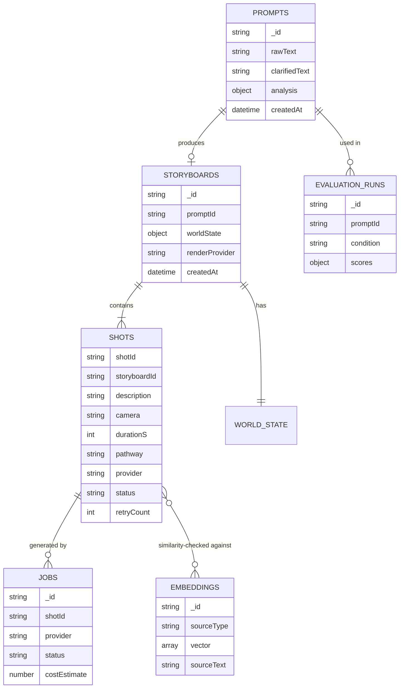

> This schema is `PROPOSED` in full — the proposal establishes *what data must exist* (world_state fields in Table `tab:worldstate`, the analysis JSON shape in §6.1, the storyboard JSON shape in §6.3) but does not define formal Mongoose schemas, indexes, or exact field names beyond those examples. Treat this ER diagram as a starting draft for Phase 2, not a ratified schema.

---

## 11. AI/ML Architecture

### 11.1 Prompt Analyzer (spaCy)

| | |
|---|---|
| Model | `en_core_web_sm` (spaCy) |
| Purpose | Rule/pipeline-based prompt quality scoring — not a trained classifier |
| Input | Raw prompt string |
| Output | 5-dimension score + flags + suggestions (JSON, proposal §6.1) |
| Preprocessing | None beyond spaCy's own tokenization |
| Postprocessing | Score aggregation across dimensions (exact formula `TBD`) |
| Inference method | Local, CPU, no GPU required |
| Hardware requirements | Runs on a standard development machine (proposal §5.4 budget: "Rs. 0 — runs on development machines") |
| Dependencies | spaCy, `en_core_web_sm` model download |
| Failure handling | `TBD` — no fallback behavior specified for non-English or malformed input |
| Expected latency | Not specified; should be low given no network call |
| Limitations | English-only; a rule-based heuristic, not a learned quality model — the proposal is explicit that this is *not* claimed as a research contribution in itself (see proposal §4, "Programmatic and Code-Driven Video Generation": "applies standard NLP tooling to a video-specific scoring rubric") |

### 11.2 LLM Agents (Screenwriter, Cinematographer, Clarification)

*(Producer/Router retired 2026-08-11 — ADR-020; provider routing is now a user selection, not an LLM call.)*

| | |
|---|---|
| Primary provider | Groq API, model `llama-3.3-70b-versatile` (confirmed 2026-08-10, ADR-011 — proposal itself only said "Groq-hosted open-weight models," e.g. Llama-family, without committing to a specific id) |
| Fallback provider | DECIDED (ADR-015/016): a HOSTED cloud LLM API, never local. Default = a second Groq model (`llama-3.1-8b-instant`) on the same key; env-overridable to any OpenAI-compatible host |
| Purpose | Storyboard decomposition, per-shot style assignment, clarification-question generation |
| Input | Clarified prompt / shot description / RAG-retrieved context |
| Output | Structured JSON (storyboard, shot parameters, clarification questions) via structured-output mode |
| Prompt/system instructions | Not specified in the proposal beyond role descriptions — actual system prompts for each agent are an implementation task, `NOT_IMPLEMENTED` |
| Model parameters | `TBD` (temperature, max tokens, etc. not specified) |
| Inference method | Remote API call |
| API requirements | Groq API key; fallback provider API key |
| Failure handling | Fallback to secondary LLM "where a step requires stronger reasoning than the primary model reliably provides" (proposal §6.3) |
| Expected latency | Groq explicitly chosen to minimize this, since "the orchestrator issues several LLM calls per generation" |
| Limitations | Multiple sequential calls per generation (1 Screenwriter + 1×N-shots for Cinematographer) — latency and cost compound with storyboard length |

### 11.3 Embedding Model

| | |
|---|---|
| Model | `all-MiniLM-L6-v2` (sentence-transformers) |
| Purpose | (a) Intent-similarity check between original and decomposed shots; (b) RAG corpus/query embedding |
| Input | Text (prompt, shot description, or corpus passage) |
| Output | 384-dimension vector (standard for this model) |
| Inference method | Local |
| Hardware | CPU-sufficient, runs on dev machine |

### 11.4 Critic Model (Vision-capable)

| | |
|---|---|
| Provider | **Decided (ADR-026, 2026-08-12): Cloudflare Workers AI, `@cf/meta/llama-4-scout-17b-16e-instruct`.** Not the fallback LLM — Groq's live model catalog has zero vision-capable models, checked directly rather than assumed. |
| Purpose | Evaluate rendered frames against the intended shot description |
| Input | Extracted frames (image) + shot description (text) — scoped to `external_api` (Pollinations/Cloudflare image) shots only; Remotion's stylized placeholder render isn't a literal depiction and can't be meaningfully judged this way (ADR-026) |
| Output | Structured pass/fail + reason (example JSON in proposal Appendix C) |
| Failure handling | Bounded retry (default max 2 attempts, `CRITIC_MAX_RETRIES`); on exhaustion, finalize with the last attempt rather than fail the job — live-verified (ADR-026) |

### 11.5 Complete AI Pipeline

```text
Raw Prompt
  ↓
spaCy Analysis (5-dimension score)
  ↓ (if below threshold)
Clarification Agent (≤2 questions, LLM)
  ↓
LangGraph Orchestrator
  ↓
  Screenwriter (LLM) → 3-5 shots
  ↓
  Cinematographer (LLM + RAG retrieval) → per-shot style params
  ↓
  Sentence-similarity validation (embedding model) → retry loop if failed
  ↓
User-selected render provider (chosen in frontend before generation, ADR-020) → stamped onto every shot
  ↓
Generation (Remotion local render OR external API call to the chosen named provider)
  ↓
Critic (vision model) → pass/fail → bounded retry loop if failed
  ↓
Validation (critic pass, or retries exhausted)
  ↓
Database (MongoDB) — persist final shot state
  ↓
Frontend (delivered video)
```

This mirrors the generic template in the user's documentation request, adapted to the actual named components — no invented steps.

---

## 12. External Services and Integrations

| Service | Status |
|---|---|
| **Groq API** | `PLANNED` (primary LLM). Purpose: low-latency inference for the multi-agent orchestration layer. Auth: API key (`GROQ_API_KEY`, placeholder — see Section 13). Rate limits: `TBD`, not documented. Fallback behavior: falls through to the secondary LLM API on failure or insufficient quality. Cost: proposal budgets "Rs. 0 – 2,000" assuming free-tier usage during development. |
| **Fallback LLM API** | `IMPLEMENTED` (AI-006). DECIDED (ADR-015/016): a HOSTED OpenAI-compatible endpoint, never local; default = second Groq model `llama-3.1-8b-instant` on the same `GROQ_API_KEY`. Purpose: absorb Groq primary unavailability. Auth: `FALLBACK_LLM_API_KEY` (blank → reuse `GROQ_API_KEY`). Cost: Rs. 0 on the Groq default; only a non-Groq override incurs the budgeted "Rs. 3,000 – 5,000." |
| **External video/image generation providers (Tier 1/2/3)** | **DECIDED and CREDENTIALS LIVE-VALIDATED (PROVIDER-001, ADR-019, 2026-08-11).** Tier 1 (free, active now): **image** = Pollinations.ai — `https://image.pollinations.ai/prompt/{text}`, no signup/API key/account at all; live-verified via `curl` → 200 OK, real 512×512 JPEG — plus Cloudflare Workers AI as a validated alternate (real account + API token confirmed live against Cloudflare's own API: account-scoped calls succeed, real text-to-image catalog of 287 models including FLUX.1/FLUX.2, SDXL, Leonardo Phoenix). **video** = Hugging Face Inference Providers (free monthly router credits; token live-verified via `whoami` → 200 OK, correct `inference.serverless.write` scope). Research initially proposed Cloudflare Workers AI for video too (citing "FLUX 3 Video"/"HappyHorse 1.0" models), but once real credentials existed this was checked directly against Cloudflare's live model catalog (`/ai/models/search`, filtered by task, by name substring, and by enumerating all task categories across all 287 models) — **no video-generation model or task category exists there**; that research was wrong (likely sourced from inaccurate secondary/SEO content), corrected same-day before any code was built on it. Hugging Face's documented cold-start latency is therefore an accepted, known limitation of the only free video option available, not a preference. Tier 2/3 (paid, **not yet wired up** — explicit team decision to stay free-only during testing): fal.ai, a single pay-as-you-go gateway (no subscription, ~$10 signup credit, one API key covers many underlying models — LTX-Video/Wan ~$0.02–0.08 for Tier 2, Kling/Veo ~$0.05–0.70 for Tier 3), to be added later as one adapter behind the Section 6.6 abstraction interface. Comfortably within budget when enabled ("Rs. 8,000 – 12,000" video / "Rs. 2,000 – 4,000" image). All Tier 1 credentials now live in `backend/.env` (gitignored). **BACKEND-005 update (2026-08-11):** adapter code built for all three; image tier (Pollinations + Cloudflare) live-verified end-to-end. Video tier hit a new blocker on its first real generation call — the account's Hugging Face monthly free credits are already depleted (`InferenceClientProviderApiError`, "You have depleted your monthly included credits") — a spend/billing limit invisible to the earlier `whoami` auth check. Code is verified correct up to that rejection; a real video has not yet been generated. |
| **Text-to-speech provider** | `PLANNED` (stretch-only), provider `TBD`. A single free-tier provider by explicit scope rule (proposal §5.2). Cost: budgeted "Rs. 0." |
| **Cloud media hosting** | `PLANNED`, provider `TBD`. Purpose: serve final video/image assets on the API pathway. Not named in the proposal. |

For every service above, credentials must be supplied via environment variables (Section 13) and **never** committed to the repository or hard-coded. Use `<API_KEY>`-style placeholders in all example configs.

**Development/testing strategy:** the proposal's budget structure (§5.4) explicitly assumes free-tier and trial-credit usage is prioritized throughout development, with paid tiers "reserved for final testing and demonstration." This is a cost-control policy, not a technical architecture decision — it does not change any code path, only which provider/tier is actually invoked at a given time.

---

## 13. Environment Variables

`.env.example` now exists at the repo root (SETUP-003) and is the source of truth; the table below mirrors it. `GROQ_MODEL` was added in AI-003 once a concrete Groq model id was confirmed working (see ADR-011) — the proposal only committed to "a Groq-hosted open-weight model," not a specific id.

```text
# --- Database ---
MONGODB_URI=                  # required, both dev and prod
REDIS_URL=                    # required (Bull.js job queue backing store)

# --- Primary LLM ---
GROQ_API_KEY=<API_KEY>        # required, primary agent-orchestration inference
GROQ_MODEL=llama-3.3-70b-versatile   # confirmed working model id (ADR-011)

# --- Fallback LLM (AI-006; ADR-015 hosted-only, ADR-016 default vendor) ---
# Hosted OpenAI-compatible /chat/completions endpoint, never a local model.
# Defaults (config.py) = a second Groq model on the same free key.
LLM_FALLBACK_ENABLED=true                          # false -> Groq failures fatal
FALLBACK_LLM_BASE_URL=https://api.groq.com/openai/v1
FALLBACK_LLM_API_KEY=                              # blank -> reuse GROQ_API_KEY
FALLBACK_LLM_MODEL=llama-3.1-8b-instant
LLM_TIMEOUT_SECONDS=60

# --- External video/image generation (PROVIDER-001, ADR-019) ---
# Tier 1 (free, active, credentials live-validated 2026-08-11).
# Image: Pollinations.ai needs NO key/account — it's a public URL API
# (https://image.pollinations.ai/prompt/{text}) — nothing to set. Cloudflare
# Workers AI is a validated alternate image provider (real text-to-image
# catalog: FLUX.1/FLUX.2, SDXL, Leonardo Phoenix — confirmed live, no credit
# card needed): https://dash.cloudflare.com
CLOUDFLARE_ACCOUNT_ID=<ACCOUNT_ID>
CLOUDFLARE_API_TOKEN=<API_TOKEN>
# Video: Hugging Face Inference Providers — NOT a fallback, this is the actual
# Tier 1 video provider. Cloudflare Workers AI has no video-generation model
# in its real catalog (checked live, ADR-019 corrected this after initial
# research suggested otherwise) — HF is the only free option that has one.
# https://huggingface.co/settings/tokens
HUGGINGFACE_API_TOKEN=<API_TOKEN>

# Tier 2/3 (paid) — NOT wired up yet; team chose free-only while testing
# (ADR-019). fal.ai is the selected single gateway for when these are
# enabled (one key, many models: LTX/Wan for Tier2, Kling/Veo for Tier3).
FAL_API_KEY=<API_KEY>             # not yet consumed by any code path

# --- Optional TTS (stretch feature only) ---
TTS_API_KEY=<API_KEY>             # TBD provider, optional

# --- Cloud media storage (provider TBD) ---
CLOUD_STORAGE_KEY=<API_KEY>
CLOUD_STORAGE_BUCKET=

# --- App config ---
PORT=                          # backend server port, TBD default
NODE_ENV=                      # development | production
AI_SERVICE_URL=                # internal URL for backend -> AI microservice calls

# --- AI microservice config ---
VECTOR_INDEX_PATH=rag/data/style_index   # RAG-001: base path; store writes {path}.faiss + {path}.meta.json
EMBEDDING_MODEL=all-MiniLM-L6-v2   # RAG-001/FR-4: corpus + query encoder (384-dim)
RAG_TOP_K=3                    # RAG-001/FR-4: default k for style retrieval
CRITIC_MAX_RETRIES=2           # confirmed default per proposal §6.7
STORYBOARD_SIMILARITY_THRESHOLD=0.35  # confirmed default per ADR-018 (max 2 retries)
ANALYSIS_SCORE_THRESHOLD=60    # confirmed default per proposal §6.1 ("default: 60/100")
```

| Variable | Required? | Dev-only or Prod too? | Notes |
|---|---|---|---|
| `MONGODB_URI` | Required | Both | — |
| `REDIS_URL` | Required | Both | — |
| `GROQ_API_KEY` | Required | Both | Never commit real value |
| `GROQ_MODEL` | Required | Both | Default `llama-3.3-70b-versatile`, confirmed available on the Groq API as of 2026-08-10 (ADR-011) |
| `FALLBACK_LLM_API_KEY` | Optional | ai-service | Blank → reuses `GROQ_API_KEY` (ADR-016 default: second Groq model, hosted) |
| `CLOUDFLARE_ACCOUNT_ID`/`CLOUDFLARE_API_TOKEN` | Required for FR-6 image Tier 1 (alternate) | Both | Free account, no credit card; live-validated 2026-08-11 (ADR-019) — real text-to-image catalog, no video models |
| `HUGGINGFACE_API_TOKEN` | Required for FR-6 video Tier 1 | Both | The actual video provider, not a fallback — Cloudflare has no video model (ADR-019); token live-validated 2026-08-11 |
| `FAL_API_KEY` | Required for FR-6 Tier 2/3 | Both | Selected (ADR-019) but deliberately not wired up yet — free-only during testing |
| `TTS_API_KEY` | Optional | Both | Stretch feature only |
| `CRITIC_MAX_RETRIES` | Required | Both | Default confirmed: `2` |
| `ANALYSIS_SCORE_THRESHOLD` | Required | Both | Default confirmed: `60` |
| `STORYBOARD_SIMILARITY_THRESHOLD` | Required | Both | Default confirmed: `0.35`, max 2 retries (ADR-018) |

**No real secrets appear anywhere in this document or should ever appear in any file in this repository.**

---

## 14. Folder and File Architecture

### 14.1 Actual current repository state

```text
fyp/                                  ← repository root (C:\Users\majid\Desktop\fyp)
├── VidCraft_Proposal.tex             ← the FYP proposal (LaTeX source). AUTHORITATIVE for intended design.
├── PROJECT_ARCHITECTURE.md           ← this file
├── PROJECT_PROGRESS.md               ← live development-state tracker
├── PROJECT_STATE.yaml                ← machine-readable mirror of progress
└── README.md                         ← orientation pointer to the above
```

That is the **entire** repository as of this writing. No other files, no `node_modules`, no `.git`, no build artifacts.

### 14.2 Proposed future structure

```text
fyp/
├── VidCraft_Proposal.tex
├── PROJECT_ARCHITECTURE.md
├── PROJECT_PROGRESS.md
├── PROJECT_STATE.yaml
├── README.md
├── frontend/                  [PROPOSED — Section 7]
├── backend/                   [PROPOSED — Section 8]
├── ai-service/                [PROPOSED]
│   ├── analyzer/
│   ├── orchestrator/
│   │   └── agents/
│   ├── rag/
│   ├── critic/
│   └── main.py
├── remotion/                  [top-level, per ADR-009 — not nested under ai-service/]
│   ├── package.json
│   ├── tsconfig.json
│   └── src/
│       ├── index.ts           (registerRoot)
│       ├── Root.tsx           (<Composition> registrations)
│       └── *.tsx               (individual compositions)
├── .env.example                [PROPOSED — Section 13]
└── docker-compose.yml          [TBD — not confirmed the team will containerize]
```

For every important file, once it exists, this section (and Section 6/7/8) must be updated to explain: purpose, responsibilities, dependencies, who imports/uses it, and what it should NOT contain (e.g. `.env.example` should never contain a real secret; `ai-service/orchestrator/agents/*.py` should not contain provider-specific HTTP logic — that belongs in the routing/adapter layer per the Section 6.6 abstraction-layer decision).

---

## 15. Data Flow

### 15.1 Primary generation flow (Remotion pathway, the guaranteed/demo-safe path)

```text
User Input (raw prompt)
  → Frontend (POST /api/prompts)
  → Backend Controller
  → AI Microservice: Prompt Analyzer (spaCy) → score
  → [if score < 60] Clarification Agent → merged prompt
  → AI Microservice: LangGraph Orchestrator
      → Screenwriter → shots[]
      → Cinematographer (+ RAG retrieval) → per-shot style
      → similarity check → (retry loop if needed)
  → Backend: applies the user's pre-selected renderProvider="remotion" (ADR-020) to every shot
  → Backend: Remotion render service → MP4 per shot
  → Backend: Critic loop (optional on this pathway, can run every shot since regen is free)
  → Backend: FFmpeg post-processing → concatenated final MP4
  → Database: persist storyboard + final media path
  → WebSocket: "generation:complete" → Frontend
  → Frontend: display final video
```

### 15.2 External API pathway (best-effort consistency, real cost)

```text
[same as above, but the user pre-selected renderProvider="pollinations"|"cloudflare"|"huggingface" (ADR-020) — applied to every shot]
  → Backend: Bull.js job enqueued per shot
  → Backend: externalApiService.generateByProvider() calls exactly the chosen provider — no auto-fallback to a different one (ADR-020)
  → External Provider API call (async, 30-120s)
  → Backend: Critic loop (bounded, max 2 retries — cost-capped on this pathway)
  → Backend: FFmpeg post-processing
  → Database + WebSocket + Frontend (same as above)
```

### 15.3 Evaluation study data flow

See the Mermaid diagram in Section 4.7 — this is a separate, offline research workflow, not part of the live user-facing pipeline.

---

## 16. User Workflows

### 16.1 Primary workflow: prompt to delivered video (happy path)

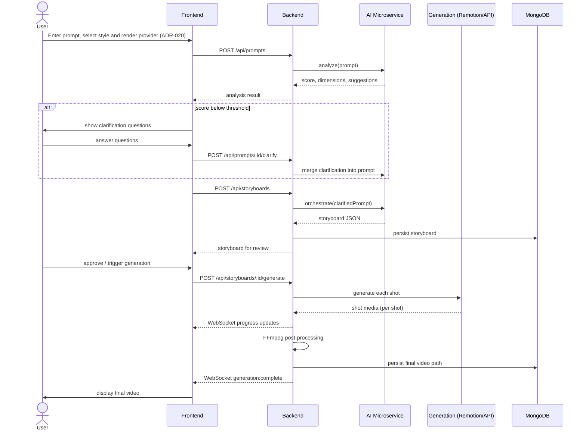

### 16.2 Error case: critic-triggered retry

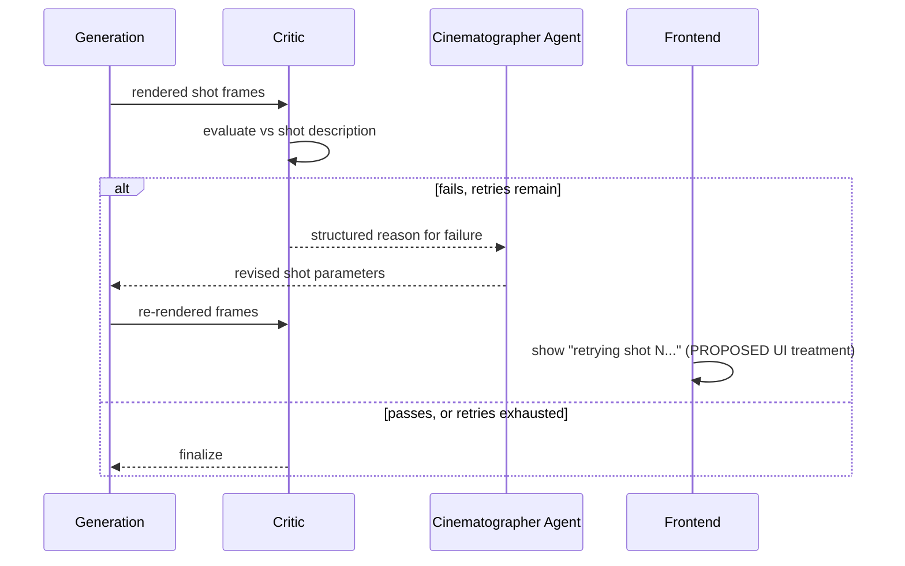

### 16.3 Error case: external API quota exhausted mid-tier

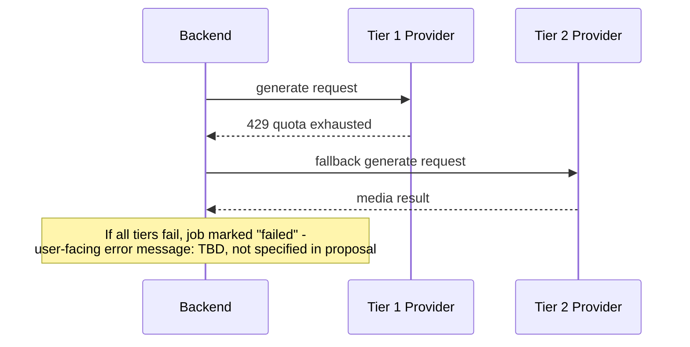

---

## 17. Security Architecture

### CURRENT

**Nothing.** No code exists, therefore no security mechanism of any kind is implemented. Do not describe this project as having any current security posture beyond "no attack surface exists because no deployed system exists."

### RECOMMENDED (not yet implemented, not yet ratified as team decisions — proposed defaults only)

| Area | Recommendation |
|---|---|
| Authentication | **Genuinely unresolved.** The proposal never describes a login/account system. Before building any user-specific feature (history, saved storyboards), the team must decide: is this a single-tenant demo tool, or does it need accounts? This is flagged again in Section 24 as a real gap, not just a checklist item. |
| Input validation | Validate prompt length/content at the API boundary before it reaches any LLM call or file-system operation. |
| Secrets management | All API keys via environment variables only (Section 13); never committed; `.env` must be in `.gitignore` from the very first commit. |
| API security | External provider API calls must be proxied through the backend — the frontend must never hold a provider API key. |
| Prompt injection | User-supplied prompt/clarification text is untrusted input to every downstream LLM call (FR-2, FR-3) — treat model outputs as data, not as instructions to execute against the system. |
| File handling | Generated media file paths/names should be server-generated (e.g. UUIDs), never derived directly from user input, to avoid path traversal. |
| Rate limiting | Generation endpoints trigger real costs (external API calls) — rate limiting per user/session is strongly advisable before any public deployment, though not discussed in the proposal at all. |
| CORS | Restrict the backend's CORS policy to the known frontend origin(s) once deployment targets are decided. |
| XSS | Frontend must never render LLM-generated or user-submitted text as raw HTML. |
| Sensitive data | Per the proposal's own Ethical and Legal Considerations (§6.13): "Only prompt text and generated media metadata are stored; no unnecessary personal data is collected." |

---

## 18. Error Handling Architecture

| Failure | Expected behavior |
|---|---|
| Validation error (empty/invalid prompt) | `400` response, no downstream processing triggered |
| Primary LLM (Groq) failure/timeout | Fall back to secondary LLM API (confirmed policy, proposal §6.3) |
| Both LLM providers fail | `TBD` — not specified. Recommend: job marked failed, user-facing error, no silent partial storyboard. |
| Database errors | `TBD` — not specified in proposal |
| Vector index (RAG) unavailable | `TBD` — Cinematographer agent presumably proceeds without grounding, but this fallback is not confirmed |
| External API quota exhausted (one tier) | Fall through to next tier (confirmed policy, proposal §9.2) |
| All tiers fail | `TBD` — not specified |
| Network/timeout on generation call | Generation window is 30–120s (confirmed); beyond that, `TBD` timeout policy |
| Storyboard similarity check fails | Retry Screenwriter, bounded by the same retry cap as the critic loop (confirmed, proposal §6.3) |
| Critic loop fails repeatedly | Finalize with the last attempt rather than fail the whole job (confirmed, proposal §6.7 pseudocode) |
| Queue (Bull.js/Redis) failure | `TBD` — not specified |
| Concatenation failure (codec/resolution mismatch between pathways) | `TBD` — **flagged as an unaddressed integration risk**, see Section 24 |
| User-facing error messages | `TBD` — no copy/UX for error states specified anywhere in the proposal |
| Logging behavior on failure | Morgan is the only logging tool named (backend HTTP logging); no structured error-logging strategy for the AI microservice is specified |

This table double as the authoritative gap list for error handling — a large fraction of it is `TBD`, and that is accurately reported here rather than papered over.

---

## 19. Testing Architecture

Directly from proposal §6.11 ("Testing Strategy"), which is the one part of the proposal that already specifies a testing approach per layer:

| Layer | Testing Approach | Tooling |
|---|---|---|
| Prompt analyzer | Unit tests on known-good and known-bad example prompts | Python `unittest` / `pytest` |
| Multi-agent orchestrator | Unit tests with mocked LLM responses; integration test on real storyboard generation | `pytest`, LangGraph test harness |
| RAG retrieval module | Precision-at-k check on a labelled sample of style queries | Manual annotation, Python scripts |
| REST/WebSocket backend | Endpoint and event contract tests | Postman, manual WebSocket inspection |
| Frontend | Manual UI walkthroughs across desktop and mobile viewports | Browser dev tools |
| End-to-end pipeline | Full run from prompt submission to delivered video, repeated for both pathways | Manual demonstration runs, logged |

**Acceptance criteria per major feature** are defined in the proposal's Scope table (`tab:scope`, reproduced in Section 2.1's `Completion criteria` rows above) and the tiered Success Criterion (Section 1). No feature should be marked `VERIFIED` in `PROJECT_PROGRESS.md` without satisfying its specific completion criterion from this document.

**Current test coverage: 0%.** No test files exist.

---

## 20. Development Roadmap

Ten phases, taken directly from the proposal's Gantt chart (proposal §8) and Individual Tasks table (§7), broken into trackable tasks. **Every task below starts at status `NOT_STARTED`** — see `PROJECT_PROGRESS.md` and `PROJECT_STATE.yaml` for the live version of this table, which is the one that should actually be updated as work happens. This copy exists to define the roadmap's *shape and dependencies*, not to be edited turn-by-turn (edit the progress file instead; only touch this roadmap if the actual plan changes — see Section 22).

### Phase 0/1 — Research & Environment Setup (May 2026)

| Task ID | Name | Depends on | Files/components | Acceptance criteria | Complexity |
|---|---|---|---|---|---|
| SETUP-001 | Technology feasibility testing (Ollama/Groq, spaCy, sentence-transformers, OpenCV, FFmpeg all runnable locally) | — | dev machines | All named tools installed and runnable with a trivial smoke test | Low |
| SETUP-002 | Initialize git repository, `.gitignore`, base folder structure | — | repo root | `git init` done, `frontend/`, `backend/`, `ai-service/` scaffolds exist | Low |
| SETUP-003 | `.env.example` created per Section 13 | SETUP-002 | `.env.example` | File exists, no real secrets, matches Section 13 | Low |

### Phase 2 — Backend, DB & Vector Index (June 2026)

| Task ID | Name | Depends on | Files/components | Acceptance criteria | Complexity |
|---|---|---|---|---|---|
| BACKEND-001 | Node.js/Express project setup | SETUP-002 | `backend/src/app.js` | Server starts, health-check route responds | Low |
| BACKEND-002 | MongoDB connection + Mongoose schema draft (Section 10) | BACKEND-001 | `backend/src/models/` | Schemas defined for `prompts`, `storyboards`; connection verified | Medium |
| BACKEND-003 | Redis + Bull.js queue scaffold | BACKEND-001 | `backend/src/queues/` | A trivial job can be enqueued and processed | Medium |
| BACKEND-004 | REST routes, middleware (Helmet, Morgan, validation), error handler | BACKEND-002 | `backend/src/routes/`, `backend/src/middleware/` | Endpoints from Section 9 stubbed and documented (even if returning mock data) | Medium |
| RAG-001 | FAISS index scaffold + MongoDB metadata sync design | BACKEND-002 | `ai-service/rag/` | Empty index can be created, queried, returns no results gracefully | Medium |

### Phase 3 — Frontend Development (June–July 2026)

| Task ID | Name | Depends on | Files/components | Acceptance criteria | Complexity |
|---|---|---|---|---|---|
| FRONTEND-001 | React/Vite/Tailwind/shadcn-ui project setup | SETUP-002 | `frontend/` | Dev server runs, base layout renders | Low |
| FRONTEND-002 | Prompt input + clarification chat UI | FRONTEND-001, BACKEND-004 | `frontend/src/pages/PromptStudio.tsx` | Can submit a prompt, display mock analysis/questions | Medium |
| FRONTEND-003 | Style configurator UI | FRONTEND-001 | `frontend/src/components/StyleConfigurator/` | Style tokens selectable, included in submission payload | Low |

### Phase 4 — Remotion Integration (July–August 2026)

| Task ID | Name | Depends on | Files/components | Acceptance criteria | Complexity |
|---|---|---|---|---|---|
| REMOTION-001 | Remotion project scaffold, first composition | SETUP-002 | `remotion/` (top-level dir, per ADR-009) | One composition renders a test MP4 locally | Medium |
| REMOTION-002 | Composition library covering ≥3 distinct shot styles | REMOTION-001 | compositions dir | Meets proposal's "at least 3 distinct animated compositions" acceptance criterion (§5.2) | High |
| REMOTION-003 | Shot → composition mapping logic | REMOTION-002 | `remotion/render-shot.mjs` (`selectCompositionId`), `backend/src/services/remotionService.js` | Arbitrary shot JSON maps to a valid composition or documented default | Done (was High/open design question, resolved per ADR — see R-11) |

### Phase 5 — Multi-Agent Orchestration & NLP Core (August–October 2026)

| Task ID | Name | Depends on | Files/components | Acceptance criteria | Complexity |
|---|---|---|---|---|---|
| AI-001 | FastAPI microservice scaffold | SETUP-002 | `ai-service/main.py` | Health-check endpoint responds | Low |
| AI-002 | spaCy prompt analyzer (FR-1) | AI-001 | `ai-service/analyzer/` | Returns structured score per proposal §6.1 schema, unit-tested | Medium |
| AI-003 | Conversational clarification agent (FR-2) | AI-002 | `ai-service/clarification/` | ≤2 questions generated, brief object produced, capped correctly | Medium |
| AI-004 | LangGraph orchestrator: Screenwriter agent | AI-003 | `ai-service/orchestrator/agents/screenwriter.py` | Decomposes a prompt into 3–5 shots | Done — see PROJECT_PROGRESS.md verification log |
| AI-005 | ~~LangGraph orchestrator: Producer/Router agent~~ **RETIRED 2026-08-11 (ADR-020)** | AI-004 | `ai-service/orchestrator/agents/producer.py` | Assigns pathway per shot per tiering policy | Superseded — pathway is now a user selection (FR-6), not an agent decision; see ADR-020 |
| AI-006 | Groq + fallback LLM integration | AI-004 | `ai-service/llm/{completion,groq_client,http_llm_client}.py` | Fallback triggers correctly on primary failure | Done — hosted OpenAI-compatible fallback (ADR-015/016); see PROJECT_PROGRESS.md verification log |

### Phase 6 — RAG Knowledge Base & Style Grounding (September–November 2026)

| Task ID | Name | Depends on | Files/components | Acceptance criteria | Complexity |
|---|---|---|---|---|---|
| RAG-002 | Curate cinematography reference corpus | — | `ai-service/rag/corpus/` | Corpus covers shot types, lighting, genre/mood conventions | Medium |
| RAG-003 | Embed corpus, populate vector index | RAG-001, RAG-002 | `ai-service/rag/` | Queries return relevant top-k results | Medium |
| AI-007 | Cinematographer agent (FR-3, grounded by RAG-003) | AI-004, RAG-003 | `ai-service/orchestrator/agents/cinematographer.py` | Per-shot style assignment demonstrably uses retrieved context | High |
| AI-008 | Sentence-similarity intent check + retry loop | AI-007 | `ai-service/orchestrator/` | Storyboard revision loop triggers correctly, bounded | Medium |

### Phase 7 — Critic Loop & External API Integration (November–December 2026)

| Task ID | Name | Depends on | Files/components | Acceptance criteria | Complexity |
|---|---|---|---|---|---|
| PROVIDER-001 | Select concrete Tier 1/2/3 providers | — | Section 12 update | At least one Tier 1 (free) provider account working end-to-end | Medium (decision-heavy, not just code) |
| BACKEND-005 | External API adapter layer (provider abstraction), restructured to an explicit `generateByProvider()` dispatcher per ADR-020; real per-shot generation wired via `generationService.js`/`POST /api/storyboards/:id/generate` per ADR-021 | PROVIDER-001, BACKEND-003 | `backend/src/services/externalApiService.js`, `backend/src/services/providers/`, `backend/src/services/generationService.js`, `backend/src/routes/storyboards.js` | Meets proposal's "at least one real video generated through a connected free-tier provider" (§5.2) — image tier verified end-to-end through the real generation path; video tier deliberately **held** (not attempted, not retried) pending a paid Hugging Face key, per direct team instruction (ADR-021) — not a code gap | High |
| BACKEND-006 | Wire user's `renderProvider` selection into `POST /api/storyboards`; stamp onto every shot | BACKEND-005, ADR-020 | `backend/src/routes/storyboards.js`, `backend/src/models/Storyboard.js` | A storyboard created with a given `renderProvider` has every shot carrying that pathway/provider, validated against the known set | Low |
| FRONTEND-004 | Render-provider selector UI (Remotion free / Pollinations / Cloudflare / Hugging Face, by name, cost badge) | FRONTEND-003, BACKEND-006 | `frontend/src/components/StyleConfigurator/` | User can select one option; selection is included in the `POST /api/storyboards` payload as `renderProvider` | Low |
| CRITIC-001 | Critic loop implementation (vision model, bounded retries) — **VERIFIED 2026-08-12**, provider Cloudflare `llama-4-scout-17b-16e-instruct` (not Groq — no vision models in its live catalog), scoped to external-API image shots only, Remotion excluded (its placeholder-card render can't be judged literally against text) — see ADR-026 | BACKEND-005 or REMOTION-002 | `ai-service/critic/`, `backend/src/services/criticService.js`, `backend/src/queues/generationQueue.js` | At least one demonstrated automatic retry cycle (Target Outcome, §3) — **met**: a real adversarial-description shot produced 2 genuine critic fails, `retry_count` reaching `CRITIC_MAX_RETRIES`, finalized with the last attempt per spec | High |

### Phase 8 — Integration & Optimization (January 2027)

| Task ID | Name | Depends on | Files/components | Acceptance criteria | Complexity |
|---|---|---|---|---|---|
| INTEG-001 | Full end-to-end wiring, frontend ↔ backend ↔ AI microservice ↔ generation. **Backend async-generation slice DONE (ADR-023):** the Bull/Redis queue now runs the real per-storyboard job — `POST /storyboards/:id/generate` returns `202 {jobId}`, the worker generates each shot with live per-shot Mongo progress, `GET /api/jobs/:id` polls it (verified, 11/11). **Remaining:** wire the frontend to call `/generate` + poll + render assets, and make `POST /api/storyboards` async too. | All prior phases | whole repo | One complete successful run, prompt to delivered video (Minimum Viable, §3) | High |
| INTEG-002 | Post-processing pipeline — concat/grade/compress in Remotion (ADR-027); thumbnails + subtitles in FFmpeg (ADR-028) | REMOTION-002, BACKEND-005 | `backend/src/services/ffmpegService.js`, `remotion/src/compositions/StoryboardVideo.tsx` | Multi-shot storyboard concatenated into one continuous MP4 (§5.2) — **met**; poster frame + WebVTT track + hardsubbed copy also delivered | Medium |

### Phase 9 — Evaluation Study (February 2027)

| Task ID | Name | Depends on | Files/components | Acceptance criteria | Complexity |
|---|---|---|---|---|---|
| EVAL-001 | Curate fixed 50-prompt test set | — | `ai-service/evaluation/dataset/` | 50 prompts covering single-shot and multi-shot ideas | Low |
| EVAL-002 | Run baseline (single-shot) condition | INTEG-001, EVAL-001 | evaluation scripts | Results logged per prompt | Medium |
| EVAL-003 | Run multi-agent condition | INTEG-001, EVAL-001 | evaluation scripts | Results logged per prompt | Medium |
| EVAL-004 | Score both conditions (CLIPScore-style metric + spaCy scores) | EVAL-002, EVAL-003 | evaluation scripts | Comparison table produced (Target Outcome, §3) | Medium |

### Phase 10 — Report Writing & Demo Preparation (March–April 2027)

| Task ID | Name | Depends on | Files/components | Acceptance criteria | Complexity |
|---|---|---|---|---|---|
| DOCS-001 | Final report writing | All prior phases | (outside this repo, or a `report/` dir — `TBD`) | Report submitted | — |
| DEMO-001 | Live demonstration rehearsal | INTEG-001 | `DEMO_RUNBOOK.md` | One successful live end-to-end run demonstrated (×3) — **met 2026-08-12**: 3 real UI runs across both pathways (Remotion 3/3 shots, Cloudflare 4/4, Pollinations 2-of-4 after real provider 500s), all producing poster + captions + hardsub with frame counts matching the assembled cut exactly. See `DEMO_RUNBOOK.md`. | — |

---

## 21. Dependency Graph

```text
SETUP-001/002/003 (environment, repo scaffold)
   ↓
   ├──────────────────────────────┬──────────────────────────────┐
   ↓                              ↓                              ↓
BACKEND-001..004                FRONTEND-001..003              AI-001 (FastAPI scaffold)
   ↓                                                              ↓
RAG-001 (index scaffold)                                     AI-002 (spaCy analyzer)
   ↓                                                              ↓
RAG-002/003 (corpus + embeddings)                             AI-003 (clarification)
   ↓                                                              ↓
   └──────────────────────────────────────────────────────→  AI-004/005/006 (orchestrator core)
                                                                   ↓
                                                              AI-007/008 (Cinematographer + RAG grounding)
                                                                   ↓
   ┌───────────────────────────────────────────────────────────────┐
   ↓                                                                 ↓
REMOTION-001..003 (guaranteed pathway)                  PROVIDER-001 → BACKEND-005 (API pathway)
   ↓                                                                 ↓
   └──────────────────────────────┬──────────────────────────────┘
                                   ↓
                            CRITIC-001 (feedback loop)
                                   ↓
                            INTEG-002 (FFmpeg post-processing)
                                   ↓
                            INTEG-001 (full end-to-end wiring)
                                   ↓
                            EVAL-001..004 (evaluation study)
                                   ↓
                            DOCS-001, DEMO-001 (report + demo)
```

The critical-path insight from this graph: **the Remotion pathway (REMOTION-001..003) has no dependency on any external provider decision (PROVIDER-001)** — it can and should be built first, since it's both the guaranteed demo-safe path and the fastest way to reach a working end-to-end system. This matches the proposal's own stated rationale (§5, "Project Rationale": Remotion as "a reliable, cost-free fallback" that keeps the system "functional and demonstrable throughout development").

---

## 22. Design Decisions / Architecture Decision Records

### ADR-001: LangGraph for multi-agent orchestration (not a hand-rolled if/else pipeline)
- **Date:** Recorded in project proposal, finalized 2026-08-10
- **Context:** The pipeline needs explicit control flow with conditional branching and bounded retry cycles (similarity check, critic loop).
- **Options considered:** Hand-rolled sequential function calls with manual state passing; LangGraph state-graph orchestration.
- **Selected:** LangGraph.
- **Why:** "gives explicit, inspectable control flow, conditional branching and bounded cycles for the retry logic" (proposal §9.1).
- **Consequences:** Adds a framework dependency and a learning curve, but makes the retry/branching logic auditable rather than buried in ad-hoc conditionals.

### ADR-002: Groq as primary LLM, secondary provider as fallback only
- **Date:** Finalized 2026-08-10
- **Context:** The orchestrator issues multiple sequential LLM calls per generation (1 + 2×N shots); latency compounds.
- **Options considered:** A single LLM provider for everything; a low-latency primary with a stronger fallback for hard cases.
- **Selected:** Groq primary, fallback provider for high-complexity/vision cases only.
- **Why:** Minimizes compounding latency on the hot path while preserving access to stronger reasoning when needed.
- **Consequences:** Two providers to integrate/maintain; this ADR fixes the *policy*, not the *vendor*. UPDATE (AI-006, 2026-08-10): the vendor and mechanism are now decided — ADR-015 mandates the fallback be a **hosted** OpenAI-compatible endpoint (never a local model, per the user's no-local-heavy-compute constraint), and ADR-016 sets the default to a second Groq model (`llama-3.1-8b-instant`) on the same free key, env-overridable to any independent provider. Also note the fallback now triggers on ANY primary unavailability (429/5xx/connection/no-key/bad-JSON), not only "high-complexity/vision" cases — that framing is superseded.

### ADR-015: No local LLM / heavy on-device compute — all inference via hosted APIs
- **Date:** 2026-08-10
- **Context:** The user directed that no LLM or heavy work run locally: it consumes dev-machine resources and yields slow responses, hurting UX.
- **Selected:** All LLM inference goes through hosted APIs. AI-006's fallback is a hosted OpenAI-compatible endpoint; an initial local Ollama/llama3 draft was implemented and **removed** the same session after a cold-start warm-up exceeded 120s (and, running native on Windows, it was unreachable from the WSL2 ai-service anyway).
- **Consequences:** Firm for the LLM path. RAG-001's local `sentence-transformers`+`torch` embedder and AI-008's similarity check are the one exception — the user **deferred** migrating them (2026-08-10): keep local embeddings for now, shift to a **hosted embeddings API** only if it measurably slows the dev machine. So this is a performance-contingent follow-up on RAG-003, not a hard requirement (note: Groq has no embeddings endpoint, so it would need a separate hosted embeddings provider).

### ADR-016: Fallback LLM default — a second Groq model via the OpenAI-compatible endpoint
- **Date:** 2026-08-10
- **Context:** Section 12/13 left the fallback vendor `TBD`. A zero-cost, no-extra-signup, API-based default was wanted.
- **Selected:** Default fallback = Groq `llama-3.1-8b-instant` through `https://api.groq.com/openai/v1` on the same free `GROQ_API_KEY` — a different per-model rate bucket than the primary `llama-3.3-70b-versatile`, directly mitigating the 30 req/min free-tier 429s. The client is provider-agnostic: `FALLBACK_LLM_BASE_URL`/`_API_KEY`/`_MODEL` override to any OpenAI-compatible host (OpenRouter, Together, Google Gemini OpenAI-compat, OpenAI) with no code change.
- **Consequences:** A same-provider fallback does not cover a *full* Groq outage; revisit if an independent secondary becomes warranted (relates to R-8/R-13).

### ADR-003: Dual-mode generation — Remotion (guaranteed) + tiered external APIs (best-effort)
- **Date:** Finalized 2026-08-10
- **Context:** Academic team with a limited budget; external APIs charge per-second; cross-clip character consistency is an open research problem industry-wide.
- **Options considered:** External-API-only pipeline; programmatic-only pipeline; both, split by an explicit, honestly-labeled consistency guarantee.
- **Selected:** Both, explicitly split.
- **Why:** Keeps the system demonstrable at zero cost throughout development (engineering merit) and avoids promising something (guaranteed API-pathway consistency) that current published research doesn't support (honesty/rigor merit) — this is the single most important framing decision in the whole proposal; do not silently "fix" the best-effort framing into a guarantee without a very good reason and a new ADR.
- **Consequences:** Two full generation pathways to build and maintain, roughly doubling FR-5/FR-6 implementation surface vs. a single-pathway design.

### ADR-004: FAISS + MongoDB metadata (not a managed vector database)
- **Date:** Finalized 2026-08-10
- **Context:** Need vector similarity search for RAG retrieval and intent-similarity checks.
- **Options considered:** Managed vector DB service (e.g. Pinecone-style); FAISS index synced with existing MongoDB metadata.
- **Selected:** FAISS + MongoDB.
- **Why:** "chosen for simplicity and to avoid depending on a separate managed vector-database service" (proposal §9.1) — avoids adding a new paid/managed dependency for a project already juggling multiple external services.
- **Consequences:** No managed scaling/durability guarantees; the team owns index persistence and rebuild logic.

### ADR-005: Bounded retry loops everywhere (default max 2), never unbounded self-refinement
- **Date:** Finalized 2026-08-10
- **Context:** Both the storyboard similarity check and the critic loop could, in principle, retry indefinitely chasing a "perfect" result.
- **Options considered:** Unbounded iterative refinement; a hard retry cap.
- **Selected:** Hard cap (default 2 attempts), finalize with the last attempt on exhaustion rather than fail the job.
- **Why:** Keeps cost and live-demo timing predictable — explicitly named as a risk mitigation in the proposal's Risk table (Section 24).
- **Consequences:** The system will sometimes ship an imperfect shot rather than loop forever — this is an intentional tradeoff, not a bug.

### ADR-006: Evaluation study must use an independent metric, not the same spaCy heuristic used to trigger enhancement
- **Date:** Finalized 2026-08-10
- **Context:** Scoring the enhancer's own output with the same heuristic that triggered enhancement is circular and proves nothing.
- **Options considered:** Reuse the spaCy score as the evaluation metric; use an independent embedding-based text-visual alignment metric (CLIPScore-style).
- **Selected:** Independent metric, with spaCy scores reported separately (not as ground truth).
- **Why:** Proposal §6.10 explicitly names avoiding this circularity as the reason for the evaluation design.
- **Consequences:** Requires implementing/adapting a second scoring mechanism distinct from FR-1.

### ADR-007: Scope trimmed deliberately — single TTS provider, small tiered API set, no guaranteed API-pathway consistency claim
- **Date:** Finalized 2026-08-10
- **Context:** Four-person academic team, fixed timeline; earlier proposal drafts (not preserved in this repo) included a much larger, unbounded list of provider integrations.
- **Options considered:** Broad integration surface (many providers/models) to show engineering breadth; narrow, deliberately bounded surface with deeper treatment of the agentic/RAG/evaluation components.
- **Selected:** Narrow surface.
- **Why:** Proposal §5.2 explicitly states these exclusions "to keep this scope achievable."
- **Consequences:** Any future request to "add more providers/models" should be weighed against this explicit scope-discipline decision, not treated as an obviously good idea by default.

### ADR-008: `ai-service` runs inside WSL2 (Ubuntu), not native Windows Python
- **Date:** 2026-08-10
- **Context:** During SETUP-001 feasibility testing on the primary dev machine (Windows 11), spaCy installed via pip but failed at `import` time. Root cause confirmed via the Windows Code Integrity event log: **Smart App Control** (a Windows 11 security feature) was blocking spaCy's unsigned compiled Cython `.pyd` extension files one at a time. All other AI-microservice dependencies tested (torch, numpy, opencv-python, faiss-cpu, sentence-transformers, fastapi, uvicorn) imported cleanly natively — the issue was scoped specifically to spaCy.
- **Options considered:** (1) User disables Smart App Control in Windows Security to allow the native install — rejected: it's irreversible without a full Windows reinstall, and it's a security-relevant system setting change that shouldn't be made just to unblock one dependency. (2) Run `ai-service` inside WSL2 (Windows Subsystem for Linux) — Smart App Control's Code Integrity policy does not intercept binaries running inside the WSL2 Linux VM.
- **Selected:** WSL2 (Ubuntu, already installed on the dev machine as the default distro).
- **Why:** Sidesteps the OS-level security policy entirely with no security tradeoff, and is the standard approach for Python native-extension-heavy workloads on Windows. Confirmed working: a venv at `ai-service/.venv-wsl` (created via the `/mnt/c/...` path into this same repo) has spaCy 3.8.15 + `en_core_web_sm` installed and verified with a real-sentence smoke test (correct tokenization, POS tags, and one named entity extracted).
- **Consequences:** Future sessions building AI-001 (FastAPI microservice scaffold) onward should develop and run `ai-service` from within WSL2, not native Windows Python. The backend (Node/Express) and frontend (React/Vite) are unaffected — no native compiled-extension dependencies were found to trigger this issue for either stack, so they can stay on native Windows unless a similar block surfaces. The native-Windows `ai-service/.venv` created earlier in SETUP-001 (which worked for everything except spaCy) is superseded by `.venv-wsl` and should be removed once AI-001 is actually scaffolded inside WSL2.

### ADR-009: Remotion lives in a dedicated top-level `remotion/` directory, not inside `ai-service/`
- **Date:** 2026-08-10
- **Context:** Section 20's roadmap and Section 14.2's proposed folder structure both left Remotion's placement `TBD` ("`ai-service/` or dedicated `remotion/` dir"). REMOTION-001 needed a real answer to scaffold anything.
- **Options considered:** (1) Inside `ai-service/` — rejected: Remotion is a Node.js/React rendering toolkit (uses JSX compositions, `@remotion/cli`, a Node-based renderer), and `ai-service/` is a Python/FastAPI project; mixing runtimes in one directory would require an awkward dual-toolchain setup with no benefit. (2) A dedicated top-level `remotion/` directory with its own `package.json` — selected.
- **Selected:** Top-level `remotion/` directory, independently `npm install`-able, with its own `package.json`, `tsconfig.json`, and `src/` (compositions in `src/*.tsx`, root registration in `src/Root.tsx`/`src/index.ts`).
- **Why:** Keeps the Node/React toolchain (Remotion, React, TypeScript) isolated from the Python AI microservice, mirroring how `frontend/` and `backend/` are already separate Node projects. The backend (per Section 6.5, "Local process invocation") will shell out to this directory's `remotion render` CLI, the same way it will shell out to FFmpeg.
- **Consequences:** `backend/src/services/remotionService.js` (REMOTION-003 / Section 6.5) should invoke Remotion, not treat it as a Python-side dependency. Update Section 14.2's proposed structure to show `remotion/` as a top-level sibling of `frontend/`/`backend/`/`ai-service/`, not nested under `ai-service/`. **Implemented 2026-08-10 (REMOTION-003):** rather than shelling out to the `remotion render` CLI, `remotionService.js` invokes `node remotion/render-shot.mjs <propsPath> <outputPath>` via `child_process.execFile` — `render-shot.mjs` uses `@remotion/bundler`'s `bundle()` + `@remotion/renderer`'s `renderMedia()` programmatic API directly. This was chosen over the CLI because it avoids any shell/argv escaping question for shot text (props travel through a temp JSON file, never a command-line string) and is the API Remotion itself recommends for render-triggered-by-application-code use cases (vs. the CLI, meant for one-off/manual renders).
- **Also noted (not an architecture decision, an environment gotcha):** TypeScript 7.x (installed by default via `npm install -D typescript` at the time of this session) breaks `@remotion/cli`'s esbuild-loader (`typescript.sys.readFile` is undefined) because Remotion's bundler expects the classic TS compiler API shape. Pin `typescript` to `^5` in any Remotion-adjacent package until Remotion officially supports TS 7.

### ADR-010: FR-1 scoring formula — equal-weight average, 40-point flag threshold
- **Date:** 2026-08-10
- **Context:** R-12 left the spaCy scoring formula/weights as `TBD` — the proposal specifies the 5 dimensions and the illustrative output shape (§6.1) but not how they combine into `overall_score`, nor the threshold for raising a flag.
- **Options considered:** (1) Equal-weight mean of the 5 dimensions — simplest, no basis yet to justify weighting one dimension over another. (2) A weighted formula favoring, e.g., subject/action over visual richness — rejected for now: no data or stated rationale to justify specific weights; would be an arbitrary choice presented as a principled one.
- **Selected:** `overall_score = round(mean(5 dimension scores))`; any single dimension below 40/100 raises that dimension's flag + a matching suggestion string.
- **Why:** Simplest defensible default absent a specified formula — documented here rather than left as a silent hard-coded choice buried in code.
- **Consequences:** Per-dimension heuristics (subject-clarity from `nsubj`/`nsubjpass` presence + vague-pronoun penalty; action-specificity from a vague-verb lemma list + `advmod` bonus; environment-detail from GPE/LOC/FAC NER + locative prepositions + time-of-day words; visual-richness from adjective density; temporal-coherence from temporal-marker presence + finite past/present tense-mixing) live as code in `ai-service/analyzer/scoring.py`. Revisit both the weights and the flag threshold once the curated 50-prompt test set (EVAL-001) exists and can show whether this default is systematically miscalibrated.

### ADR-011: Concrete Groq model selected — `llama-3.3-70b-versatile`
- **Date:** 2026-08-10
- **Context:** Section 11.2 left the specific Groq model `TBD` ("Groq-hosted open-weight models, e.g. Llama-family," not a committed id). AI-003 (clarification agent) needed a real model id to make its first LLM call.
- **Options considered:** Queried the live Groq `/models` endpoint with the project's API key; available options included `llama-3.1-8b-instant`, `llama-3.3-70b-versatile`, `openai/gpt-oss-20b`/`120b`, `qwen/qwen3.6-27b`, among others.
- **Selected:** `llama-3.3-70b-versatile` as the default (`GROQ_MODEL` env var, overridable), confirmed working via a live JSON-mode structured-output smoke test.
- **Why:** Larger/more capable than the `8b-instant` variant for the structured-reasoning tasks the orchestrator agents will need (question generation, storyboard decomposition), while still served on Groq's low-latency infrastructure per ADR-002. Kept as an env var rather than hard-coded so it can be swapped without a code change if latency/quality tradeoffs need revisiting.
- **Consequences:** AI-004/AI-005/AI-006 (Screenwriter/Producer/Groq-integration agents) should default to the same `GROQ_MODEL` unless a specific step is later found to need a different model. This ADR fixed only the primary Groq model id; the fallback-provider choice was subsequently resolved by ADR-015 (hosted-only, never local) + ADR-016 (default = second Groq model `llama-3.1-8b-instant`).

### ADR-012: Screenwriter drafts full shot shape (camera + pathway placeholder), not just narrative fields
- **Date:** 2026-08-10
- **Context:** The proposal splits shot generation across three agents — Screenwriter (narrative decomposition), Cinematographer (per-shot camera/lighting/mood, RAG-grounded, AI-007), Producer/Router (pathway assignment, AI-005). Building AI-004 alone raised the question of whether the Screenwriter's output should omit `camera`/`pathway` entirely (leaving a partial shape until AI-005/007 exist) or draft placeholder values for them now.
- **Options considered:** (a) Screenwriter output omits `camera`/`pathway`, leaving the storyboard incomplete until AI-005/AI-007 land; (b) Screenwriter drafts a best-effort `camera` value per shot and a hardcoded `pathway` default, both explicitly documented as placeholders for later agents to overwrite.
- **Selected:** (b). `ai-service/orchestrator/agents/screenwriter.py` asks the LLM for a `camera` framing per shot and hardcodes every shot's `pathway` to `"remotion"` (`DEFAULT_PATHWAY`).
- **Why:** Matches the same "reasonable, documented default" precedent as ADR-010/REMOTION-003's fallback default — it lets AI-004's output already conform to the full FR-3 storyboard JSON shape and flow directly into the existing Remotion pathway (REMOTION-003) today, rather than sitting unusable until AI-005/AI-007 are built. AI-005 (Producer/Router) is expected to overwrite `pathway` per its tiering policy; AI-007 (Cinematographer) is expected to overwrite/refine `camera` and populate `style_tokens` (left as `[]` by the Screenwriter) using RAG-grounded retrieval — neither treats the Screenwriter's draft as final.
- **Consequences:** Until AI-005/AI-007 exist, every generated storyboard routes 100% of shots through Remotion with camera framings that are a first-draft LLM guess, not retrieval-grounded. This is acceptable for the Minimum Viable criterion (Remotion-only end-to-end demo) but must not be read as Cinematographer/Producer logic already existing. **Update (2026-08-11):** both now exist and are VERIFIED — AI-005 (Producer/Router) and AI-007 (Cinematographer) overwrite/refine the Screenwriter's placeholders exactly as anticipated here; see Section 6.3's current implementation status.

### ADR-013: ~~Producer/Router pathway heuristic — photorealism signal maps to external_api, else remotion~~ **SUPERSEDED 2026-08-11 by ADR-020**
- **Superseded note:** The Producer/Router agent this ADR describes has been removed — pathway/provider is now an explicit user choice, not an LLM heuristic. Kept below for history only; do not treat as current behavior. See ADR-020.
- **Date:** 2026-08-10
- **Context:** The proposal (§6.6, "API-based generation") states external-API generation is for "photorealistic output," while Remotion is the stylized/animated pathway — but doesn't give the Producer/Router agent (AI-005) a precise, implementable decision rule, and concrete Tier 1/2/3 providers are still `TBD` (PROVIDER-001, open question R-8). AI-005 needed a real, testable routing decision now, not a decision deferred until providers are chosen.
- **Options considered:** (a) Route every shot to `remotion` unconditionally until PROVIDER-001 resolves (defers the decision entirely); (b) An LLM classification per shot: does its description or the storyboard's `world_state.style_tokens` explicitly call for photorealistic/live-action output? If yes → `external_api`, else → `remotion`.
- **Selected:** (b). `ai-service/orchestrator/agents/producer.py`'s `assign_pathways()` sends the full shot list + `world_state` to Groq in one call and gets back a per-shot `pathway` decision using exactly this photorealism heuristic.
- **Why:** Gives AI-005 a real, LLM-reasoned decision (not a hardcoded stub) that's directly traceable to the proposal's own stated pathway distinction, and is verifiably testable today even though nothing downstream can execute an `external_api` shot yet.
- **Consequences:** A shot routed to `"external_api"` by this agent **cannot currently be rendered** — the external API adapter layer (BACKEND-005) and concrete provider selection (PROVIDER-001) don't exist yet. This is a forward-looking routing decision only; INTEG-001 (full end-to-end wiring) is where an `external_api` shot will eventually need a real generation backend, or a documented interim fallback to Remotion. Live-verified 2026-08-10: a prompt mixing an explicit "photorealistic" shot with two "stylized animated" shots correctly split 1 `external_api` / 2 `remotion`.

### ADR-018: Storyboard intent-similarity threshold — 0.35 cosine similarity, max 2 retries
- **Date:** 2026-08-11
- **Context:** R-12 left the storyboard similarity-check threshold `TBD` (the proposal's §6.3 pseudocode describes the retry behavior but not a numeric threshold). AI-008 needed a concrete number to be implementable at all.
- **Options considered:** (a) Leave the check disabled/always-pass until real evaluation data (EVAL-001) exists to calibrate a threshold — rejected: this would ship AI-008 as dead code, the same "speculative scaffolding" the project avoids elsewhere (cf. ADR-017). (b) Pick a documented default now, the same way ADR-010 resolved the spaCy scoring formula, and revisit once real evaluation data exists.
- **Selected:** (b). `STORYBOARD_SIMILARITY_THRESHOLD = 0.35` (cosine similarity between the clarified prompt and the storyboard's joined shot descriptions, both encoded with the existing all-MiniLM-L6-v2 model from RAG-001 — no second embedding pathway), `MAX_STORYBOARD_RETRIES = 2` reusing ADR-005's bounded-retry default. Both are env-overridable in `ai-service/config.py`.
- **Why:** Live verification (WSL2, real Groq API + real embedder) measured ~0.7 cosine similarity between a real clarified prompt and its real generated storyboard — a genuinely well-aligned pair. 0.35 sits comfortably below that, so well-formed storyboards pass on the first attempt without spurious retries, while still being a real gate rather than an unreachable one (forcing the threshold to an impossible 1.5 in the same session confirmed the retry path fires and correctly finalizes after exhausting `MAX_STORYBOARD_RETRIES`, rather than hanging).
- **Consequences:** These are first-pass defaults, not a calibrated result — revisit once the curated 50-prompt evaluation set (EVAL-001) provides enough real (prompt, storyboard) pairs to check whether 0.35 is systematically too strict or too loose. This closes R-12's second half (the first half, the spaCy formula, was resolved by ADR-010).

### ADR-019: Concrete Tier 1/2/3 external provider selection (PROVIDER-001)
- **Date:** 2026-08-11
- **Context:** R-8 left all three API tiers `TBD` — the proposal deliberately specifies only a tiering policy (free → affordable paid → premium, §9.2), not named vendors. FR-6's completion criterion requires "at least one Tier 1 (free) provider account working end-to-end." The team gave two explicit constraints this session: (1) wire up only the free tier for now, but keep the code swappable to paid tiers with minimal change later; (2) for video specifically, avoid Hugging Face if a comparably free but faster option exists, since HF felt slow in practice.
- **Options considered — Tier 2/3 structure:** (a) a single gateway (fal.ai) fronting many underlying models with one API key/SDK; (b) distinct named vendors per tier (e.g. direct Replicate/Stability for Tier 2, direct Kling/Google Veo for Tier 3). (b) demonstrates broader vendor integration but multiplies auth/response-shape handling for a 4-person team; (a) collapses BACKEND-005's provider-abstraction work to effectively one paid adapter regardless of how many models are used across Tier 2 and Tier 3.
- **Options considered — video Tier 1:** Hugging Face Inference Providers (free monthly router credits, but a well-documented serverless cold-start pattern — 503 "model loading" + retry-after — matching the team's own experience of it feeling slow); Cloudflare Workers AI, initially proposed based on secondary research describing "FLUX 3 Video"/"HappyHorse 1.0" text-to-video models as available there; skipping a free video tier entirely and starting the paid ladder at Tier 2.
- **CORRECTION (same day, after credentials existed):** once the team supplied real Cloudflare credentials, the Cloudflare pick was checked directly against Cloudflare's own live API (`GET /accounts/{id}/ai/models/search`) rather than taken from secondary research — filtered by `task=text-to-video` (0 results), by name substring `video`/`motion`/`animate` (0 results each), and by enumerating every task category across all 287 models in the account's real catalog (Automatic Speech Recognition, Text Classification, Text Embeddings, Image-to-Text, Text-to-Speech, Image Classification, Text Generation, Text-to-Image, Translation — **no video category at all**). Cloudflare Workers AI does not offer text-to-video generation; the initial research was wrong, most likely sourced from inaccurate secondary/SEO "AI tool comparison" content rather than Cloudflare's own catalog. This was caught before any BACKEND-005 code was written against it.
- **Selected:**
  - **Tier 1 (free, wired up now, credentials live-validated):** **Image** = Pollinations.ai (`https://image.pollinations.ai/prompt/{text}`) — no signup, no API key, no account of any kind; live-verified via `curl` → `200 OK`, real 512×512 JPEG with valid EXIF. Cloudflare Workers AI kept as a validated **alternate image** provider instead of being discarded — its real catalog (confirmed live via an authenticated account-scoped call, `total_count: 287`) includes genuine text-to-image models (FLUX.1, FLUX.2, SDXL, Leonardo Phoenix, DreamShaper), and the team's account + token already exist and work (`CLOUDFLARE_ACCOUNT_ID`/`CLOUDFLARE_API_TOKEN` in `backend/.env`). **Video** = Hugging Face Inference Providers — not a fallback but the actual pick, since it's the only free option that has a video-generation capability at all; its cold-start latency is an accepted, documented limitation rather than a preference (consistent with ADR-003's pattern of honestly labeling best-effort tradeoffs). Token live-verified via `GET /api/whoami-v2` → `200 OK`, authenticated, scope includes `inference.serverless.write`.
  - **Tier 2/3 (paid, selected but deliberately NOT wired up yet):** fal.ai as the single pay-as-you-go gateway for whenever the team enables paid tiers — one API key, no subscription/minimum spend, covers cheap models (LTX-Video ~$0.02/clip, Wan ~$0.08/s) for Tier 2 and premium models (Kling ~$0.56–0.70/5s, Veo 3.1 Fast ~$0.05–0.10/s) for Tier 3 through the same client.
- **Why:** Directly satisfies both team constraints: free-only now with documented live proof for every credential actually used (not just a claim), and a structure where enabling Tier 2/3 later is "one adapter + one env var" (`FAL_API_KEY`) rather than a redesign, because Section 6.6 already mandates a provider-abstraction interface — this decision populates that interface's Tier 1 adapters now and reserves a slot for Tier 2/3 rather than inventing new architecture. Verifying the video pick against Cloudflare's real, live catalog — rather than trusting secondary research once real credentials made that possible — caught a genuine error before it became architecture BACKEND-005 would have been built against.
- **Consequences:** All three Tier 1 credentials (`CLOUDFLARE_ACCOUNT_ID`, `CLOUDFLARE_API_TOKEN`, `HUGGINGFACE_API_TOKEN`) are live in `backend/.env` (gitignored) and live-validated — no further account setup blocks BACKEND-005. `fal.ai`'s `FAL_API_KEY` env var exists in `.env.example` but is consumed by no code path yet, by design — do not wire it up without a further explicit team decision to move off free-only. Resolves R-8.

### ADR-020: Rendering pathway/provider is a user choice, not an automated agent decision — Producer/Router (AI-005) retired
- **Date:** 2026-08-11
- **Context:** ADR-013 gave the Producer/Router agent (AI-005) an LLM-reasoned photorealism heuristic to auto-assign each shot's `pathway` (`remotion` vs `external_api`). Once BACKEND-005 made `external_api` a real, costed operation (Section 6.6/12) rather than a forward-looking stub, the team reconsidered: this is a student FYP, not production software, and an agent silently deciding to spend real (if small) money per shot is the wrong default. The team's actual goal is different from what ADR-013 assumed: Remotion should be offered as an explicit, permanent **free tier**, and the paid providers should be **named, user-selectable options** ("remotion for free and other models... will also be listed there so user can select whichever he wants but it will cost a little") — not a hidden agent decision the user has no visibility into or control over.
- **Options considered:** (a) Keep AI-005, surface its decision as a pre-selected default the user can override per shot; (b) Remove AI-005 entirely — the user picks one rendering option for the whole video upfront, applied uniformly to every shot; (c) Keep AI-005 but only for a free/paid *classification*, still letting the user pick the specific provider within whichever class it lands in.
- **Selected:** (b). The user picks exactly one option — `remotion`, `pollinations`, `cloudflare`, or `huggingface` — once, before generation, via a new Style Configurator section (FRONTEND-003 extension). That choice is stamped onto every shot in the storyboard uniformly; AI-005's per-shot LLM classification is removed from the LangGraph graph entirely (`screenwriter` → `cinematographer` → `intent_check` → END, no `producer` node).
- **Why:** (a) and (c) both preserve an agent making a cost-affecting decision on the user's behalf, which is exactly what the team wants to stop doing — this is meant to be a visible, transparent choice ("this is not a production software"), not a smart default. (b) is also strictly simpler: one field on the storyboard-creation request instead of a per-shot LLM call, one fewer LLM round-trip per generation (latency and Groq-quota win, relevant given the free-tier rate limits noted in PROJECT_PROGRESS.md), and it removes the "what does the agent decide, and can I trust it" ambiguity a demo audience would otherwise have to have explained to them.
- **Consequences:** ADR-013 is **superseded**, not deleted (kept for history — its content is no longer how the system behaves). `ai-service/orchestrator/agents/producer.py` is deleted from the codebase (git history retains it) and its graph node is removed; the Screenwriter's shot output no longer includes a `pathway` field at all (it never actually executed one — see AI-004's original note that it was a hardcoded placeholder) — pathway/provider is now assigned entirely by the backend from the user's request, not by any agent. `backend/src/services/externalApiService.js` changes from an automatic same-tier fallback abstraction (Pollinations → Cloudflare on failure) to an explicit `generateByProvider(providerId, prompt)` dispatcher — once a user has explicitly picked "Pollinations" by name, silently substituting a different provider on failure would violate their actual choice, so a failure is now surfaced as an error rather than papered over. FR-3 and FR-6 (Section 3/6.3/6.6 below) are updated accordingly. This does not touch Remotion's guaranteed-free framing (ADR-003) — if anything it makes that framing more literal, since "Remotion (free)" is now a real, explicit menu item rather than an implicit fallback.

### ADR-021: Real per-shot generation wired for image providers only; video (Hugging Face) deliberately held; new single-image mode added
- **Date:** 2026-08-11
- **Context:** Two direct team instructions in the same session. First: "as image generation is available on free tier on cloudflare do it and hold video generation (until i provide paid api with higher limits)" — i.e. stop waiting on BACKEND-005's Hugging Face credit blocker (PROJECT_PROGRESS.md Section 3) and instead pull forward the real generation-invocation slice of INTEG-001 for the two providers that already work for free (Pollinations, Cloudflare), leaving Hugging Face explicitly paused rather than retried. Second, after seeing the result: the team observed that picking an image provider still produced a multi-shot storyboard, and asked whether image generation should instead skip the storyboard entirely and just generate one image from the enhanced prompt. Discussion clarified this is genuinely additive, not a replacement — FR-9's post-processing pipeline (still `NOT_IMPLEMENTED`, INTEG-002) is specified to concatenate every shot's output (Remotion-rendered clip *or* external-API still, held for its `duration_s`) into one continuous video, and the evaluation study (EVAL-002/003, OBJ-8) is built around comparing a single-shot baseline against the multi-shot multi-agent pipeline — so the existing storyboard flow with an image provider is not a bug to fix, it's a still-image-per-shot pipeline still waiting on INTEG-002's concatenation step. The team then asked for single-image generation as a genuinely new, separate mode alongside it.
- **Selected:** (1) `backend/src/services/generationService.js` now performs real generation: `generateShotAsset()` dispatches to `remotionService.renderShot()` for `pathway:"remotion"` shots and `externalApiService.generateByProvider()` for `pollinations`/`cloudflare` shots, writing output under the new gitignored `backend/generated/` (served at `/media`, `app.js`). A new `POST /api/storyboards/:id/generate` (Section 9.3, previously `PROPOSED` as async) runs this per shot and persists `shot.asset_url`/`shot.status`/`shot.error`, synchronously per ADR-014's precedent (the queue still has no real job type — that's still INTEG-001's remaining scope, not resolved here). (2) `provider:"huggingface"` shots are **not attempted** — `generateShotAsset()` throws an `err.onHold` error keyed by provider (not pathway) from a `HELD_PROVIDERS` map, and the route marks that shot `status:"on_hold"` with an explanatory `error` message, live-verified to return in ~60ms (no network call attempted, unlike a real HF call which would take the documented 30–120s+ cold-start window). This is a deliberate pause, not a bug — it resumes the moment the team supplies a paid `HUGGINGFACE_API_TOKEN` with higher limits; no code change is expected to be needed. (3) A new, additive single-image mode: `POST /api/images` (`backend/src/routes/images.js`) takes a prompt's already-enhanced text (same FR-1/FR-2 pipeline the storyboard flow uses) plus optional style tokens, generates exactly one image via an explicit image-only provider choice (`IMAGE_PROVIDERS = ['pollinations','cloudflare']`, `constants/renderProviders.js`), and returns `{originalPrompt, enhancedPrompt, imageUrl}` — no Screenwriter call, no shot decomposition. `Prompt.image_provider`/`image_url` persist the result. The frontend (`StyleConfigurator`) gained a "What do you want to generate?" mode toggle (`single_image` vs `storyboard`, `GenerationMode` in `lib/types.ts`) that, in single-image mode, narrows the rendering-method tiles to the two image providers and routes `handleGenerate()` to `api.generateSingleImage()` instead of `api.generateStoryboard()`; a new `SingleImageView.tsx` shows the original-vs-enhanced prompt side by side with the generated image, satisfying the "let the user see the difference" ask directly.
- **Why:** Retrying Hugging Face against a known-depleted free-tier quota (PROJECT_PROGRESS.md Section 3's existing finding) wastes time for a guaranteed failure; holding it is honest about the actual constraint (money, not code) and keeps the two working free image providers from being blocked by an unrelated one. Wiring real generation now (rather than waiting for BACKEND-003's queue/INTEG-001) was an explicit scope call by the team, accepted because it's a strict subset of INTEG-001's eventual job (same adapters, same output contract) — nothing here will need to be redone when the queue is wired in, just re-hosted behind a job instead of a synchronous request. Single-image mode is additive rather than a change to what an image-provider storyboard means, because collapsing the storyboard flow to one image whenever an image provider is picked would silently break the FR-9/EVAL-002-003 assumption that every shot (any pathway) is a segment of one concatenated video — that assumption is core to the project's own comparative-evaluation methodology (OBJ-8), not incidental.
- **Consequences:** BACKEND-005's proposal-§5.2 acceptance criterion ("at least one real video generated through a connected free-tier provider") remains **not met** — this ADR does not change that, it explicitly defers it to a future paid key, so BACKEND-005 stays out of Section 2 until video is real-verified (see PROJECT_PROGRESS.md). The image tier, by contrast, is now verified at a deeper level than PROVIDER-001/BACKEND-005's prior "adapter returns real bytes when called directly" — it's verified through the actual request path a user would exercise (`POST /storyboards/:id/generate`, live browser run through `POST /api/images`), a meaningfully stronger claim. `remotion/`'s output contract is unchanged (`renderShot()` reused as-is). No new fields were added to the shot shape beyond `asset_url`/`error` (both optional) and `on_hold` as a new `status` enum value — existing consumers (frontend `StoryboardView.tsx`, `remotion/src/types.ts`) are unaffected since neither is required. `Storyboard`'s render-provider validation (`RENDER_PROVIDERS`, unchanged, still 4 values) is untouched; `IMAGE_PROVIDERS` is a new, separate 2-value subset used only by the images route/model field, not a breaking change to the storyboard path. R-10 (codec/resolution mismatch between Remotion and API-provider output at FFmpeg-concat time) remains open and is now slightly more concrete: Cloudflare/Pollinations both return 1024×1024/768×768 square JPEGs, not necessarily matching Remotion's 1920×1080 output — INTEG-002 will need to normalize this, not addressed here.

### ADR-022: Voice-to-text prompt input via the browser Web Speech API (not a hosted STT backend)
- **Date:** 2026-08-11
- **Context:** A standing direct team request — the sole item in `PROJECT_STATE.yaml`'s `next_tasks`: a press-to-talk button on the prompt box that streams transcribed speech into the textarea as the user speaks. Two implementation paths existed: (a) the browser-native Web Speech API (`SpeechRecognition`/`webkitSpeechRecognition`), which streams interim + final words client-side, or (b) a hosted speech-to-text endpoint (e.g. a new `POST /api/transcribe` backed by Groq `whisper-large-v3`) fed by `MediaRecorder`, which records-then-transcribes a whole utterance.
- **Selected:** Path (a), the Web Speech API, behind two small layers. `frontend/src/hooks/useSpeechRecognition.ts` wraps the raw recognizer and exposes `{ supported, listening, transcript, interim, error, start, stop, reset }` with version-proof local typings (the API is still non-standard and not reliably present in the installed TS DOM lib), a double-start guard, and `abort()` on unmount. `frontend/src/hooks/useDictation.ts` binds that recognizer to a single text field: it owns the **press-and-hold ("walkie-talkie") gesture** and streams recognized speech into the field — appended *after* whatever text was already there when the mic was pressed (`mergeSpoken()` collapses the seam to a single space) — returning `{ supported, listening, errorMessage, handlers }` where `handlers` implements hold via pointer capture (talk while held, release to stop; `setPointerCapture` guarded so a capture failure never aborts the press) **and** keyboard hold (hold Space/Enter) so it stays keyboard/screen-reader accessible. `frontend/src/components/DictationMic.tsx` is a self-contained mic button built on `useDictation` (renders nothing when unsupported). It is used in **two places**: (1) `PromptComposer.tsx` — a mic inside the main prompt textarea (auto-padded so text never runs under it) plus a pulsing "Listening…" indicator and friendly copy for the recognizer error codes worth showing (`not-allowed`, `no-speech`, `audio-capture`), and (2) `ClarificationChat.tsx` — one `DictationMic` beside *each* answer box, so spoken answers work throughout the clarify step, not just the first prompt. No backend, no API key, no new dependency.
- **Why:** The request is specifically for *streaming* transcription into the box; the Web Speech API's `interimResults` does exactly that live, whereas a Whisper record-then-POST flow only yields text after the utterance ends. It also honors **ADR-015** (no local heavy compute): in Chrome/Edge the audio is transcribed on the browser vendor's cloud, so there is zero load on the user's machine and no local Whisper/torch — the same reasoning that keeps the LLM path hosted. And it consumes **no Groq quota** (the free-tier limits that pace the rest of the system), costs nothing, and adds no server surface.
- **Consequences:** Browser support is the tradeoff — Chrome/Edge work; Firefox and older Safari do not expose the API, so the mic simply does not render there (the typed fields are unaffected). `useSpeechRecognition.ts` is deliberately the only integration seam to the recognizer: if cross-browser or provider-consistent transcription is ever wanted, swapping in a `MediaRecorder → POST /api/transcribe` (Groq `whisper-large-v3`) implementation behind the same `{ supported, listening, transcript, interim, error, start, stop, reset }` contract touches only that file — `useDictation`, `DictationMic`, `PromptComposer`, and `ClarificationChat` are unaffected. This is an additive, team-requested UI feature outside the Section 20 roadmap's 35-task list (like ADR-021's single-image mode), so it does not change the verified-task completion count. Voice input now covers both the main prompt composer and every clarification answer; any future text field can adopt it by dropping in one `<DictationMic value=… onValueChange=… />`.

### ADR-023: Async generation — one Bull job per storyboard + polling (resolves the ADR-014/ADR-021 synchronous stopgap)
- **Date:** 2026-08-11
- **Context:** `POST /api/storyboards/:id/generate` (ADR-021) and `POST /api/storyboards` (ADR-014) both ran **synchronously** because BACKEND-003's Bull/Redis queue had no real job type wired in — the response only returned once every shot had been rendered/generated (30–120s+ for video, seconds each for images/Remotion). INTEG-001's job is to move generation onto the queue. Three sub-decisions: job **granularity** (one job per storyboard vs one per shot), job **store** (Bull/Redis vs a Mongo `jobs` collection), and progress **transport** (WebSocket push vs polling `GET /api/jobs/:id`).
- **Selected:** (1) `POST /api/storyboards/:id/generate` now enqueues **one Bull job per storyboard** on the `generation` queue and returns `202 { jobId, storyboardId, status }` immediately. The worker (`backend/src/queues/generationQueue.js` `processGeneration`) iterates the shots via the **unchanged** `generationService` adapters (Remotion render / external-API generation), persists each shot's `status`/`asset_url`/`error` to Mongo **incrementally** (so `GET /api/storyboards/:id` shows live progress), and reports `job.progress()` as a 0–100 percentage. (2) A new `GET /api/jobs/:id` returns `{ jobId, state, progress, storyboardId, failedReason?, shots[] }` — live lifecycle/progress read from Bull (Redis), per-shot results read from the storyboard doc. (3) `Storyboard` gains a `job_id` field linking to the most-recent run, used for **in-flight dedup** (a second `/generate` while a job is `waiting`/`active`/`delayed` returns the same `jobId` instead of enqueuing a duplicate) and client reconnect after a reload. The worker runs **in-process** with the API server (single-process dev/demo; a production deploy would run it as a separate Bull worker, no code change). Per-shot granularity, a Mongo `jobs` collection, and WebSocket push were all **not** chosen — see Why.
- **Why:** This resolves the ADR-014/ADR-021 stopgap without redoing any per-shot work — literally the same adapters and output contract, re-hosted behind a job — so nothing built in ADR-021 is thrown away. **Per-storyboard** (not per-shot) granularity is the minimal genuine-async wiring that keeps the `generationService` reuse clean and matches the `202`+poll contract; per-shot fan-out (better parallelism, granular retries) is deferred to when CRITIC-001 actually needs per-shot retry accounting. **Bull/Redis as the sole job store** avoids a duplicate source of truth: Bull already persists state/progress/returnvalue/failedReason and the storyboard doc already holds per-shot results, so the Section 10.1 Mongo `jobs` collection stays **deferred** (same spirit as ADR-017's FAISS-over-Mongo). **Polling `GET /api/jobs/:id`** (the proposal's own documented WebSocket fallback) is simpler than a WebSocket channel and sufficient for the demo; WebSocket push remains a future add. A per-shot failure or a held `huggingface` (video) shot is recorded on that shot and the job **continues** (mirrors the prior synchronous route) — the job only fails on an infrastructure error.
- **Consequences:** `POST /api/storyboards/:id/generate` changed from `200` (full storyboard) to `202 { jobId }`. The frontend never called `/generate` (only `POST /api/storyboards` + `POST /api/images`), so **no UI breaks** — but wiring the frontend to call `/generate`, poll `GET /api/jobs/:id`, and render the resulting assets is the **remaining INTEG-001 frontend slice, still open**. `POST /api/storyboards` (storyboard *creation*) is still synchronous (ADR-014) — only *generation* is async now; making creation async too is a separate follow-up. The in-flight dedup (`storyboard.job_id` + Bull `getState`) is **best-effort, not atomic**: two truly-concurrent `/generate` calls could each enqueue a job that then parallel-saves the same doc (a Mongoose `VersionError` on one) — the realistic one-generate-per-storyboard flow plus the dedup guard covers this, and hardening to atomic per-shot `updateOne` or a single-active-job lock is deferred. **Verified** by an HTTP integration run (real Express app + Bull + Redis + Mongo, only per-shot generation stubbed for speed/determinism since the adapters were already verified in ADR-021): `202` returns a `jobId`; the job goes `active → completed` with progress `0 → 33 → 67 → 100`; the three shot outcomes persist correctly (`completed`+`asset_url` / `on_hold` / `failed`+`error`); dedup returns the same job while active; `GET /api/jobs/:id` and the 404 paths behave — **11/11 checks, deterministic across 3 runs.**

### ADR-024: EVAL-002 baseline condition scope — enhancement text + spaCy scores now; real media generation deferred

- **Date:** 2026-08-12
- **Context:** EVAL-002 ("run baseline (single-shot) condition," Section 4.7/20) had two open scope questions the roadmap doesn't resolve: (1) what exactly "Condition A: single-shot baseline enhancement" means as code, and (2) whether this task should also invoke real media generation ("Generate output - same backend" in the Section 4.7 diagram) so EVAL-004 has rendered output to run its CLIPScore-style alignment metric against, or whether that's a separate concern. Rendering is the expensive, undecided part: the Remotion pathway re-bundles on every `render-shot.mjs` invocation (tens of seconds each), and the external-API pathway is provider-dependent (ADR-020/021) with no single "the" backend to render *this* comparison through — running 50 renders now, before EVAL-004 fixes the actual scoring methodology (which frame(s) get embedded, whether video or a still is scored, whether both conditions must render through the identical provider), risks doing it twice.
- **Selected:** (1) **Condition A** = `ai-service/evaluation/baseline.py`'s `generate_baseline(prompt)`, ONE `complete_json` call, no clarification round-trip (AI-003), no RAG grounding (AI-007), no multi-shot decomposition (AI-004 produces 3-5 shots; this produces exactly one `{enhanced_description, camera}`), no retry loop (AI-008) — the direct structural counterpoint to the multi-agent pipeline, matching the Section 4.7 diagram's "Condition A" box. (2) `ai-service/evaluation/run_baseline.py`'s `run(prompts)` runs every prompt in the fixed EVAL-001 set through it, paced at 2.5s/call (Groq free tier is 30 req/min; this stays at ~24/min), records **both** the raw FR-1 spaCy `overall_score`/`dimensions` for the original prompt and for the enhanced text (Section 4.7: "spaCy dimension scores - reported, not ground truth"), and writes one record per prompt to `evaluation/results/baseline_results.json`, isolating any single prompt's failure (LLM error, malformed output) as an `"error"`-status record rather than aborting the run. (3) Real media generation (and therefore the CLIPScore metric itself) is explicitly **NOT** run here — that decision is deferred to whenever EVAL-003/EVAL-004 fix the rendering methodology, so it's made once and applies identically to both conditions.
- **Why:** Reusing `llm.complete_json` and `analyzer.score_prompt` (both already built, both already tested) rather than adding a second LLM-calling or scoring pathway keeps Condition A's only novel surface area the prompt/shape contract itself — a single-file addition mirroring `orchestrator/agents/screenwriter.py`'s existing pattern. Text-only scope for EVAL-002 avoids speculative rendering work: nothing yet reads or needs 50 (soon 100) generated videos, and the project's own precedent (ADR-017's "don't add an unread consumer") argues against building it before EVAL-004 exists to consume it. Recording FR-1 scores on both original and enhanced text costs nothing extra (both are local, offline, instant) and gives an early, honest signal for the final report even before CLIPScore exists.
- **Consequences:** Live-run against the real Groq API + real spaCy pipeline, all 50 EVAL-001 prompts, 50/50 succeeded — see `PROJECT_PROGRESS.md` Section 2 for the full verification record and aggregate numbers. One genuine, reportable finding surfaced by this real run and worth carrying into the final report as-is (not "fixed," since FR-12's completion criterion explicitly accepts a directional result either way): the baseline's average spaCy `overall_score` did **not** improve (70.4 → 69.6 across the 50 prompts; 18 improved / 4 unchanged / 28 got worse) despite the enhanced text being visibly richer (~1045 chars average vs. the original prompts' much shorter length) — largely because `temporal_coherence` (ADR-010's finite-tense-mixing/temporal-marker heuristic) tends to drop when a single-paragraph present-tense description replaces a shorter original, which is a property of the **heuristic**, not evidence the enhancement is worse; ADR-006 already establishes spaCy isn't the evaluation's ground-truth metric for exactly this kind of reason, and CLIPScore (EVAL-004) is the metric that actually answers FR-12's question. EVAL-003 (multi-agent condition) can reuse `run_baseline.py`'s shape (load EVAL-001 prompts, pace calls, isolate per-prompt failures, write one results JSON) as a template without sharing code — it calls the existing `orchestrator/graph.py` pipeline instead of `baseline.py`, a big enough difference that a shared abstraction now would be premature. Media generation for both conditions, and the CLIPScore scorer itself, remain **NOT_STARTED** and are EVAL-003/EVAL-004's task, not retroactively added here.

### ADR-025: EVAL-003 (Condition B) skips clarification too, for the same controlled-comparison reason as ADR-024; run is quota-interrupted, resumable

- **Date:** 2026-08-12
- **Context:** EVAL-003 ("run multi-agent condition") needed one design decision ADR-024 didn't settle: whether Condition B ("the full multi-agent pipeline" per Section 4.7) should run the fixed EVAL-001 prompts through the interactive clarification step (AI-003, FR-2) before the orchestrator graph, or feed each prompt directly into `orchestrator/graph.py`'s `generate_storyboard(clarified_prompt)` as-is. A live 50-prompt run then hit a real, previously-uncharacterized constraint: Groq's per-model daily token budget for `llama-3.3-70b-versatile` turned out to be **~100,000 tokens/day in practice** (not the 1,000,000/day headline figure) — the run 429'd at prompt 28/50, and the same-account fallback model (`llama-3.1-8b-instant`, ADR-016) was exhausted too, so there was no automatic recovery path within the same day.
- **Selected:** (1) `ai-service/evaluation/multiagent.py`'s `generate_multiagent(prompt)` calls `orchestrator.graph.build_graph()` (the exact production graph, not a reimplementation) with the raw EVAL-001 prompt as `clarified_prompt` directly — no AI-003 clarification round-trip — and additionally surfaces `attempt_count`/`similarity_score` from the graph's final state (present internally but stripped by `generate_storyboard()`'s public return shape), since retry count and the intent-similarity verdict are exactly the per-shot diagnostics PROJECT_ARCHITECTURE.md Section 9 calls out as worth logging for the evaluation study. (2) `ai-service/evaluation/run_multiagent.py`'s `run(prompts)` mirrors `run_baseline.py`'s shape (paced, per-prompt failure isolation, one results JSON) but adds a `--resume` flag: given an existing `multiagent_results.json`, already-`"ok"` records are reused verbatim (zero re-spent tokens) and only missing/failed prompts are re-run. (3) The interrupted run itself is left as-is rather than silently re-run/padded: **27/50 prompts succeeded live** (real Groq + real RAG-grounded Cinematographer output, all first-attempt passes — `attempt_count:1` for all 27, `similarity_score` 0.475–0.926, well above the 0.35 threshold), persisted to `evaluation/results/multiagent_results.json`; the remaining 23 are recorded as `"error"` records with the real 429 message, to be completed via `--resume` once Groq's daily quota resets. EVAL-003 is marked `IN_PROGRESS`, not `VERIFIED`, until that resume completes all 50.
- **Why:** Skipping clarification for Condition B mirrors Condition A's design (ADR-024) precisely so the study's independent variable stays "single-shot enhancement vs. multi-agent decomposition+RAG-grounding+retry," not conflated with "was the prompt clarified first" — introducing clarification only for one condition would confound the comparison, and EVAL-001's prompts were deliberately written with moderate detail specifically so neither condition needs it. `--resume` was added because burning through most of a day's Groq budget on 27 prompts just to have to re-spend it all again on a full 50-prompt re-run (discarding real, successfully-generated storyboards) would be wasteful and dishonest about what actually happened — the interrupted run is real data, not a failed attempt to throw away.
- **Consequences:** This is a materially different, more binding constraint than `memory/groq_free_tier_limits.md` previously recorded (1M tokens/day) — the memory file was corrected this session with the concrete ~100k TPD-per-model figure observed live, so future live-LLM planning (this project's or otherwise) budgets against the real number, not the optimistic one. **Real finding from the 27 completed prompts, reportable as-is:** the multi-agent condition's average spaCy `overall_score` dropped even more than the baseline's did (69.3 → 54.3, 26/27 prompts scored *lower* after enhancement, only 1 improved) — noticeably worse than EVAL-002's 70.4 → 69.6. This is very likely a heuristic artifact of *how* the comparison text is built for scoring, not a real quality gap: Condition B's `enhanced_description` is built by joining 3-5 short, fragment-like shot descriptions with `". "` (`run_multiagent.py`), which reads as choppier and less temporally/subjectively coherent to the spaCy heuristic than Condition A's single flowing paragraph — reinforcing, even more sharply than ADR-024's baseline finding did, exactly why ADR-006 designated spaCy as "reported, not ground truth" and CLIPScore (EVAL-004) as the metric that actually answers FR-12's question. `attempt_count:1` for all 27 completed prompts means the AI-008 retry loop never actually fired in this run (every storyboard passed the 0.35 similarity threshold on the first attempt) — consistent with, not contradicting, AI-008's own verification, which already demonstrated the retry path fires under a forced-impossible threshold; it simply didn't need to here.

**RESOLUTION, same day (2026-08-12):** a Windows Task Scheduler entry was briefly set up to auto-run `--resume` the next day, but the user then gave direct instruction to **stop pursuing the remaining 23 prompts entirely** — reasoning that they failed for a single, understood, non-code cause (Groq's real daily quota, not a defect in `multiagent.py`/`run_multiagent.py`) and would very likely succeed if retried, so waiting on/automating that retry wasn't worth doing right now. The scheduled task was cancelled and its helper script deleted. EVAL-003 stays `IN_PROGRESS`, not `VERIFIED` — the 27/50 real, successful results are genuine and kept as-is, but the task's own completion criterion ("results logged per prompt" for all 50) isn't met and this record does not claim otherwise. This is the same pattern as BACKEND-005's Hugging Face video hold (ADR-021): a real, understood, non-code reason for incompleteness, a **deliberate** stop rather than an active blocker anyone is working around, per direct team instruction — not a task to pick up again unless the team asks. If the study later needs the full 50, `python -m evaluation.run_multiagent --resume` (already reuses the 27 real results, only re-runs the missing 23) is still there to run manually whenever wanted; no code changes are anticipated to be needed for that to succeed.

### ADR-026: CRITIC-001 — vision-model provider (Cloudflare, not Groq/fallback LLM) and pathway scope (external-API images only, not Remotion)

- **Date:** 2026-08-12
- **Context:** CRITIC-001 ("critic loop implementation," FR-8/Section 6.7/11.4) had two open questions the proposal explicitly left `TBD`: (1) which provider supplies the vision-capable model — the proposal guessed "likely the fallback LLM if it offers multimodal capability," never confirmed — and (2) which generation pathway(s) the loop actually gates, since the roadmap's own unblock condition ("BACKEND-005 or REMOTION-002," Section 20) treats the two as interchangeable without saying which was intended. Both were checked live rather than assumed, per this project's established practice (the same pattern ADR-019 used when Cloudflare's video-catalog assumption turned out wrong).
- **Selected:** (1) **Provider: Cloudflare Workers AI's `@cf/meta/llama-4-scout-17b-16e-instruct`**, not Groq. A live query against Groq's own `/models` endpoint returned zero vision-capable models on this account today — the proposal's "likely the fallback LLM" guess doesn't hold, mirroring the Cloudflare-video correction ADR-019 already made once. Cloudflare already has live-validated credentials (PROVIDER-001) and needs no new signup; its `llama-3.2-11b-vision-instruct` was tried first but gated behind a Community License requiring manual dashboard acceptance (an "accept terms" action this agent does not take on the user's behalf) — `llama-4-scout-17b-16e-instruct` needs no such gate and was live-verified to return correctly-grounded structured `{pass, reason}` verdicts against both a genuinely matching and a genuinely mismatching real image before any code was written against it. (2) **Scope: `pathway === 'external_api'` shots only** (Pollinations/Cloudflare-generated images; Hugging Face video stays excluded automatically since BACKEND-005's hold means those shots never reach `'completed'`). Remotion shots are deliberately **skipped** — discovered live during verification: Remotion's guaranteed pathway renders a stylized placeholder (a near-black theme background + a text caption that fades in only after 50% duration, see `remotion/src/theme.ts` + `compositions/*.tsx`), not a literal depiction of the shot description. Running the critic against it produced exactly the verdict a correctly-functioning vision model *should* give a dark abstract card judged against "a sunlit meadow" — a real, working critic returning `fail` every single time, by design, not by defect, which would exhaust `CRITIC_MAX_RETRIES` on every Remotion shot for no benefit and make the guaranteed-safe pathway look broken in the evaluation study/UI. `ai-service/critic/vision_client.py` (`evaluate_frame`, a new `POST /critic/evaluate` FastAPI route) does the vision call; `backend/src/services/criticService.js` (`runCriticLoop`) owns the pathway filter, frame extraction (`ffmpeg` first-frame extraction for `.mp4`, direct read for images — `ffmpeg` confirmed on PATH), and the bounded regenerate-then-reevaluate loop, called from `generationQueue.js`'s per-shot processor right after a shot reaches `'completed'`.
- **Why:** Keeping the vision-LLM call in `ai-service/critic/` (not `backend/`) preserves the existing architectural line this project has held since ADR-020: all LLM/AI-model decisions live in the Python service, `backend/` only orchestrates generation-provider adapters and the queue — Cloudflare-as-vision-model is conceptually the same category as Groq/the fallback LLM, just with an image input. Reusing `retry_count` (already on the shot schema, previously unused — its doc comment already referenced Section 10.2's SHOTS entity intent) rather than adding a parallel counter avoids a duplicate field. A critic-loop *infrastructure* failure (ai-service unreachable, `ffmpeg` missing) is deliberately **not** allowed to downgrade a successful generation to `'failed'` — `generationQueue.js` catches it separately and leaves the shot `'completed'` with `critic_reason` explaining why it's unverified, mirroring the existing "one bad provider call must not fail the whole batch" ethos already applied to per-shot generation errors. The proposal's "Cinematographer revises the shot" detail (an LLM rewriting the description/camera between retries) is **deliberately deferred** — regeneration reuses the same description/camera unchanged; FR-8's stated completion criterion is only "at least one demonstrated automatic re-generation cycle triggered by structured critic feedback," which doesn't require the revision step, and adding it now would be scope beyond what's needed to close CRITIC-001.
- **Consequences:** Live-verified end-to-end against the real stack (real Express, real Bull/Redis, real MongoDB, real ai-service, real Cloudflare vision model, real Pollinations image generation, real Remotion render, no stubs) via temporary harnesses (`backend/_critic_verify*.js`, deleted after use): (1) an external-API (Pollinations) shot generated a real "cozy library" image and the critic correctly passed it with a grounded reason; (2) a paired Remotion shot in the same storyboard correctly skipped the critic loop entirely (`critic_passed` stayed `null`); (3) a deliberately adversarial external-API description ("a single solid-black frame with... nothing else") produced two genuine critic fails, `retry_count` reaching exactly `CRITIC_MAX_RETRIES` (2), and the shot correctly finalized as `'completed'` with the last attempt's verdict rather than being marked `'failed'` — a real, structured-feedback-triggered automatic retry cycle, satisfying FR-8's stated completion criterion on the actual shipped code path. `CRITIC_MAX_RETRIES=2` was already documented as the confirmed default in the Section 13 `.env.example` template (added when that template was first written, unused until now) — no new default needed deciding. ai-service now holds its own copy of the Cloudflare credentials (same real values as `backend/.env`) since it's a separate process, mirroring how `GROQ_API_KEY` is held independently by each service.

### ADR-027: FR-7 continuity injection for the API pathway, and FR-9 concatenation in Remotion rather than FFmpeg

- **Date:** 2026-08-12
- **Context:** Two defects reported together by the team, with one shared root cause — the pipeline's two halves were never actually connected. (1) *"Remotion makes videos of only the text I pasted."* Correct, and by construction: `remotion/src/` contained no `` element at all; `WideShot`/`MediumShot`/`CloseUpShot` drew a background colour, a gradient, and `<div>`s of caption text. Remotion is a compositor, not a generative model — it can only animate assets it is handed, and nothing handed it any. (2) *"Storyboard images from Pollinations/Cloudflare are almost completely different from each other."* Also correct: `generationService.generateShotAsset()` accepted `worldState` as its third parameter and then never used it on the API pathway, passing a bare `shot.description`. Every shot was an independent draw from a different short sentence, sharing no subject, environment, or palette — and the Cinematographer's RAG-grounded `style_tokens` (AI-007) were computed, persisted, and discarded unread. FR-7's own table already specified the fix ("constructed once per storyboard, injected into every shot's generation call"); it had simply never been implemented for that pathway. Meanwhile FR-9 was `NOT_IMPLEMENTED`, so per-shot stills were left as loose files that nothing ever joined — the pipeline had no final deliverable at all.
- **Selected:** (1) **Continuity is injected as prompt structure + deterministic seed + optional reference anchoring** (`backend/src/services/continuityPrompt.js`; see FR-7's implementation-status note for the three tiers). (2) **Framing vocabulary is expanded, and motion vocabulary is dropped, before reaching the image model** — `framingPhrase()` maps the Screenwriter's terse camera strings to descriptive phrases ("extreme close-up, tightly cropped on the described detail…"), while motion words ("slow dolly-in", "handheld") are deliberately discarded there and instead drive the Remotion camera move. Framing goes to the image model; motion goes to the compositor. (3) **FR-9 concatenation happens in Remotion** (`StoryboardVideo` + `<Series>`), not via an FFmpeg concat demuxer.
- **Why:** *On the per-shot seed:* a single storyboard-wide seed was the obvious first choice and was implemented first — it is wrong. Live testing showed a shared seed pins the *composition*, not merely the palette: a wide, a medium, and a close-up all returned the same front-facing portrait. Continuity has to come from the repeated prompt block; the seed's only remaining job is per-shot reproducibility for FR-12. *On prompt ordering:* framing and action were originally placed at the tail of the prompt and lost to the invariant block, producing three identically-framed shots; moving them to the front fixed it, because diffusion text encoders weight earlier tokens most heavily. Both corrections came from looking at real generated images, not from reasoning about the API. *On Remotion over FFmpeg:* an FFmpeg concat of stills yields a slideshow, whereas every shot assembled through Remotion is already a moving shot using the per-shot-type camera movement the compositions implement anyway. It also keeps one renderer in the stack instead of two, makes the shot→composition taxonomy the single source of truth for how a framing is interpreted, gives the FR-7 theme somewhere real to apply (a shared grade + vignette over genuine imagery, rather than merely tinting a text card), and structurally closes R-10 — there is no cross-source concat of pre-encoded media to mismatch, since everything passes through one composition at a fixed 1920×1080/30fps. FFmpeg is *not* removed from the stack: it still serves FR-8's frame extraction and still owns FR-9's unimplemented thumbnail/subtitle steps.
- **Consequences:** Live-verified 2026-08-12 with three real Pollinations generations plus a real Remotion render (no stubs): same subject/location/palette across all three shots, framing correctly varying wide → medium → close, assembled into one 1920×1080 H.264 MP4 of exactly 300 frames (the storyboard's 4+3+3s at 30fps) with no text cards. Three real defects surfaced and were fixed during verification: helmet's `Cross-Origin-Resource-Policy: same-origin` blocked the headless browser from loading any `/media` still (fixed, scoped to `/media`); `render-shot.mjs` ran `main()` at import time, making its `selectCompositionId` export unusable outside the CLI (fixed with a main-module guard); and the taxonomy had to move to `src/shotTaxonomy.mjs` to be reachable from both Node and the browser bundle without duplication. `Storyboard` gains `video_url`/`video_error`; `world_state.reference_image_url` is finally written and read. Assembly is deliberately non-fatal — per-shot assets are the quota-expensive part of a run and survive an assembly failure. **Follow-up, same day — tier 3 verified against real Cloudflare credentials, then defaulted off.** The API contract works as coded (`image_b64` accepted; img2img returns raw PNG bytes, not FLUX's JSON-with-base64 — the response branching handles both), but a controlled comparison on the same three-shot storyboard showed anchoring makes the output *worse*: it inherits the reference's composition, so a wide, a medium and a close-up all rendered as the same standing pose, at 512×512 (SD v1.5's default, a quarter of FLUX's 1024×1024 — since pinned) and ~6s/shot against ~2.2s unanchored. A strength sweep found no escape: 0.65/0.75 copy the reference's layout wholesale, while 0.95 changes wardrobe colour, loses the setting, and puts a second person in frame. Prompt+seed continuity alone (tiers 1–2) held subject/wardrobe/location steady *and* produced correctly varying framing including a genuine close-up. So `CONTINUITY_REFERENCE_ANCHORING` now defaults to `false`; the tier remains implemented and verified as an FR-12 ablation condition. **This is the one part of ADR-027 where the initial design intent was contradicted by measurement rather than refined by it** — worth stating plainly, because "reference image conditioning improves character consistency" is true in general and false for this specific model pairing, and the FYP write-up should say so with the evidence rather than repeat the general claim.

### ADR-028: INTEG-002's FFmpeg half — WebVTT as the single caption format, hardsub as a separate file, and a caption/picture desync guard

- **Date:** 2026-08-12
- **Context:** ADR-027 moved FR-9's concatenation into Remotion and left the rest of the proposal's post-processing list — thumbnails and subtitles — explicitly with FFmpeg, unimplemented. That was the only item on the roadmap that was both unblocked and unstarted (BACKEND-005's video tier waits on a paid key; EVAL-003/004 wait on Groq quota), so it was picked up. The work is small in surface area but has an unusually high density of ways to be *silently* wrong, and the decisions below are mostly about refusing those.
- **Selected:** (1) **One subtitle format, WebVTT.** It is the only format an HTML5 `<video><track>` can display, and libass reads it happily, so a single `storyboard.vtt` drives both the browser's native caption toggle and the burn-in. Writing SRT for FFmpeg plus VTT for the browser would have created two near-identical files that can disagree. (2) **The hardsubbed video is a separate file, not a replacement.** `storyboard.mp4` is never modified; `storyboard-subtitled.mp4` sits beside it and the UI offers both ("Download" / "With captions"). (3) **Captions describe the *assembled* timeline, and are refused if they might not.** Cue boundaries come from a newly-extracted `remotionService.assembledShots()` — the same filter `renderStoryboard()` uses, exported precisely so a second copy cannot drift — and the derived frame total is cross-checked against the `durationInFrames` Remotion actually reported. On a mismatch, `postProcess()` writes no captions and reports why. (4) **The poster frame is the midpoint of the first assembled shot**, not of the whole video. (5) Artifacts fail **independently**, and the whole step is non-fatal.
- **Why:** *On the separate hardsub:* burned-in text cannot be turned off, and the clean master is what a frame-level image metric would have to score for the evaluation study (FR-12/EVAL-004) — baking captions into the only copy would quietly corrupt that. More generally, by the time post-processing runs, the quota-expensive per-shot assets and the assembled video already exist; nothing here is worth putting them at risk, which is the same reasoning ADR-027 used to make assembly itself non-fatal. *On the desync guard:* shots that fail to generate are dropped from the video and occupy no time on the timeline, so captions built from the authored shot list would run progressively later than the picture. Captions that drift look correct until someone watches to the end — strictly worse than having none, so the guard refuses rather than guesses. This is not a hypothetical: the verification run had shot 1 die on a real transient Pollinations 500, and the shipped code correctly produced two cues starting at `00:00:00.000` with shot 2's text over a 180-frame video, where the naive version would have written three cues over 300 frames. *On the poster:* shot one is the establishing shot, and its midpoint clears the opening frames of the camera move (where a dolly-in is still at its widest and least composed) while still showing what the storyboard opens on; a midpoint of the whole timeline lands on an arbitrary later shot, often a close-up of a detail, which makes a poor thumbnail. *On the filter invocation:* the `subtitles` filter is called with `cwd` set to the media directory and the file referenced by bare basename, because FFmpeg's filtergraph parser treats `:` and `\` as syntax and a Windows absolute path (`C:\…\storyboard.vtt`) needs two levels of escaping to survive it — passing a constant basename from a known cwd sidesteps the escaping entirely.
- **Consequences:** `backend/src/services/ffmpegService.js` (the file this task's roadmap row always named) exposes `postProcess()`, called from `queues/generationQueue.js` after a successful assembly; results persist as `Storyboard.thumbnail_url` / `subtitles_url` / `subtitled_video_url` / `postprocess_error`, surface on `GET /api/jobs/:id`, and drive the UI's `<video poster>`, its native `<track>`, and the second download link. Live-verified end-to-end against the real stack with no stubs (real Express, real Bull on real Redis, real MongoDB, real Pollinations, real Remotion, real FFmpeg), including the dropped-shot case above; `ffprobe` confirmed the master at exactly the 180 frames the caption builder computed; burn-in confirmed by extracting real frames at four timestamps across two storyboards; a real Chromium against the real `/media` mount confirmed the browser parses the track (`readyState` 2 = LOADED, mode `showing`, cues at exactly 0–3s and 3–6s, correct `activeCue` at t=4.0, poster 640×360). 13/13 offline edge checks passed via a temporary harness, deleted after use (the backend has no test framework — same convention as the CRITIC-001 and R-14 verifications). **Requires an FFmpeg build with `--enable-libass`** for the burn-in; the `.vtt` and the thumbnail need only a stock build, and because artifacts fail independently, a build without libass degrades to "captions in the browser, no hardsubbed download" rather than to nothing. **Environment defect found, not fixed** (needs `sudo`, so left to the team): the WSL2 Redis service binds `127.0.0.1` *inside* WSL and is unreachable from Windows, so the committed `REDIS_URL=redis://localhost:6379` makes every `POST /:id/generate` fail with an ioredis "max retries per request" error. Worked around during verification with a second Redis instance on port 6380 bound to `0.0.0.0`; a durable fix needs either a `sudo` edit to `/etc/redis/redis.conf` or a `wsl --shutdown` to restore WSL's localhost forwarding.

### ADR-029: Frontend visual identity re-grounded in the subject — a grading suite, not an AI-SaaS template

- **Date:** 2026-08-12
- **Context:** The team asked for a deeper frontend pass — better colour, animation, 3D and scroll/hover detail. The existing system (FRONTEND-002/003) already had most of that machinery: `reveal-3d` scroll reveals, `tilt-3d` pointer tilt, `hover-lift`, shimmer, staggered tile entrances and a `prefers-reduced-motion` guard. The problem was not a shortage of effects. It was that the identity — aurora orbs, glassmorphism, a violet→cyan gradient, an animated gradient headline, round numbered step pills — is the single most templated look in AI products right now, and adding more effects to that base makes it read as *more* generic, not less. Worse, the subject was invisible: this is a cinematography tool, RAG-grounded on 75 real film-technique passages, that decomposes a prompt into framed shots and grades them into a film, and none of that vocabulary appeared anywhere in the interface. It could have been a note-taking app.
- **Selected:** The palette, type and surfaces are now taken from the subject rather than from a brand deck. **Colour** is the warm/cool axis of colour grading itself — amber `#E8A33D` against cyan `#3FB8C4` — because that axis *is* the vernacular of the thing being built. Dark theme is the grading suite (near-black `#14181D`, warm film-base off-white type rather than pure white); light theme is a light table in a cool lab white `#E9EBEE`, deliberately **not** a warm cream, which is its own AI-design cliché. **Type** now has three real roles where it previously had one: Barlow Condensed for display (slates, title cards and camera reports are all condensed because the information is dense and the column is narrow), Geist retained for body, and IBM Plex Mono for every number — timecode, durations, shot IDs, scores — because that is how a camera department sets data. **Surfaces** are flat bordered "plates" with a single hairline of the grade axis, replacing glassmorphism. **Ambience** is film grain plus a lens vignette and a two-point key/fill wash, replacing the aurora orbs: grain is the emulsion and the vignette is the lens, so both are properties of the medium rather than decoration. Radii tightened (a grading suite is full of rectangles — frames, gates, monitors). One motion scale (`--ease-out`, `--ease-spring`, three durations) now governs the whole product. **The gradient is used in exactly three places** — the plate hairline, the wordmark rule, and active progress — rather than on every button.
- **Why:** Spend boldness in one place and keep everything else quiet. The one bold element is the **pipeline made visible** (`PipelineRail.tsx`), and it earns its place on UX grounds rather than decorative ones: generating a storyboard takes roughly two minutes, and that time was previously represented by a single percentage while every interesting thing this project does — four agents in sequence, RAG-grounded camera work, an intent check that can send the storyboard back for a rewrite, a vision critic that regenerates shots that do not match their description, then assembly into a film — happened invisibly. For a viva that is the worst possible trade: the examiner watches a progress bar while the contribution runs unseen. The rail reports **only what the API actually returns**; because the orchestrator does not stream per-agent progress, stages 1–3 resolve together as a group that is running rather than faking a sequential fill, which would be inventing detail we do not have. Per-shot squares carry the critic's verdict, so a shot that generated but failed critique is visibly different from one that failed outright.
- **Consequences:** `frontend/src/index.css` is rewritten around the new tokens; `AuroraBackground.tsx` is replaced by `RoomAmbience.tsx`; `PipelineRail.tsx` is new; `Card` moves from `glass` to `plate`; `Badge` is now a slate field (monospaced, uppercase, tracked, square) rather than a pill; `FlowSteps` uses square markers with monospaced numbers; the hero is a title card framed by letterbox rules instead of a badge-plus-gradient-headline. `StoryboardView`'s standalone `GenerationBar` was removed as redundant — the rail owns generation progress in full. Two new dependencies: `@fontsource/barlow-condensed`, `@fontsource/ibm-plex-mono`. The frontend `Shot` type gained the `critic_passed` / `critic_reason` fields the backend was already returning but the UI never modelled. **Verified live** against a real full-stack run: both themes pass WCAG AA (dark — body 14.07:1, muted 6.74:1, amber 8.27:1; light — body 14.92:1, muted 5.18:1), no horizontal scroll at 375px, `tsc -b` and `oxlint` clean, and the rail was driven through a real 4-shot generation from `composing` to all five stages resolved, ending on "poster · captions · subtitled copy". `prefers-reduced-motion` continues to disable every animation including the grain. **Supersedes the violet→cyan system** recorded in the FRONTEND-002/003 notes. **FOLLOW-UP same day — depth pass, and the colour work put through a validator rather than an eye.** The team kept the palette and asked for more colour and a more premium feel. Three things came out of it. (1) **Material.** Every plate now carries a 1px top-edge highlight over a two-layer downward shadow (`--edge-light`, `--shadow-1..3`), hover responds in three channels at once (lift, border warmth, a brand-tinted shadow) rather than one, and primary buttons get a top-lit fill with a warm cast shadow (`.btn-premium`). Depth and light direction are what read as premium; more effects do not. (2) **A real bug found in passing:** `AnalysisPanel`'s score ring was still painting the retired violet→cyan gradient (`#a855f7`/`#6366f1`/`#22d3ee`) with a hardcoded white track that broke in light theme — a leftover the first pass missed. (3) **The data colours were computed, not eyeballed**, using the dataviz skill's validator against the real plate surfaces, and it caught two genuine defects: `--success` green sat at ΔE 8.9 from `--accent` cyan (below the 15 normal-vision floor — hard to tell apart even with full colour vision), and any orange 'warning' distinct enough to be useful collided with `--destructive` red at ΔE 4.1 for deuteranopes. Resolved by *removing* colours rather than adding them: success is aliased to the cool pole, the status set is reduced to three validated hues (amber/cyan/red — CVD ΔE 14.2 dark, 14.5 light; normal-vision ΔE 22.9/21.9), and every shot tick now carries a glyph so status is never colour alone. Dedicated `--mark-*` tokens were added because a colour legible as 12px text and a colour that reads as a filled mark are different colours (`--accent` clears 4.5:1 as text but is chroma 0.084 as a mark; the mark step is chroma 0.10 but only 3.79:1 as text). Dimension meters use a single-hue sequential ramp — magnitude — not a traffic-light rainbow, since the number already states magnitude and the label already states identity. **A second real bug** surfaced while verifying: the score count-up sat at 0 because browsers do not fire `requestAnimationFrame` in a background tab, so a panel mounting while `document.hidden` showed a confidently wrong score; it now lands on the true value immediately when hidden or when motion is reduced. Note that the "violet & cyan" entry in `StyleConfigurator/styleOptions.ts` is unaffected and was deliberately left alone — that is a *palette the user picks for their video*, i.e. product content, not interface chrome.

---

## 23. Constraints and Rules — PROJECT RULES

Only confirmed requirements/decisions are listed as hard rules. Where no team decision exists yet, that is stated explicitly rather than invented.

**Technologies that MUST be used** (confirmed by proposal): React (frontend), Node.js/Express (backend), MongoDB (database), Python/FastAPI (AI microservice), LangChain/LangGraph (orchestration — not a hand-rolled pipeline, per ADR-001), Groq API (primary LLM, per ADR-002), Remotion (guaranteed-consistency pathway), FFmpeg (post-processing), FAISS (vector search, per ADR-004).

**Technologies that MUST NOT be used / practices that MUST NOT happen:**
- Do not claim guaranteed visual consistency on the external API pathway anywhere in code, UI copy, or documentation (ADR-003). This is a proposal-level commitment, not a style preference.
- Do not implement unbounded retry/refinement loops — every retry loop must have a hard cap (ADR-005).
- Do not add additional TTS providers beyond the single free-tier provider without a new scope decision (ADR-007).
- Do not add additional image/video generation models beyond the tiered set without a new scope decision (ADR-007).
- Do not evaluate the multi-agent pipeline's output using the same spaCy heuristic used to trigger enhancement (ADR-006) — this would silently reintroduce the circularity the proposal explicitly designed around.
- Do not commit real API keys/secrets to the repository, ever.

**Architecture rules:**
- Provider-specific external-API logic must live behind the abstraction layer described in Section 6.6 — orchestration/agent code must not contain provider-specific HTTP calls directly (Risk-table mitigation).
- The Remotion pathway must remain fully functional with zero external API dependency at all times — it is the designated fallback that keeps the system demonstrable (ADR-003).

**Naming/coding conventions:** `TBD` — not yet decided by the team. **Recommendation only** (not a rule until ratified): adopt Prettier/ESLint for JS/TS and Black/PEP8 for Python at Phase 0/1 kickoff, then record the actual decision here as a new ADR once made. Do not treat this recommendation as binding.

**API conventions:** REST endpoint shapes in Section 9 are `PROPOSED`, not ratified — confirm during Phase 2 and update this document, don't silently diverge from it without updating it.

**Database rules:** Collection/schema names in Section 10 are `PROPOSED`. MongoDB itself (as the technology) is a confirmed rule; the specific schema is not.

**Deployment constraints:** None confirmed. Development happens on local machines (confirmed, budget-driven). No production hosting decision exists (Section 4.9).

---

## 24. Known Problems and Risks

Combines the proposal's own Risk table (§6.9) with additional gaps surfaced during this documentation pass.

| # | Problem | Impact | Current workaround | Proposed solution | Priority | Status |
|---|---|---|---|---|---|---|
| R-1 | **Zero code implemented** — entire system is unbuilt | Expected at this stage, not itself a defect | N/A | Execute the roadmap in Section 20, starting with SETUP/BACKEND/AI scaffolds | Critical (but normal) | Open |
| R-2 | Free-tier API quotas exhausted before demo | Medium | Remotion pathway remains fully functional independent of any external API | Paid-tier budget reserved for final demonstration (proposal) | Medium | Open |
| R-3 | External provider deprecates/changes API mid-project | Medium | — | Tiered provider list with alternatives; abstraction layer isolates provider-specific code | Medium | Open |
| R-4 | Multi-agent orchestration produces incoherent storyboards | Medium | — | Bounded retry via similarity check + critic loop; Remotion used as primary demonstrated case | Medium | Open |
| R-5 | Critic loop cost/latency exceeds demo time budget | Low | — | Hard-capped retry limit; critic loop optional on API pathway | Medium | Open |
| R-6 | Character consistency on API pathway is visibly weak | High (likelihood) | Explicitly scoped as best-effort | N/A — this is an accepted, documented limitation, not something to "fix" | Low (by design) | Accepted, not a bug |
| R-7 | Team member availability conflicts with timeline | Low | — | Individual task ownership (Section 20); buffer weeks in later phases | Medium | Open |
| R-8 | ~~**No provider selected within any of the three API tiers**~~ **RESOLVED 2026-08-11 (decision); video verification blocked 2026-08-11** | Was High — blocked FR-6, PROVIDER-001, BACKEND-005 | Tier 1 selected AND credentials live-validated (Pollinations + Cloudflare for image, Hugging Face for video); Tier 2/3 (fal.ai) selected but intentionally deferred | PROVIDER-001 (ADR-019) selected concrete providers per tier — see Section 12. BACKEND-005 built the adapter layer and live-verified both image providers end-to-end (real JPEGs from Pollinations and Cloudflare). Hugging Face video is code-complete and auth/routing-verified but blocked by a **new finding**: the account's monthly Inference Providers free credits are already depleted (`whoami`'s 200 OK, checked in PROVIDER-001, only proves the token/scope — it doesn't prove remaining spend). No Tier 2/3 fallback exists yet (fal.ai not wired up), so a video shot cannot currently be rendered by any provider | Image tier: resolved + verified. Video tier: decision resolved, code complete, but **live generation blocked** until Hugging Face credits reset (unknown date) or the team chooses to pre-pay (financial decision, not made here) | Open (video verification only) |
| R-9 | **No authentication/authorization model specified anywhere** | Medium — blocks any user-specific feature (history, saved storyboards) | None | Team must explicitly decide: single-tenant demo vs. accounts, before Phase 3 UI work depends on it | Medium | Open (newly surfaced by this doc) |
| R-10 | **Codec/resolution mismatch risk when concatenating Remotion output with external-API output** | Medium — could break FR-9 for mixed-pathway storyboards | Assembly runs entirely inside one Remotion composition at a fixed 1920×1080/30fps (ADR-027), so no cross-source concat of pre-encoded media happens and there is nothing to mismatch. Stills are drawn with `objectFit: cover`, making provider-side dimension differences irrelevant. | — (mitigation is structural, not a workaround) | **Closed** 2026-08-12 |
| R-11 | ~~**Shot → Remotion composition mapping strategy undefined**~~ **RESOLVED 2026-08-10** | Was High — blocked REMOTION-003, and by extension the Minimum Viable success criterion | REMOTION-002 established the taxonomy (leading word of `shot.camera` → Wide/Medium/CloseUp). REMOTION-003 implemented `selectCompositionId()` in `remotion/render-shot.mjs`: matches `wide`/`medium`/`close-up`-prefixed camera values to their composition, and falls back to `MediumShot` (documented, chosen as the most visually neutral option) for anything else — verified with both a matching shot and a deliberately unrecognized `camera` value ("aerial drone, 360 orbit"), both rendered to valid MP4s without error. | N/A — resolved | N/A | Resolved |
| R-12 | **Numeric thresholds undefined** (storyboard similarity threshold; exact spaCy scoring formula/weights) | Medium — blocked AI-008 from being fully specified | Reasonable defaults will need to be chosen and documented, not silently hard-coded without record | Decide and record as an ADR once chosen | Medium | **Resolved 2026-08-11** — spaCy scoring formula/weights decided (ADR-010, 2026-08-10). Storyboard similarity threshold decided (ADR-018, 2026-08-11): 0.35 cosine similarity, max 2 retries. |
| R-13 | No error-handling policy for "all LLM fallbacks fail" or "all API tiers fail" cases | Medium | None | Define fail-closed behavior (job marked failed, user-facing error) before Phase 8 integration | Medium | Open (newly surfaced by this doc) |
| R-14 | ~~**`handleGenerate`/`runAnalyze` each fired twice per single click**~~ ~~**ROOT-CAUSED 2026-08-12, not a frontend bug**~~ **HARDENED 2026-08-12** — during the real full-stack INTEG-001 confirmation run, `POST /api/prompts` and `POST /api/storyboards` were each observed to fire twice; initially suspected as a `<StrictMode>` double-invoke defect, but the team confirmed the actual cause: two independent actors (the automated browser-tool session driving the confirmation run, and a team member separately/concurrently opening the same dev frontend and clicking Generate) hit the same dev backend around the same time, unaware of each other — genuine concurrent access, not duplicated events from one click. The resulting race — two `/generate` calls on the same storyboard, one hitting a Mongoose `VersionError` (500) — was a real gap in the dedup's atomicity under concurrent requests. **Fixed same day**: `POST /:id/generate`'s "fresh run" write (`backend/src/routes/storyboards.js`) now goes through `Storyboard.collection.findOneAndUpdate` (the native MongoDB driver, not Mongoose's `doc.save()`/`Model.findOneAndUpdate`) scoped to a compare-and-swap on the `job_id` value read at the top of the handler. Only the request whose CAS still matches when MongoDB executes the write wins the claim; every other concurrent request detects the lost race (`findOneAndUpdate` returns no match), discards its now-redundant Bull job, and hands back the winner's `job_id` instead of erroring. Mongoose's own `findOneAndUpdate`/`save()` were deliberately avoided for this specific write — both add an implicit version-key guard on top of array-touching updates that fights with a hand-rolled CAS rather than composing with it (confirmed by reproducing a `VersionError` through `Model.findOneAndUpdate` before switching to the native driver). | Low-medium (pre-fix) — self-healed that time (the second call succeeded, correct end result shown, zero user-visible error), but any two genuinely concurrent `/generate` calls on the same storyboard (two users, or a user double-clicking on a slow connection) would hit the same raw 500 | N/A — fixed, not just mitigated | N/A — done | Low | **Resolved 2026-08-12** — live-verified via a temporary HTTP harness (real app + real Bull/Redis + real MongoDB, no stubs, deleted after use): 5 genuinely concurrent `POST /:id/generate` calls on one storyboard all returned `202` with the identical `jobId`, zero 500s, exactly one job_id persisted (repeated 3x, no flakiness). Separately confirmed the pre-existing sequential behavior is unchanged: an immediate re-call while a job is still active still dedups to the same `jobId`, and calling `/generate` again after the job completes correctly starts a genuinely new job (regenerate). |

---

## 25. Definition of Done

A component must satisfy **all** of the following before its status may be changed from `IN_PROGRESS` to `COMPLETED` in `PROJECT_PROGRESS.md`, and **all** of the following plus independent verification before `VERIFIED`:

### Feature complete
- Code exists in the repository implementing the feature's stated inputs/processing/outputs (Section 2.1).
- The feature's specific "Completion criteria" row (Section 2.1) is met, not just "code exists that looks related."

### API complete
- Endpoint implemented matching (or deliberately superseding, with this document updated) its Section 9 specification.
- Request validation and error responses implemented, not just the happy path.
- Tested via Postman or equivalent per Section 19.

### Component complete
- All items in that component's Section 6 entry addressed: inputs/outputs match spec, failure modes handled (not just happy path), current implementation status updated in this document.

### Phase complete
- Every task listed under that phase in Section 20 is at minimum `COMPLETED`.
- The phase's Gantt-chart milestone (proposal §8, "Key Milestones") is demonstrably true, not assumed.

### Project complete
- All Minimum Viable outcomes (Section 1 / proposal §3) are true and independently verified.
- Target outcomes are true and reported (directional result not required to favor the multi-agent pipeline — an honest negative/mixed result still counts as "done" for the evaluation study specifically).
- Final live demonstration has actually been run successfully at least once (not "should work"). **Satisfied 2026-08-12** — three successful live end-to-end runs through the real UI, logged in `DEMO_RUNBOOK.md` (DEMO-001). Note the rehearsal's two operational findings: ai-service needs a throwaway warm-up run before any demo (a cold first request takes ~2 minutes and returns 502 through the Vite proxy), and Remotion is the pathway to demo live because it carries no external-provider risk.

### The verification rule (applies to all of the above)
**A feature/component/phase must never be marked `VERIFIED` because documentation says it's done, or because code that looks plausible exists.** `VERIFIED` requires actually inspecting the code and/or running it and/or running its tests, and recording that inspection in `PROJECT_PROGRESS.md`'s "Verified Components" section (with what was checked and the result). This is the single most important rule in this entire document — it is the whole reason `PROJECT_PROGRESS.md` exists as a file separate from this one.

---

# AI AGENT HANDOFF INSTRUCTIONS

**You are entering an existing project. Do not start coding immediately.**

As of this document's writing, "existing" means: one proposal document and this documentation set. It does **not** mean there is working code to preserve — but the *plan* is established and should not be casually re-derived or second-guessed without reading it first. Follow this procedure:

### Step 1 — Read `PROJECT_ARCHITECTURE.md` (this file)
Understand what the project is, why it exists, and how it is supposed to work. Pay particular attention to Section 22 (ADRs) — these are decisions with documented rationale, not arbitrary choices you're free to silently change.

### Step 2 — Read `PROJECT_PROGRESS.md`
Understand where development currently stands. This file is expected to change frequently; this file (`PROJECT_ARCHITECTURE.md`) changes rarely, only when the actual architecture changes.

### Step 3 — Read `PROJECT_STATE.yaml`
The machine-readable summary. Useful for quickly checking task statuses and dependencies without parsing prose.

### Step 4 — Inspect the repository directly
Do not trust any status marker in these documents without checking the actual files. Run `git status`, list directories, open the files that are claimed to exist.

### Step 5 — Compare documented architecture against actual implementation
If a discrepancy exists — documentation claims something is `IMPLEMENTED` but the code doesn't exist or doesn't match — **the repository wins.** Correct `PROJECT_PROGRESS.md` immediately; do not proceed as if the documentation were correct.

### Step 6 — Identify the current development phase
Cross-reference `PROJECT_STATE.yaml`'s `current_phase` against Section 20's roadmap.

### Step 7 — Identify the highest-priority unfinished task
Check `PROJECT_PROGRESS.md`'s "Next Recommended Actions" section first — it should already reflect this. If it's stale or missing, derive it from Section 21's dependency graph: find the earliest task in the critical path that is not yet `COMPLETED`.

### Step 8 — Check dependencies
Confirm every task listed as a dependency in Section 20/21 is actually `COMPLETED` (verified in the repo, not just claimed) before starting the next one.

### Step 9 — Implement only what is required
Do not expand scope beyond the task's definition in Section 20 without flagging it — especially do not silently add providers, models, or features excluded in Section 1/23 ("Explicitly out-of-scope").

### Step 10 — Test/verify the implementation
Per Section 19's testing approach for that layer, and Section 25's Definition of Done for that item's category.

### Step 11 — Update `PROJECT_PROGRESS.md`
Move the task to its new status, add it to "Completed Features" or "In Progress" as appropriate, log it in "Recent Changes," and update the completion percentage based on actual verified task counts — never estimate.

### Step 12 — If architecture changed, update `PROJECT_ARCHITECTURE.md`
If you deviated from a documented design (e.g. picked a different vector store, changed the retry cap, chose an auth strategy), update this document's relevant section **and** add a new ADR in Section 22 explaining what changed and why. Do not let code and documentation drift apart.

### Step 13 — Record significant decisions
Any non-trivial choice (a concrete provider selection for PROVIDER-001, a numeric threshold for R-12, an auth strategy for R-9) gets a new ADR, not just a code comment.

### Step 14 — Provide a concise summary of what changed and what should happen next
End your turn by stating, in plain language: what you did, what you verified (and how), and what the next recommended action is — mirroring the structure of this handoff section so the next agent (human or AI) can pick up immediately.

---

*End of PROJECT_ARCHITECTURE.md.*
